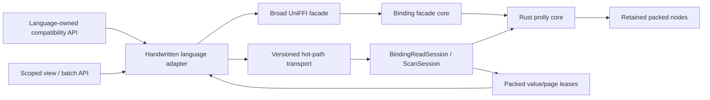

# Language Bindings Performance Architecture

Status: proposed

Date: 2026-07-16

Scope: Rust binding facade, Go, Python, Kotlin/JVM, Java, Node/TypeScript,
Ruby, Swift, browser/standalone WASM, and shared consumers of prolly reads

## Summary

The Rust prolly implementation now has packed retained nodes, borrowed point
reads, reusable read sessions, and borrowed range/diff/conflict traversal. The
current foreign-language compatibility facade does not preserve most of those
advantages across the runtime boundary. It converts trees, keys, values, and
pages through owned UniFFI records and target-language objects. This keeps the
API safe and portable, but it adds repeated native calls, allocation, decoding,
and copying to the hottest read operations.

The measured Go binding makes the boundary cost visible:

- Rust through Go wins 25 of 30 bulk-write scenarios;
- native Go wins all 30 point-read and all 30 range-scan scenarios;
- the median binding/native-Go latency ratio is `0.50x` for writes, `5.34x`
  for point reads, and `7.24x` for scans; and
- the highest scenario median peak RSS is 10.22 GiB for the binding versus
  6.84 GiB for native Go.

The write result proves that the Rust engine remains competitive when one
boundary transition is amortized over a large batch. The read result shows
that per-operation transport and ownership dominate fine-grained workloads.
The complete evidence and limitations are recorded in
[`../performance-results/go-binding-vs-native-go-final-2026-07-16/report.md`](../performance-results/go-binding-vs-native-go-final-2026-07-16/report.md).

This design adds an optimized binding transport without removing UniFFI or
changing existing owned APIs:

1. retain a root-bound native read session;
2. expose a versioned, narrow hot-path ABI for point reads, multi-get, scans,
   diffs, and conflicts;
3. use packed page buffers with validated offset tables;
4. distinguish owned compatibility methods from callback-scoped or
   lease-scoped view methods;
5. keep Go, JVM, Python, Node, Swift, Ruby, and WASM adapters idiomatic while
   sharing the same Rust session and packed codecs; and
6. extend the same substrate to diff/merge, secondary indexes, and proximity
   queries.

Correctness is non-negotiable. No binding optimization may change key order,
value bytes, cursor semantics, root CIDs, error timing guarantees, merge
results, or persisted formats. No foreign pointer may be retained beyond the
duration permitted by that runtime.

## Relationship to Existing Designs

This document refines, rather than replaces:

- [`language-bindings-design.md`](language-bindings-design.md), which remains
  authoritative for parity, packaging, the broad UniFFI facade, and release
  policy;
- [`superpowers/specs/2026-07-15-prolly-zero-copy-read-architecture-design.md`](superpowers/specs/2026-07-15-prolly-zero-copy-read-architecture-design.md),
  which remains authoritative for packed Rust nodes, borrowed core APIs,
  `ReadSession`, cache behavior, diff/merge, indexes, and proximity; and
- [`language-store-adapters-design.md`](language-store-adapters-design.md),
  which remains authoritative for host-language stores and async adapter
  packaging.

The earlier binding rule, "copy byte buffers at the boundary," remains valid
for compatibility methods. It is no longer sufficient as the only transport
for performance-critical reads. This design adds explicit optimized methods
whose lifetime and ownership contracts make fewer copies safe.

## Goals

- Preserve all existing public language APIs and their owned-result behavior.
- Make repeated point reads reuse a decoded tree/root and native read session.
- Reduce the common owned point-read path to one native operation and one
  required result copy.
- Provide a zero-per-entry-allocation range path for runtimes that can consume
  callback-scoped or page-lease views.
- Amortize boundary work for multi-get, diff, conflict, and merge-resolution
  workloads.
- Reduce write-side memory amplification without regressing the existing bulk
  write advantage.
- Use one shared Rust implementation for all language packages.
- Make every copy, native transition, retained byte, page, and lease observable.
- Establish repeatable performance gates against direct Rust, compatibility
  bindings, and native-language comparators.

## Non-Goals

- A binding cannot outperform direct Rust for the identical single-key
  operation merely because it is a binding. It always adds a runtime boundary.
- This design does not replace the content-addressed node format or alter CIDs.
- It does not create independent native prolly implementations per language.
- It does not expose unconstrained Rust references to foreign runtimes.
- It does not make asynchronous callbacks borrow Rust memory across an await.
- It does not promise a 1.5x or 2x win before a complete measured result proves
  it for a named workload and machine.
- It does not optimize database or network storage latency by hiding blocking
  I/O behind a synchronous FFI method.

## Findings and Current Copy Ledger

### Direct Rust point read

The optimized native path is:

```text
ReadSession -> retained packed root/routes -> packed leaf -> get_with callback
```

The tree is decoded once, the session retains immutable node bytes, and the
value is borrowed for the callback. A warm hit requires no owned value object.

### Current compatibility point read

The current Go `Engine.Get` is representative of the owned compatibility path:

```text
Go Tree bytes
  -> allocate RustBuffer
  -> copy and decode TreeRecord
Go key
  -> encode length + bytes
  -> allocate RustBuffer
  -> copy and decode Vec<u8>
Rust engine.get
  -> allocate Option<Vec<u8>>
  -> serialize UniFFI result
  -> copy whole RustBuffer into Go
  -> decode and copy value into final []byte
  -> free RustBuffer
```

The engine handle is also cloned through FFI for each wrapper method. The
generated-object ownership of that clone must be audited immediately: if it is
an owned UniFFI handle, every clone requires a corresponding free. Regardless
of ownership, a clone transition per key is unnecessary for a synchronized,
live engine or read-session handle.

### Current range scan

Go `ScanRange` first performs a lower-bound call, then repeatedly calls
`RangePage` with a 1,024-entry limit. A 10M full scan therefore makes roughly
9,766 page calls. Each page serializes the tree, cursor, and end bound; builds
owned Rust entry records; serializes a result buffer; copies the whole result
into Go; and then copies every decoded key and value into its own Go slice.

The cursor contains a resume key, not a retained native traversal stack. The
next page must route back into the tree instead of continuing directly from a
pinned leaf and stack.

### Current bulk write

The Go mutation slice, encoded UniFFI buffer, copied RustBuffer, decoded Rust
mutations, and tree-building state can coexist. Boundary cost is amortized over
the full batch, explaining good write latency, but the duplicate
representations contribute to peak RSS.

### What the benchmark does and does not prove

The benchmark measures the public binding path as a whole. It does not isolate
cgo, handle cloning, UniFFI encoding, allocation, tree decoding, or result
copying independently. Those mechanisms are strongly indicated by code-path
inspection and must be measured separately before attributing a percentage to
any one of them.

## Terminology

### Compatibility facade

The existing broad UniFFI, Node-API, JNI/JVM, Swift, Ruby, Python, Go, and WASM
surface. Its records are self-contained and may be retained by the caller.

### Hot-path ABI

A small versioned native interface for point reads, multi-get, scans, diffs,
and conflict pages. It complements the compatibility facade and is allowed to
use explicit handles, packed buffers, and scoped views.

### Owned result

Target-runtime memory that remains valid after the binding method returns.

### View result

Bytes backed by an immutable native lease or WASM linear-memory window. The
view is valid only for the documented callback or lease lifetime.

### Page lease

An explicit owner of one immutable packed result page. Releasing the lease
invalidates all views into that page.

### Read session

A native object bound to one immutable tree, store, and format identity. It
retains the decoded root, session-local routing state, and bounded locality
metadata.

### Packed page

An ABI-only, non-persisted buffer containing a header, validated offset table,
and contiguous key/value arena.

## Normative Correctness and Safety Invariants

1. Existing owned methods remain source- and behavior-compatible.
2. Owned and view methods return identical key/value bytes and ordering.
3. Binding transport formats never participate in node CIDs or persistence.
4. A read session is bound to exactly one immutable tree/config/store identity.
5. A page or value lease retains every native allocation referenced by a view.
6. A released lease can never be read, resumed, or released twice.
7. Rust never retains a pointer into Go, JVM heap, Python-managed memory,
   JavaScript-managed memory, Swift-managed memory, or Ruby-managed memory
   after the native call returns.
8. Borrowed input pointers are read-only and valid only during the call.
9. Async work owns all bytes that survive an await or thread handoff.
10. No engine, cache, session, or metrics lock is held while invoking a foreign
    callback.
11. Engine/session close synchronizes with active operations and is idempotent.
12. Every packed offset, length, count, tag, and total byte size is validated
    before a foreign slice or buffer view is created.
13. Early stop reports the stopping record as visited, matching current APIs.
14. Store errors after partial streaming preserve the documented partial
    delivery semantics; owned collection methods remain all-or-error.
15. Custom resolver results are validated before any merged root is published.
16. Fast-path failure can fall back to the compatibility method only when doing
    so preserves error and side-effect semantics.

## Architecture Overview



The design has three layers:

1. **Rust core:** existing packed nodes, `ReadSession`, borrowed entry/diff/
   conflict views, and immutable stores.
2. **Binding session and transport:** root-bound sessions, scan cursors, packed
   page codecs, lease registry, and a narrow C/native transport.
3. **Language adapter:** idiomatic owned APIs plus optional scoped-view,
   explicit-session, iterator, and batch APIs.

UniFFI remains the parity and compatibility mechanism. The hot path is not a
second tree implementation; it is another transport into the same binding
facade core.

## Public API Tiers

| Tier | Contract | Typical APIs | Retention |
| --- | --- | --- | --- |
| A | Existing owned compatibility | `Engine.Get`, `Range`, `Diff`, `Merge` | caller may retain results |
| B | Explicit session, owned output | `ReadSession.Get`, `GetMany`, owned scan iterator | caller may retain results |
| C | Scoped view | `GetView`, `ScanRangeView`, `DiffView` | callback or lease scope only |
| D | Packed/batched throughput | packed multi-get/page/conflict batches | explicit page lease |

Tier A is never removed. Tier B should become the recommended API for repeated
reads. Tier C is opt-in and must use names that reveal the lifetime contract.
Tier D is primarily an adapter/internal primitive, but advanced language APIs
may expose a page object where that is idiomatic.

## Native Object Model

### `BindingReadSession`

Conceptually:

```rust
pub struct BindingReadSession {
    engine: Arc<BindingEngineInner>,
    tree: Tree,
    reader: BindingStoreReadSession,
    limits: BindingReadLimits,
    metrics: Arc<BindingMetrics>,
}
```

Requirements:

- decode and validate the tree once at construction;
- retain the root and bounded routing/locality state;
- expose point, multi-get, bound, rank/select, prefix, range, diff, proof-read,
  and index/proximity helpers over the same root;
- be immutable from the caller's perspective;
- support either documented concurrent reads or explicit `clone_for_worker`;
- reject use after close; and
- account retained root, route, node, scratch, and lease bytes.

The initial implementation chooses one session per worker. It does not put a
mutex around every core read to simulate concurrency. Language adapters may
create a bounded cache of sessions keyed by `(root CID, format identity)` for
legacy Tier-A methods, but the cache defaults to at most one recent root and
must be included in cache metrics. Explicit sessions avoid cache ambiguity.

### `BindingScanSession`

A scan session owns:

- a `BindingReadSession` reference;
- start/end or prefix bounds;
- direction;
- the native traversal stack and current retained leaf;
- an ended/closed state; and
- bounded page-building scratch.

It does not serialize a resume key and route from the root for every page.
Compatibility cursor tokens remain supported by the old page methods.

### Diff and conflict sessions

- `BindingDiffSession` owns two compatible read sessions and two traversal
  stacks.
- `BindingConflictSession` owns base, left, and right sessions plus merge
  frontier state.
- Equal-subtree CID skipping remains inside Rust.
- Foreign pages contain only emitted logical records, never internal nodes.

### Handle lifecycle

Every native object has exactly one ownership model:

- object handles are created once and freed once;
- method calls borrow a live handle under adapter close synchronization;
- cloning is explicit and paired with a free;
- finalizers/Cleaners are leak backstops, not correctness mechanisms; and
- debug builds expose live-handle counters grouped by object kind.

The first implementation task is an audit of the current generated and
handwritten clone/free behavior for engine, transaction, blob-store, policy,
callback, page, and session handles.

## Versioned Hot-Path ABI

### ABI policy

- Export `prolly_fast_abi_version()` and capability bits.
- Version the ABI independently from the persisted format and language package.
- Use fixed-width integer fields and explicit little-endian packed buffers.
- Never expose a Rust struct layout directly.
- Use opaque `u64` handles with generation checks or opaque pointers managed by
  one registry; do not mix models.
- Return structured status codes; retrieve detailed owned error bytes only on
  failure.
- Validate limits before allocating or traversing.

### Point read primitives

The owned fast path uses caller-provided output storage:

```c
ProllyGetIntoResult prolly_read_session_get_into(
    uint64_t session,
    const uint8_t *key_ptr,
    size_t key_len,
    uint8_t *out_ptr,
    size_t out_capacity
);
```

The result contains `status`, `found`, `written`, and `required_capacity`.
Input is borrowed only for this call. The common small-value path completes in
one native call. If the output is too small, the adapter grows its buffer and
retries; the session may retain a bounded last-hit lease so a retry copies the
same validated value without retraversing the tree.

The view path returns a lease:

```c
ProllyValueLease prolly_read_session_get_lease(
    uint64_t session,
    const uint8_t *key_ptr,
    size_t key_len
);

void prolly_value_lease_release(uint64_t lease);
```

`ProllyValueLease` contains status, found, lease handle, immutable pointer, and
length. The adapter exposes it only inside a callback or an explicit page/value
object with deterministic close.

### Multi-get primitive

Keys use one packed arena and offset table. Results use one packed page:

```text
key_count | key_offsets[count + 1] | key_arena
```

The Rust session sorts only when the API contract permits it, preserves input
order in the output, deduplicates internal traversal work without changing
duplicate results, and returns found/missing status per requested position.

### Packed entry page format

The first ABI-only page format is:

```text
magic            4 bytes  "PRPG"
version          u16      1
kind             u16      entry, diff, conflict, neighbor, or index match
flags            u32      direction, terminal, optional-field flags
record_count     u32
table_bytes      u32
arena_bytes      u64
records          kind-specific fixed-width offset table
arena            concatenated immutable bytes
```

An entry record contains:

```text
key_offset       u32
key_length       u32
value_offset     u32
value_length     u32
```

Offsets are relative to the arena. Page construction rejects any arena larger
than the configured `u32` offset range and starts another page. Every decoder
checks magic, version, kind, table size, count multiplication overflow, arena
size, individual ranges, and non-overlap rules before producing views.

The default page policy is the first of 4,096 records or 4 MiB of arena bytes.
Those values are tuning defaults, not ABI. Benchmarks must cover 256, 1,024,
4,096, 16,384, and byte-limited pages before changing them.

### Diff record

A packed diff record contains a kind tag, key range, and optional old/new value
ranges. Absent values use a flag, never an ambiguous zero-length sentinel.

### Conflict record

A packed conflict record contains key plus independently flagged base, left,
and right value ranges. Delete/absence semantics remain identical to the Rust
`ConflictRef` contract.

### Page ownership

- Rust allocates and validates one immutable page.
- The page lease owns the page bytes and any retained node handles used for a
  direct arena representation.
- The adapter may build target-runtime views only while the lease is live.
- Owned APIs copy directly from the page arena into final target objects; they
  do not first copy the whole page and then copy each field again.
- View APIs release the page after the callback or explicit page close.
- A scan callback that stops inside a page closes the scan unless it requested
  explicit page/cursor semantics. It never silently resumes after unconsumed
  records.

## Existing API Compatibility

Existing methods retain their signatures and owned semantics. Their internal
implementation changes as follows:

- `Engine.Get` uses a bounded recent-root session and `get_into`, returning an
  owned target-language byte array.
- `GetMany` uses the packed multi-get primitive and copies only final values.
- Go `ScanRange` uses a native scan session and packed pages, but creates owned
  `Entry` key/value slices before invoking the existing visitor because that
  visitor may retain them.
- Eager `Range` collects from the same scan session with existing error
  semantics.
- Existing diff/conflict pages adapt packed records into owned records.
- Existing merge APIs keep identical resolver and publication behavior.

No existing method begins returning a reused scratch slice or a view whose
lifetime is shorter than before.

## New Language-Neutral APIs

The exact spelling is idiomatic per language, but every binding provides the
same capabilities:

```text
engine.read(tree) -> ReadSession
session.get(key) -> owned optional bytes
session.get_view(key, callback) -> found/outcome
session.get_many(keys) -> owned ordered optionals
session.get_many_page(keys) -> page lease/view
session.scan_range(start, end, callback) -> owned compatibility callback
session.scan_range_view(start, end, callback) -> scoped EntryView
session.scan_prefix_view(prefix, callback)
session.scan_reverse_view(start, end, callback)
session.diff_view(other_session, callback)
session.conflicts_view(left_session, right_session, callback)
```

The owned session API is recommended by default. View APIs are advanced,
explicitly named, and documented adjacent to their lifetime restrictions.

## Language-Specific Adaptation

### Go

- Use the versioned C ABI through cgo for hot paths; keep UniFFI for broad
  parity methods.
- Protect handle use versus `Close` with adapter synchronization instead of
  cloning an engine handle per method.
- Pass `[]byte` input pointers only for the duration of a synchronous call and
  call `runtime.KeepAlive` after native use.
- `ReadSession.Get` uses a reusable small output buffer and returns a correctly
  sized owned slice.
- `GetView` and `ScanRangeView` create slices over C-owned lease memory only
  inside the callback; callers must copy to retain.
- Never pass a Go pointer containing Go pointers to Rust and never retain a Go
  pointer after cgo returns.
- Provide explicit `Close`; finalizers report leaks in debug mode but do not
  define lifetime.
- Run `go test -race` for close/read, concurrent-session, early-stop, and
  callback-reentrancy tests.

Illustrative API:

```go
session, err := engine.Read(tree)
if err != nil { return err }
defer session.Close()

value, found, err := session.Get(key) // owned

found, err = session.GetView(key, func(value []byte) bool {
    consume(value) // valid only here
    return true
})

outcome, err := session.ScanRangeView(start, end, func(entry EntryView) bool {
    consume(entry.Key, entry.Value)
    return true
})
```

### Python

- Keep `bytes` results for compatibility.
- Expose sessions and page iterators in the native extension.
- Expose view APIs as callback-scoped `memoryview` objects whose owner capsule
  retains the lease; invalidate access after close where the runtime permits.
- Release the GIL during Rust traversal and page construction; reacquire it
  before creating Python objects or invoking Python callbacks.
- Never call Python while holding a Rust cache/session lock.
- For normal Python iteration, decode a page at a time to amortize extension
  calls even when final objects are owned `bytes`.

### Kotlin and Java

- Share the Rust session and packed page implementation.
- Compatibility APIs return `ByteArray` and Java `byte[]`.
- View APIs use read-only `ByteBuffer`/direct buffers owned by a page object.
- One JNI/UniFFI transition returns a page; never call JNI once per row.
- `AutoCloseable`/Kotlin `use` closes sessions and pages deterministically.
- `Cleaner` is a leak backstop only.
- Do not expose a direct buffer after its page is closed.

### Node and TypeScript

- Use the shared Rust session directly through Node-API, not the C ABI when a
  native Node wrapper can call Rust without another layer.
- Compatibility APIs return copied `Buffer`/`Uint8Array` values.
- View pages use external read-only Buffers with a finalizer that releases the
  page lease; explicit `close`/`dispose` remains preferred.
- Synchronous callbacks may receive views. Async promises must own or lease
  bytes until resolution and must never borrow stack/session scratch.
- Catch JavaScript exceptions, stop traversal, release the page, and propagate
  the original error.

### Swift

- Compatibility APIs return owned `Data`.
- View APIs use `Data(bytesNoCopy:)` or an explicit `EntryPage` wrapper whose
  deallocator releases the native lease.
- Use deterministic `close` where practical and preserve Swift exclusivity
  rules during callbacks.
- Never reuse page memory while a Swift view is live.

### Ruby

- Compatibility methods return binary-encoded owned strings.
- Prioritize sessions and page batching before exposing borrowed strings,
  because Ruby mutation and retention make view semantics easy to misuse.
- A future view API must return frozen binary strings or an explicit page/view
  object backed by a native lease.

### Browser and standalone WASM

- Compatibility methods return copied `Uint8Array` values.
- Packed pages live in WASM linear memory and are addressed by offsets, never
  host pointers.
- A JavaScript view is valid only until page release and only while memory
  growth cannot invalidate the underlying `ArrayBuffer`.
- The wrapper either prevents memory growth while leases are active or detects
  a changed memory buffer and rejects stale views.
- No view survives an `await` unless it is copied or backed by an explicit
  retained page whose memory-growth policy guarantees stability.

## Point-Read Algorithms

### Owned session get

1. Validate the live session and key length.
2. Borrow the foreign key for the call.
3. Traverse through the retained native session using `get_with`.
4. Copy the value directly into caller-provided output storage.
5. Return found/written/required status.
6. On insufficient capacity, retry from a bounded retained last-hit lease or
   retraverse without changing logical behavior.

The implementation must not construct `TreeRecord`, `Vec<u8>` key, owned Rust
value, serialized UniFFI result, whole-page Go copy, and final value copy for a
single successful hit.

### View get

1. Traverse with `get_with`.
2. Retain the packed leaf/node in a value lease.
3. Return immutable pointer/offset and length.
4. Invoke the language callback or construct an explicit value view.
5. Release the lease deterministically.

### Multi-get

1. Validate the key arena once.
2. Preserve original request positions.
3. Group/sort internal probes only when results can be restored exactly.
4. Reuse session routing and leaf locality across probes.
5. Emit one packed ordered result page.
6. Copy or view results according to the selected API tier.

## Range and Prefix Algorithms

1. Construct one native scan session from the retained read session.
2. Seek once to the lower/upper bound.
3. Retain the traversal stack and current leaf.
4. Fill packed pages directly from borrowed `EntryRef` values.
5. Release internal node handles once the page lease safely owns or copies the
   referenced bytes.
6. Continue from traversal state, not by routing from a serialized resume key.
7. Enforce end/prefix bounds before emitting each record.
8. Report visited count and early stop exactly once.

Increasing page size without retaining traversal state or removing per-field
copies is not considered a complete optimization.

## Diff and Merge

### Diff

- Construct `BindingDiffSession(base, other)` from compatible read sessions.
- Skip equal CIDs in Rust.
- Emit packed diff pages in key order.
- Preserve add/remove/modify tags and absent-value distinctions.
- Adapt pages into owned compatibility records only at the outer boundary.

### Conflict inspection

- Retain base/left/right read sessions.
- Emit packed conflict pages with explicit optional-value flags.
- Keep early-stop and error behavior identical to current conflict scans.

### Merge

- Built-in resolvers execute entirely in Rust and cross the boundary only with
  the final tree/result records.
- Host-language resolvers receive bounded conflict batches where supported.
- Resolver decisions return as a packed decision array keyed by conflict
  ordinal; Rust validates count, ordinal, key identity, decision tag, and value
  limits.
- The compatibility one-conflict callback remains available.
- No root is published until all decisions validate and canonical merge
  application succeeds.

Batching resolver callbacks changes transport, not resolver ordering or merge
semantics.

## Writes

### Packed mutation arena

Define an ABI-only mutation format:

```text
magic/version/count
records: kind + key offset/length + value offset/length
arena: key and value bytes
```

Rust borrows the arena during a synchronous batch call. The core gains a
`MutationRef`/packed preprocessing path so it does not immediately recreate a
`Vec<Vec<u8>>` for every key and value. When ownership is required by sorting,
deduplication, or deferred application, copy once into one Rust-owned arena.

For workloads too large for one foreign arena, add a `BindingBatchWriter`:

- accepts bounded packed chunks;
- owns/spools Rust-side mutations;
- preserves global last-write-wins and canonical final-root semantics;
- finalizes one logical batch; and
- releases language-side chunks after ingestion.

Applying chunks as independent tree mutations is not an acceptable substitute
unless it is proven to produce the same canonical root and stats.

## Secondary Index Foundation

Secondary-index APIs build on the same session and page types:

- bind source and index roots to compatible sessions;
- scan composite index-key ranges with a retained cursor;
- emit packed index-match pages;
- batch source-record joins inside Rust;
- avoid returning source rows that will be filtered immediately in the host;
- keep index/source version and schema checks before query delivery; and
- expose owned matches and scoped `IndexMatchView` variants.

Index build, verification, repair, replacement, and historical query paths must
share the packed mutation/read substrate rather than introduce another FFI
record format.

## Proximity Map Foundation

Proximity queries should cross the language boundary at the highest useful
level:

- pass one query vector and filter/options record;
- perform candidate lookup, filtering, approximate search, exact rerank, and
  deterministic ordering in Rust;
- retain vector/candidate bytes under native handles;
- return only packed top-K neighbor records; and
- copy application payloads only for final neighbors requested by the caller.

Returning every candidate vector to the host language for scoring defeats the
shared Rust engine and is not supported by the fast path. WASM SIMD/alignment
and JVM direct-buffer alignment must be validated independently.

## Proofs, GC, Sync, and Maintenance

These APIs usually return self-contained artifacts and are not initially on the
zero-copy critical path. They still benefit from sessions and packed internal
inspection. Proof bundles, manifests, sync plans, and GC plans remain owned at
the foreign boundary because callers persist or transmit them.

## Async and Cancellation

- An async operation owns all input that survives scheduling.
- A page lease may survive an await only through an explicit owned lease
  object; callback-scoped views never do.
- Go context, Java cancellation, Python cancellation, JavaScript AbortSignal,
  and Swift task cancellation are checked between bounded native pages or
  batches.
- Cancellation closes cursors and releases leases before returning.
- Partial streaming delivery remains documented; owned methods remain
  all-or-error.

## Reentrancy, Errors, and Panics

- Foreign callbacks execute with no Rust cache/session registry lock held.
- Reentry into the same mutable scan cursor is rejected deterministically.
- Reentry through another read session is permitted.
- A foreign exception/panic stops delivery, releases current leases, and maps
  back to the original language error where supported.
- Rust panics never unwind across C/JNI/Node/WASM boundaries.
- Fast status codes distinguish invalid handle, closed handle, buffer too
  small, malformed packed input, store error, corruption, callback failure,
  cancellation, and internal failure.
- Detailed error payload allocation occurs only on failure.

## Observability

Add counters/histograms grouped by language, API tier, and operation:

- FFI/native transitions;
- handle clone/create/free/live counts;
- sessions opened, reused, evicted, and closed;
- tree/config bytes decoded per operation;
- input and output bytes copied;
- RustBuffer allocations/frees;
- target-runtime allocations where measurable;
- value/page leases created, peak live, retained bytes, and leaked-at-finalizer;
- scan pages, records/page, bytes/page, cursor seeks, and retained-stack steps;
- multi-get keys, distinct leaves, reordered probes, and batch width;
- owned versus viewed entries/diffs/conflicts;
- resolver callback count and conflicts/callback;
- mutation input, arena, decoded, scratch, and peak retained bytes; and
- fast-path fallback count and reason.

Production counters must avoid per-row synchronization. Use session-local
aggregation and flush at close/page boundaries. Allocation counting may remain
benchmark-only.

## Testing Strategy

### Semantic equivalence

For every optimized method, compare against the owned compatibility method:

- found and missing point reads;
- empty, one-byte, 100-byte, and large values;
- forward/reverse range and prefix bounds;
- empty tree and empty range;
- early stop at first/middle/last record;
- cursor/page boundaries;
- add/remove/modify diff events;
- delete/absence merge conflicts;
- duplicate multi-get keys;
- mutation duplicate and last-write-wins behavior; and
- secondary-index/proximity ordering and tie breaking.

### Lifetime and resource tests

- use after session/page/value close;
- double close/release;
- engine close racing reads;
- page retained while cache evicts;
- callback exception and reentry;
- finalizer leak detection;
- handle create/free balance over millions of calls;
- Go GC during borrowed input calls;
- JVM/Python/Node/Swift GC while leases are live; and
- WASM memory growth with active/stale pages.

### Malformed input and fuzzing

Fuzz every packed decoder for overflow, truncated headers/tables, invalid tags,
out-of-range offsets, overlapping ranges where forbidden, excessive counts,
oversized arenas, invalid UTF-8 only where text is required, and inconsistent
optional flags. Run Rust fuzzing plus language-level corrupt-page fixtures.

### Concurrency tools

- Rust Miri and sanitizers for lease/session internals;
- ThreadSanitizer where supported;
- Go race detector;
- JVM concurrency tests and Cleaner stress;
- Python subinterpreter/GIL tests where supported; and
- Node worker-thread and async cancellation tests.

## Performance Evaluation

### Required comparison layers

Measure each logical workload at four layers:

1. direct Rust borrowed/session API;
2. existing owned compatibility binding;
3. optimized session-owned API; and
4. optimized view/packed/batch API.

Where a true native implementation exists, add it as a fifth comparator. Never
substitute an old run without identifying that it is cross-run evidence.

### Workload matrix

- sizes: 10K, 50K, 1M, 5M, 10M, and a larger dedicated-host tier;
- arrival/update order: append, deterministic random, and clustered;
- phases: fresh and 30% mutation with the existing insert/update contract;
- values: 0, 1, 16, 64, 100, 1K, and large-value references;
- point reads: hits, misses, mixed hit ratio, hot set, random, and clustered;
- multi-get widths: 1, 8, 32, 128, 1,024, and 16,384;
- scans: full, 1 row, 100 rows, 1%, prefix, reverse, and early stop;
- diffs: identical, sparse, clustered, dense, and structurally misaligned;
- merge: no conflict, sparse conflict, dense conflict, built-in resolver, and
  host callback resolver;
- concurrency: one worker first, then 2/4/8 readers on a dedicated host; and
- stores: in-memory first, then warm/cold file and selected host adapters.

Each scenario records latency, throughput, allocations, copied bytes, native
transitions, peak RSS, lease bytes, validation digest, result count, binary
hash, source hash, and machine state.

### Initial performance gates

Correctness gates are absolute. Performance gates are release criteria for the
optimized path and may be revised only with published evidence:

1. `ReadSession.Get` uses one native read operation in the common-size case and
   improves median point latency by at least 3x versus the current compatibility
   Go path at 1M, 5M, and 10M.
2. Owned `ReadSession.Get` performs at most one target-language value allocation
   on a hit; `GetView` performs zero value allocations.
3. `GetMany` with width 128 or greater amortizes boundary cost enough to target
   at least 1.5x native-Go throughput on the measured in-memory large-tree
   workloads. A miss is reported, not waived.
4. `ScanRangeView` performs zero key/value allocations per entry and at most one
   page allocation/lease per page.
5. Large-tree `ScanRangeView` targets no worse than 1.5x native-Go ns/row;
   existing owned scan targets no worse than 2.5x after removing redundant
   copies.
6. Optimized binding writes do not regress more than 10% from the current
   medians and keep all correctness/root checks.
7. The 10M random-mutation binding median peak RSS targets at most 1.25x the
   native-Go comparator or documents the remaining owned representation.
8. Handle create/free balance is zero at test end; no finalizer is required to
   meet the balance.
9. No optimized path regresses direct Rust or changes persisted bytes.

The 1.5x targets are goals to prove, not claims established by this document.

## Delivery Plan

### Phase 0: Measurement and ownership lock

- add isolated empty-call, handle, input-copy, output-copy, tree-decode,
  point-hit/miss, page-decode, and allocation microbenchmarks;
- add cgo/JNI/Node/Python transition and byte-copy counters;
- audit every clone/free path;
- freeze owned/view equivalence fixtures; and
- run the current matrix on an idle dedicated host.

Exit: every suspected cost has a measurable counter or benchmark and handle
ownership is documented.

### Phase 1: Shared session core

- implement `BindingReadSession` and per-store session enum;
- expose session lifecycle through UniFFI for compatibility;
- add bounded recent-root reuse for legacy methods;
- add close/race/resource metrics and tests.

Exit: repeated reads no longer decode/reacquire the same root internally.

### Phase 2: Go point and multi-get fast path

- implement ABI version/capabilities;
- implement `get_into`, value lease, and packed multi-get;
- remove per-call handle cloning from synchronized Go hot paths;
- add Go owned/session/view APIs and benchmarks.

Exit: point-read and batch gates pass or misses are published with profiles.

### Phase 3: Packed scan pages

- implement page codec/validator and lease registry;
- implement retained forward/reverse/prefix scan sessions;
- migrate Go owned `ScanRange` internally;
- add Go `ScanRangeView` and page-size experiments.

Exit: ordering, early-stop, lifetime, allocation, and scan gates pass.

### Phase 4: Diff, conflict, and merge

- add retained diff/conflict sessions and packed record kinds;
- adapt owned APIs;
- add bounded host-resolver batches;
- verify canonical merge roots against compatibility paths.

### Phase 5: Packed writes and RSS

- add packed mutation input and `MutationRef` preprocessing;
- add bounded batch writer for very large foreign inputs;
- measure memory representation high-water marks;
- preserve canonical roots and stats.

### Phase 6: Other language adapters

Recommended order based on impact and implementation reuse:

1. Node/TypeScript native;
2. Kotlin/Java direct-buffer pages;
3. Python sessions/page iteration;
4. Swift leases;
5. WASM offset pages and memory-growth safety;
6. Ruby sessions/page batching, then views if ergonomically safe.

Every language ships owned compatibility first, then session-owned, then view
APIs after its lifetime tests pass.

### Phase 7: Secondary indexes and proximity

- move index scans/source joins to shared sessions/pages;
- move proximity top-K output to packed neighbor pages;
- benchmark index selectivity, source joins, filter ratios, candidate counts,
  vector dimensions, and top-K independently.

## Source Layout

Proposed ownership:

```text
bindings/uniffi/src/
  lib.rs                 compatibility exports and object wiring
  read_session.rs        BindingReadSession and store dispatch
  scan_session.rs        retained entry/diff/conflict cursors
  packed_page.rs         format, builder, validator, leases
  fast_abi.rs            versioned C ABI exports and status mapping
  packed_mutation.rs     mutation arena and batch writer
  metrics.rs             binding transport metrics

bindings/go/
  prolly.go              existing compatibility surface
  session.go             explicit owned session API
  view.go                scoped point/page views
  fast_abi.go            cgo transport and close synchronization
  packed_page.go         validated lazy page decoder

bindings/<language>/
  generated compatibility bindings
  handwritten session/view adapter
  lifetime and performance tests
```

The exact Rust module split may change during implementation, but hot ABI,
packed codec, session ownership, and language adaptation must not remain one
monolithic generated file.

## Alternatives Rejected

### Increase the Go page size only

This reduces page calls but leaves root reseeks, whole-page copies, and per-key/
value allocations. It is a tuning step after the session/page design.

### Call Go once per Rust row

Per-row Rust-to-Go callbacks replace allocation cost with millions of runtime
transitions and complicate panic/reentrancy behavior. Pages amortize transitions.

### Make existing results borrowed by default

Existing callers may retain byte arrays or entries. Shortening their lifetime
silently is unsafe and source-compatible but behavior-breaking.

### Replace UniFFI entirely

UniFFI provides broad feature parity, generated packaging, and safe owned
records. The optimized transport is deliberately narrow and additive.

### Retain foreign input pointers

This violates runtime movement/GC rules and cgo constraints. Inputs are borrowed
only during synchronous calls or copied into Rust ownership.

### Change the persisted node format

The measured problem is at the language boundary. A wire-format change would
add migration and CID risk without removing UniFFI copies.

### Create native prolly ports per language

This fragments correctness, merge behavior, conformance, and maintenance. The
Rust engine remains authoritative.

## Risks and Mitigations

| Risk | Mitigation |
| --- | --- |
| View used after release | explicit view names, deterministic close, generation-checked leases, debug poisoning |
| Hidden session memory | bounded cache, retained-byte metrics, explicit sessions, eviction tests |
| ABI divergence from UniFFI | shared facade-core functions and owned/view differential tests |
| Handle leak/double free | single ownership model, counters, stress tests, idempotent close |
| Page decoder vulnerability | versioned format, checked arithmetic, fuzzing in Rust and target languages |
| Callback deadlock/reentry | no internal locks during callbacks, same-cursor reentry rejection |
| Async borrow escape | owned/leased async requests only; no callback-scoped view across await |
| Generator replacement | handwritten public adapters isolate generated code and hot ABI |
| Performance overclaim | paired runs, raw data, binary hashes, confidence limitations, honest misses |
| Fast path semantic drift | compatibility oracle, fixtures, root/CID equivalence, staged rollout |

## Acceptance Criteria

The design is complete when:

1. Existing language APIs and fixtures remain compatible.
2. A shared root-bound binding read session exists for every compiled store.
3. The Go hot path avoids repeated tree serialization and per-call object
   cloning.
4. Point-read owned and view results match the compatibility oracle for all
   values and errors.
5. Native scan sessions retain traversal state and packed pages pass fuzzed
   validation.
6. Owned scans copy directly into final language objects; view scans allocate
   no key/value objects per row.
7. Diff, conflict, and merge roots match existing implementations.
8. Packed mutations preserve last-write-wins, ordering, stats, and final CIDs.
9. No foreign pointer outlives its permitted scope and no async borrow crosses
   an await.
10. Handle and lease counts balance without finalizers.
11. Go race, Rust Miri/fuzz/sanitizer, JVM, Python, Node, Swift, Ruby, and WASM
    lifetime suites pass for shipped tiers.
12. Secondary-index and proximity adapters reuse the same session/page/lease
    foundation.
13. Performance gates are run in release mode on a documented host and every
    miss is retained in the report.
14. Persisted bytes, CIDs, conformance digests, result counts, scan ordering,
    and merge results remain unchanged.

## Final Decision

Keep the broad owned UniFFI facade as the stable compatibility and feature
parity layer. Add a narrow, versioned performance transport backed by explicit
root-bound read sessions, retained native cursors, packed validated pages, and
scoped leases. Implement Go first because it has the strongest paired evidence,
then reuse the same Rust substrate through idiomatic adapters for Node, JVM,
Python, Swift, WASM, and Ruby.

The optimized owned API should be the normal application default. Scoped view
and packed-page APIs remain explicit advanced options. This preserves safety
and binding compatibility while giving high-throughput services a path to
amortize the runtime boundary and recover the performance already present in
the Rust prolly core.
