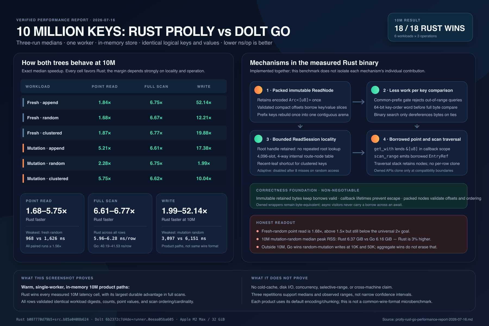

# 10M Rust vs Dolt Go Prolly Report

This is the single-screen summary of the validated 10M in-memory benchmark,
the Rust read mechanisms present in the measured binary, and the limitations
that prevent broader claims. Select the image to open the resolution-independent
SVG source.

The figures come from the
[complete three-run report](prolly-rust-go-performance-report-2026-07-16.md)
and its checked-in [normalized measurements](../performance-results/zero-copy-final-rerun-2026-07-16/results.csv).
