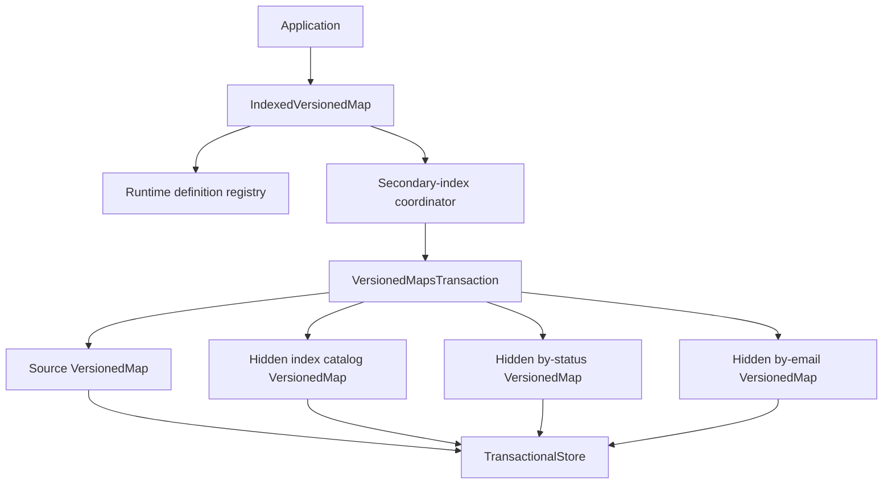
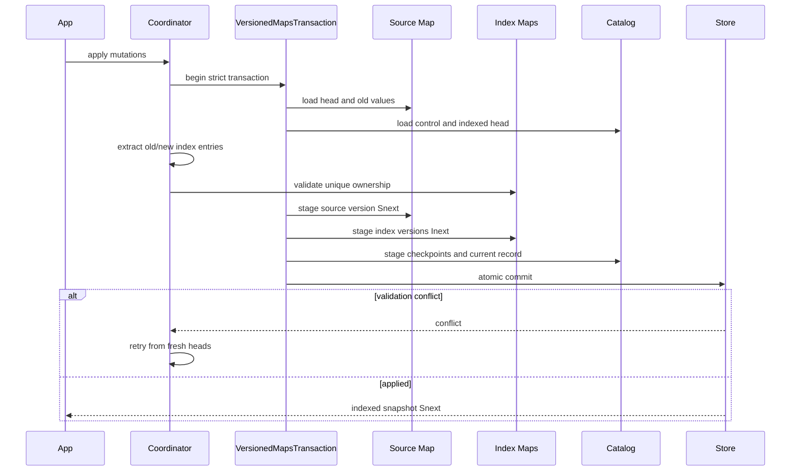

# Versioned Secondary Indexes

## Status

Proposed technical design for first-class secondary-index support on top of
`VersionedMap`.

This document defines the target architecture, persisted metadata, consistency
model, public API shape, update and query algorithms, index lifecycle,
retention, backup, synchronization, failure handling, bindings, and staged
implementation plan. Names and exact Rust signatures remain subject to API
review, but the invariants and storage relationships are intended to be
normative.

## Summary

A secondary index is a derived ordered map. It has its own immutable prolly
tree and therefore its own `MapVersionId`, structural sharing, history, diff,
range scans, and synchronization behavior. It is not an independently writable
source of truth.

For each source-map version, the engine records the exact version of every
active secondary-index map derived from it:

```text
source map version S42
├── users tree root P42
├── by-status index version I17, derived from S42
└── by-email index version I29, derived from S42
```

Source, index, and association-catalog heads are advanced in one strict store
transaction. Readers first resolve one immutable indexed snapshot and then use
only the source and index versions named by that snapshot. They never combine
independently loaded mutable heads.

The implementation builds on the existing:

- `VersionedMap` and `MapVersionId` abstractions;
- immutable named version roots;
- `MapSnapshot` reads;
- `ProllyTransaction` optimistic multi-root commit;
- `VersionedMapsTransaction` support for updating multiple managed maps in one
  transaction;
- deterministic batch, diff, range, backup, sync, and GC primitives.

The first release supports strict, synchronously maintained secondary indexes.
Eventually consistent indexing is a separate future mode with explicit
freshness APIs; it must not weaken the strict defaults described here.

## Motivation

Applications commonly store authoritative records by primary key but query
them by other attributes:

```text
primary map
user-id -> User

secondary map: by-status
(tenant-id, status, user-id) -> empty

secondary map: by-email
email -> user-id
```

The repository already demonstrates incremental secondary-index maintenance in
`examples/secondary_index.rs`. That example correctly derives index mutations
from source diffs and verifies the result against a rebuild. What it does not
yet provide is an engine contract for:

- atomic publication of source and index versions;
- durable association between an index version and its source version;
- safe access to current and historical index snapshots;
- prevention of writes that bypass index maintenance;
- unique constraints and deterministic physical index layouts;
- index registration, rebuild, upgrade, and drop workflows;
- coordinated retention, garbage collection, backup, restore, and sync;
- recovery and verification after corruption or interrupted maintenance;
- a portable API for Rust and language bindings.

Without those guarantees, an application can observe a new source head with an
old secondary-index head, silently bypass maintenance through the ordinary
`VersionedMap` API, or sweep index nodes while retaining source versions.

## Goals

The design must:

1. Keep the authoritative collection a normal `VersionedMap`.
2. Represent every secondary index as a normal, hidden `VersionedMap`.
3. Associate each published index version with the exact source
   `MapVersionId` from which it was derived.
4. Atomically publish strict source and secondary-index changes.
5. Make torn source/index reads impossible through the safe API.
6. Support exact current and historical queries.
7. Prevent ordinary managed-map mutation helpers from bypassing active strict
   indexes.
8. Support non-unique, unique, multi-entry, sparse, and optionally covering
   indexes.
9. Reuse source structural sharing and incremental mutation paths instead of
   rebuilding indexes on every update.
10. Make indexes rebuildable because source records remain authoritative.
11. Coordinate index retention, GC, backup, restore, import, export, and sync
    with source-map history.
12. Provide deterministic behavior and portable record formats for language
    bindings.

## Non-goals

The first implementation does not provide:

- a SQL parser or cost-based query optimizer;
- joins across independently managed maps;
- general aggregate materialized views whose output for one key depends on many
  source records; they can reuse the coordinator but need a separate delta
  contract;
- full-text search, approximate nearest-neighbor search, or arbitrary external
  search-engine integration;
- asynchronously stale indexes hidden behind APIs that imply strict
  consistency;
- index extractor code serialization or automatic hashing of closure machine
  code;
- arbitrary writes to secondary-index maps;
- independent merge conflict resolution for derived index maps;
- cross-store strict indexes when the participating roots cannot commit in one
  atomic backend transaction.

External search engines and vector stores can use the same checkpoint concepts,
but they require a separate sidecar design because their state is not a prolly
map and cannot participate in `TransactionalStore::commit_transaction`.

## Terminology

### Source map

The authoritative `VersionedMap` containing application records. Source-map
versions retain their existing meaning: `MapVersionId` is the content-derived
identity of the source tree and its tree configuration.

### Secondary index

A declared deterministic mapping from one source entry to zero or more logical
index entries.

### Secondary-index map

The hidden `VersionedMap` that stores the physical entries of one secondary
index definition generation.

### Definition generation

The immutable identity of an index name, extractor revision, physical layout,
uniqueness mode, and projection policy. Changing any compatibility-relevant
part creates a new generation.

### Index checkpoint

A durable association between a source `MapVersionId`, a secondary-index map
ID, its index `MapVersionId`, and its definition generation.

### Index catalog

A hidden versioned map containing persisted definitions, checkpoints, lifecycle
state, and one current indexed-head record. Its own head is the coordination
point readers resolve first.

### Indexed snapshot

An immutable source snapshot plus the exact secondary-index snapshots selected
by one catalog version.

### Strict index

An index for which every published source head has a corresponding index
checkpoint and all related heads are committed atomically.

## Core Invariants

The safe API must preserve all of the following.

### I1: Source authority

Source records are authoritative. Index entries are derived and may be rebuilt.
No operation interprets a secondary-index entry as an independent application
write.

### I2: Exact derivation

Every `IndexCheckpoint` names exactly one source `MapVersionId` and one index
`MapVersionId`. An index version must not be presented as current for any other
source version.

### I3: Atomic strict publication

For a strict index, source head, index head, immutable version roots, checkpoint
records, and catalog head are staged in one `TransactionalStore` commit. The
commit applies all of them or none of them.

### I4: Snapshot-first reads

Queries resolve one catalog version first and load immutable source and index
versions from its records. A query never reads the mutable source and index
heads independently.

### I5: Maintenance cannot be bypassed

Once a source map has an active strict index, ordinary `VersionedMap` head-
changing operations fail with a structured error directing callers to the
indexed-map coordinator. The coordinator alone receives an internal maintenance
permit.

This fence covers apply, put, delete, edit, rebuild, import-as-head, restore,
rollback, merge publication, and multi-map transaction helpers. Read-only raw
map operations remain available.

### I6: Deterministic extraction

Given the same definition generation, primary key, and source value, the
extractor must return the same logical entries in every process and retry.
Extractors must be side-effect free because optimistic conflicts can execute
them more than once.

### I7: Definition compatibility

Persisted definition generation must match the registered runtime definition
before writes or index queries proceed. A mismatch fails during open or
operation dispatch; it never silently reinterprets stored index bytes.

### I8: Coordinated history

Retention of a source version retains every index version needed by its kept
checkpoints. Pruning a source version may remove an index version root only when
no retained checkpoint references it.

### I9: Derived merge

Merge and rollback select or produce primary source content first. Secondary
indexes are selected from an existing exact checkpoint or regenerated from the
resulting source change. Index maps are never merged independently.

### I10: Verifiable physical ownership

Every physical index entry identifies its primary key. Unique entries store the
owner in the value. Non-unique entries include the primary key in the physical
key and also expose it through decoding.

## Architecture



### `VersionedMap`

`VersionedMap` remains the single-tree managed-map primitive. Its
`MapVersionId` continues to hash its tree `RootManifest`. Secondary-index
support must not change the identity of an existing source version merely
because an index is registered, rebuilt, or removed.

### `IndexedVersionedMap`

`IndexedVersionedMap` is the safe application facade for a source map with
registered secondary indexes. It owns:

- the source `VersionedMap` handle;
- a runtime `SecondaryIndexRegistry`;
- the hidden index-catalog map handle;
- helpers for resolving hidden secondary-index map IDs;
- coordinated mutation, query, rebuild, verification, retention, and backup
  operations.

Possible construction:

```rust,ignore
let users = prolly
    .versioned_map(b"users")
    .with_secondary_indexes(
        SecondaryIndexRegistry::new()
            .register(by_status())
            .register(by_email()),
    )?;
```

An alternative `prolly.indexed_map(map_id, registry)` constructor may be more
convenient for bindings. Both should produce the same facade and persisted
namespace.

Head-changing operations return the complete coordinated publication result,
not only the new source version:

```rust,ignore
pub struct IndexedMapVersion {
    pub source: MapVersion,
    pub catalog: MapVersion,
    pub indexes: Vec<IndexCheckpoint>,
}

pub enum IndexedMapUpdate {
    Applied {
        previous_source: Option<MapVersionId>,
        current: IndexedMapVersion,
    },
    Unchanged {
        current: Option<IndexedMapVersion>,
    },
    Conflict {
        current: Option<IndexedMapVersion>,
    },
}
```

The write surface mirrors the safe `VersionedMap` path:

```rust,ignore
let ada_bytes = encode_user(&ada)?;
let grace_bytes = encode_user(&grace)?;
let committed = users.edit(|edit| {
    edit.put(user_key("u001"), ada_bytes);
    edit.put(user_key("u002"), grace_bytes);
})?;

let updated_grace_bytes = encode_user(&updated_grace)?;
let conditional = users.edit_if(Some(&committed.source.id), |edit| {
    edit.put(user_key("u002"), updated_grace_bytes);
})?;
```

Typed indexed-map wrappers reuse `KeyCodec` and `ValueCodec`; extractors receive
decoded typed values in Rust while the persisted low-level contract remains
byte-oriented.

### Hidden secondary-index maps

Each definition generation receives a separate hidden managed-map ID. Separate
maps are preferred over placing every index in the source tree because they:

- preserve the existing source `MapVersionId` contract;
- isolate key layouts and range scans;
- reuse `VersionedMap` history, batches, backup, and sync;
- allow definition generations to coexist during rebuilds;
- avoid rewriting unrelated index roots when one index changes;
- allow shared index roots across source versions when indexed attributes did
  not change.

Conceptual internal IDs are built with `KeyBuilder`, not string concatenation:

```text
catalog map ID:
  (system, secondary-index-catalog, source-map-id)

index map ID:
  (system, secondary-index, source-map-id, index-name, definition-fingerprint)
```

`VersionedMap` already hex-encodes arbitrary map IDs below its reserved named-
root namespace, so these binary IDs cannot collide with application map IDs.

### Index catalog

The index catalog is itself a hidden `VersionedMap`. It provides immutable
catalog snapshots and lets the coordinator use the existing multi-map
transaction machinery.

The catalog contains:

```text
format
control
definitions/<index-name>/<generation>
checkpoints/<source-version>/<index-name>/<generation>
current
lifecycle/<index-name>/<generation>
```

The `current` record is deliberately denormalized. A current indexed read loads
one catalog snapshot, decodes one record, and obtains the exact source and
index versions without separately consulting mutable heads.

## Persisted Records

All new records use deterministic versioned CBOR with an explicit magic,
format version, and bounded lengths. Unknown required fields or unsupported
format versions fail closed.

The following Rust shapes illustrate semantic fields, not a commitment to
Serde's default wire representation.

### Definition descriptor

```rust,ignore
pub struct SecondaryIndexDescriptor {
    pub format_version: u32,
    pub source_map_id: Vec<u8>,
    pub name: Vec<u8>,
    pub generation: u64,
    pub extractor_id: String,
    pub fingerprint: Cid,
    pub uniqueness: IndexUniqueness,
    pub projection: IndexProjection,
    pub physical_layout_version: u32,
}

pub enum IndexUniqueness {
    NonUnique,
    Unique,
}

pub enum IndexProjection {
    PrimaryKeyOnly,
    Covering,
}
```

The fingerprint hashes the portable descriptor fields, including the
application-provided `extractor_id`. The engine cannot hash closure semantics.
Applications must change `extractor_id` or `generation` whenever extraction
behavior changes.

### Checkpoint

```rust,ignore
pub struct IndexCheckpoint {
    pub source_map_id: Vec<u8>,
    pub source_version: MapVersionId,
    pub index_name: Vec<u8>,
    pub definition_fingerprint: Cid,
    pub index_map_id: Vec<u8>,
    pub index_version: MapVersionId,
    pub created_at_millis: Option<u64>,
}
```

Checkpoint identity can be the hash of its canonical bytes. Timestamps are
metadata and do not participate in compatibility decisions.

### Current indexed head

```rust,ignore
pub struct IndexedHeadRecord {
    pub source_version: MapVersionId,
    pub indexes: Vec<IndexCheckpoint>,
}
```

Index checkpoints are sorted by raw index name and generation before encoding.
Duplicate names are invalid.

### Lifecycle state

```rust,ignore
pub enum SecondaryIndexState {
    Building {
        base_source_version: MapVersionId,
        progress: Option<RangeCursor>,
    },
    CatchingUp {
        indexed_through: MapVersionId,
    },
    Active,
    Failed {
        code: String,
        message: String,
    },
    Dropping,
}
```

Failure messages are diagnostic metadata; machine-readable codes are stable.

## Runtime Definition API

The low-level extractor contract should be object-safe and byte-oriented so it
can be adapted across bindings:

```rust,ignore
pub trait SecondaryIndexExtractor: Send + Sync {
    fn descriptor(&self) -> &SecondaryIndexDescriptor;

    fn extract(
        &self,
        primary_key: &[u8],
        source_value: &[u8],
    ) -> Result<Vec<SecondaryIndexEntry>, SecondaryIndexError>;
}

pub struct SecondaryIndexEntry {
    /// Logical lookup term; the engine constructs the physical key.
    pub term: Vec<u8>,

    /// Optional deterministic covering payload.
    pub projection: Option<Vec<u8>>,
}
```

Typed wrappers may decode source values and encode logical terms:

```rust,ignore
fn by_status() -> TypedSecondaryIndex<UserId, User, StatusKey> {
    SecondaryIndex::non_unique("by-status", 1, "app.user.by-status/v1")
        .entries(|id, user| {
            [StatusKey {
                tenant_id: user.tenant_id.clone(),
                status: user.status.clone(),
                user_id: id.clone(),
            }]
        })
}
```

Extraction requirements:

- output may contain zero entries for sparse indexes;
- output may contain several entries for multi-valued attributes such as tags;
- terms and projections must be deterministic;
- the engine sorts and deduplicates identical emitted entries;
- duplicate terms with different projections from one source record are an
  extraction error;
- extractors must not perform I/O or mutate external state;
- panics from Rust callbacks and exceptions from host callbacks become
  structured extraction errors and abort the transaction.

## Physical Index Layout

Applications emit logical terms. The engine owns the physical layout so it can
enforce ownership and evolve layout versions deliberately.

### Non-unique index

```text
physical key   = KeyBuilder(term, primary-key)
physical value = IndexValue(primary-key, optional projection)
```

Including the primary key in the physical key permits multiple records with
the same term and makes removal exact. Repeating it in the value gives bindings
and future layout versions a uniform decode path; an implementation may omit
the duplicate bytes only if the layout version specifies reconstruction.

Example:

```text
(tenant=acme, status=active, user=u001) -> user=u001
(tenant=acme, status=active, user=u002) -> user=u002
```

### Unique index

```text
physical key   = KeyBuilder(term)
physical value = IndexValue(primary-key, optional projection)
```

The value identifies the owner and supports a uniqueness check without loading
the source record.

### Covering values

Covering payloads let a query return a deterministic projection without a
second source lookup. Version one should keep them inline and bounded. Blob
offload inside index values is deferred because it complicates blob retention
and usually indicates that the projection is too large.

### Encoding and ordering

Term, primary-key, and internal discriminator segments use `KeyBuilder` segment
encoding. Raw concatenation is forbidden because it can create ambiguous keys
and incorrect prefix bounds. Typed numeric and timestamp codecs must preserve
the ordering contract required by the query.

## Registration and the Write Fence

Merely offering an `IndexedVersionedMap` wrapper is insufficient: existing
callers could retain a raw `VersionedMap` handle and publish a new source head
without maintaining indexes.

The source-map namespace therefore gains a control root:

```text
maps/versioned/<source-id-hex>/control
```

The control root points to a small tree containing the active strict definition
descriptors and catalog map ID. Absence means the map is unmanaged. Presence of
any active strict index enables the write fence.

Every public head-changing `VersionedMap` path must read this root inside its
transaction. When strict indexes are active it returns:

```rust,ignore
Error::SecondaryIndexesRequireCoordinator {
    map_id,
    active_indexes,
}
```

The coordinator validates the same control root and calls an internal apply
primitive with an unconstructable `IndexMaintenancePermit`. The control root is
part of the transaction read set, so concurrent registration, upgrade, or drop
conflicts with writes rather than racing them.

Advanced callers can still corrupt reserved named roots by deliberately
constructing their internal names and using raw manifest APIs. Those namespaces
are documented as engine-owned. The safe managed-map API must not make bypass
possible accidentally.

## Atomic Write Algorithm

### Inputs

- source map ID;
- source mutations with last-write-wins semantics;
- active strict definition registry;
- optional expected source `MapVersionId`;
- one transaction timestamp.

### Steps

1. Start `ProllyTransaction` and wrap it in `VersionedMapsTransaction`.
2. Load and validate the control root and persisted descriptors.
3. Load the source head and the current indexed-head record from the catalog.
4. Verify that the catalog source version equals the actual source head.
5. If the caller supplied an expected version, reject a mismatch without
   staging writes.
6. Normalize source mutations by key using existing last-write-wins rules.
7. Batch-read the old source values for every affected key.
8. Determine each final new value from the normalized mutation set.
9. Run every active extractor on each old and new record.
10. Convert old/new emissions into deduplicated index deletes and upserts.
11. Validate unique ownership against the current index snapshot and all final
    owners in this mutation batch.
12. Apply the normalized source mutations to the source map inside the
    multi-map transaction, obtaining source version `Snext`.
13. Apply each index mutation batch to its hidden map, obtaining index versions
    `Inext`.
14. Write checkpoint records `(Snext, index name, generation) -> Inext`.
15. Replace the catalog `current` record with `Snext` and every active
    checkpoint.
16. Advance source, index, catalog, and immutable version roots in the same
    transaction.
17. Commit. On root validation conflict, discard all staged state and retry
    from step 1 up to the configured retry limit.



### Why derive from mutations instead of a full diff

The engine already knows the affected primary keys. Reading old values and
comparing them with final values avoids traversing the complete source diff and
decoding unrelated records. A structural diff remains useful for rebuild
catch-up, verification, imported snapshots, and merge publication.

### Unchanged source values

If normalized source mutations produce the current source tree unchanged, the
operation must not create new index or catalog versions. The coordinator
returns the existing indexed snapshot.

### Retry semantics

Extraction can run more than once. APIs and documentation must state this
explicitly. Extractors cannot send messages, increment counters, perform
payments, or rely on wall-clock time or randomness.

## Index Delta Planning

For one changed source record:

```text
old entries = extractor(primary-key, old-value), or empty if absent
new entries = extractor(primary-key, new-value), or empty if deleted

deletes = old entries - new entries
upserts = new entries - old entries
```

Set comparison uses canonical logical term and projection bytes. This skips
unnecessary rewrites when a source field changes but indexed fields do not.

The planner groups mutations per index map and passes one batch to the tree
engine. This preserves route coalescing and atomic node writes.

### Unique validation

For every affected unique term, validation computes final ownership rather
than checking inserts one at a time:

1. Load the existing owner, if any.
2. Apply all planned removals to the logical ownership set.
3. Apply all planned additions.
4. Reject if more than one distinct primary key remains.

This permits an atomic transfer of a unique value from one record to another in
the same source edit while rejecting two final owners.

The error contains index name, generation, logical term, existing owner, and
candidate owner without exposing decoded application values:

```rust,ignore
Error::UniqueSecondaryIndexViolation {
    index_name,
    generation,
    term,
    existing_primary_key,
    candidate_primary_key,
}
```

## Read and Query API

### Resolving a current snapshot

`IndexedVersionedMap::snapshot()`:

1. Loads one immutable catalog head.
2. Decodes its `IndexedHeadRecord`.
3. Loads the immutable source version root named by the record.
4. Loads every immutable index version root named by its checkpoints.
5. Validates definition fingerprints and derivation source IDs.
6. Returns `IndexedMapSnapshot`.

If another writer commits during these steps, the immutable version roots still
resolve the original catalog selection. No torn snapshot is possible.

```rust,ignore
let snapshot = users.snapshot()?;

let user = snapshot.source().get(b"user/u001")?;

let active = snapshot
    .index(b"by-status")?
    .prefix(&status_term("acme", "active"))?;
```

### Historical snapshots

```rust,ignore
let old = users.snapshot_at(&source_version)?;
let old_active = old.index(b"by-status")?.prefix(&term)?;
```

If the requested definition generation was not built for that retained source
version, the API returns `SecondaryIndexUnavailableAtVersion`. Callers may
explicitly:

- fall back to a source scan;
- request a background historical build;
- query a different retained generation;
- fail the request.

The engine must not silently query an index derived from another source
version.

By default, `snapshot_at(source_version)` resolves the definition generations
selected by the current catalog and looks for checkpoints for that source
version. Callers that need to reproduce the exact index selection observed at
an earlier time use the complete `IndexedMapSnapshotId` described below. This
distinction avoids inventing ancestry or event semantics for the content-only
source `MapVersionId`.

### Reproducible indexed snapshot identity

A source `MapVersionId` identifies source content, not the set of index
artifacts available for it. `IndexedMapSnapshot` therefore also exposes its
catalog `MapVersionId`. The pair is a reproducible selection:

```rust,ignore
pub struct IndexedMapSnapshotId {
    pub source_version: MapVersionId,
    pub catalog_version: MapVersionId,
}
```

This matters when a new index generation is rebuilt for unchanged source
content.

### Query results

```rust,ignore
pub struct SecondaryIndexMatch {
    pub term: Vec<u8>,
    pub primary_key: Vec<u8>,
    pub projection: Option<Vec<u8>>,
}
```

An index handle should provide:

- `get_unique(term)`;
- `prefix(term_prefix)` and `range(start, end)`;
- forward and reverse cursor pages;
- `primary_keys(...)`;
- `records(...)`, which performs one ordered `get_many` against the pinned
  source snapshot;
- `covering(...)`, which returns projections without source reads;
- stats, debug views, proof generation, and raw snapshot access for advanced
  callers.

### Cursor safety

Secondary-index cursors include or are carried alongside:

- source version;
- index version;
- definition fingerprint;
- raw tree cursor.

Resuming a cursor against a different snapshot returns
`SecondaryIndexCursorVersionMismatch` instead of silently skipping or repeating
results.

## Registration and Initial Build

### Empty source map

Registering an index on an empty source map creates an empty hidden index map,
its first checkpoint, catalog records, and the write fence in one transaction.

### Existing source map: initial blocking implementation

The first implementation may use a blocking, retryable build:

1. Read source head `Sbase`.
2. Stream every source entry from the immutable source snapshot.
3. Extract and externally sort or batch index entries under a configured memory
   budget.
4. Build the hidden index tree with `SortedBatchBuilder`.
5. Validate uniqueness and physical encoding.
6. Start a strict transaction and confirm the source head remains `Sbase`.
7. Publish the index version, checkpoint, descriptor, catalog current record,
   and control root atomically.
8. If the source moved, discard publication and retry or enter catch-up mode.

Node writes are content-addressed and can be reused across retries even if
unpublished nodes remain until GC.

### Online build

Online build is a later phase:

1. Pin source version `Sbase` and record `Building` state.
2. Build the index outside the head transaction with resumable range cursors.
3. Load current source head `Scurrent`.
4. Apply structural diffs `Sbase -> Scurrent` to the built index.
5. In a final transaction, validate that the source remains `Scurrent`.
6. Publish the caught-up index and activate its descriptor.
7. If validation conflicts, repeat catch-up from the last indexed source
   version.

Resource budgets limit entries per page, decoded bytes, temporary sort memory,
and transaction size.

## Definition Upgrade

Changing extractor behavior, uniqueness, projection, or physical layout creates
a new generation and hidden index-map ID. It never reinterprets the previous
generation.

Upgrade flow:

1. Persist the new descriptor in `Building` state.
2. Build it from an immutable source version.
3. Catch up if necessary.
4. Atomically replace the active generation in `current` and the control root.
5. Retain the old generation while retained indexed snapshots reference it.
6. Remove its version roots only after coordinated retention proves them
   unreferenced.

Historical source versions can be backfilled into the new generation on
demand. Until then, queries return explicit availability information.

## Drop

Dropping an index:

1. Marks its descriptor `Dropping`.
2. Atomically removes it from the active control and current records.
3. Stops maintaining it for new source versions.
4. Preserves old checkpoints and index versions required by retained indexed
   snapshots.
5. Lets coordinated pruning remove unreferenced history.
6. Lets normal node GC reclaim unreachable index nodes afterward.

An immediate destructive drop is reserved for administrative recovery and must
require explicit confirmation.

## Rollback, Rebuild, Import, and Merge

Every operation that can change source head must have an index-aware path.

### Rollback

To roll back to source version `S12`:

1. Resolve active-generation checkpoints for `S12`.
2. If all exist, atomically move source, index, and catalog heads to that
   selection.
3. If any are absent, return `SecondaryIndexUnavailableAtVersion` or rebuild
   them before publication according to caller policy.

The raw `VersionedMap::rollback_to` path is blocked by the write fence.

### Rebuild source

Bulk source replacement computes index trees from the replacement snapshot
before publishing any head. The final transaction publishes the complete
selection. A sorted source builder should feed index builders during the same
input pass when practical.

### Import and restore

A source-only snapshot cannot become head of an indexed map without deriving or
supplying matching index checkpoints. The API requires one of:

- import and rebuild indexes before publication;
- import a verified indexed-map backup containing matching artifacts;
- administrative import with indexes disabled, which changes the control state
  explicitly and is not the default.

### Merge

Secondary indexes are not independently merged. To publish a merged source
candidate:

1. Merge source trees using normal conflict resolution.
2. Diff current source head against the merged source candidate.
3. Derive index deltas from old and new source records.
4. Apply them to current index snapshots.
5. Publish source and index results atomically.

This prevents derived conflicts and stale entries that could result from
merging index trees directly.

## Verification and Repair

### Structural verification

Fast verification checks:

- catalog record decoding and format versions;
- runtime descriptor fingerprints;
- referenced source and index version roots exist;
- `MapVersionId` values match their tree manifests;
- checkpoints name the source version selected by their catalog entry;
- physical index entries decode and identify primary keys;
- unique physical keys have one owner by construction.

### Semantic verification

Semantic verification streams a source snapshot, rebuilds expected logical
entries for one index, and compares the rebuilt root with the recorded index
root. Deterministic prolly structure makes root equality a strong complete
check when tree configuration and physical layout match.

Modes:

```rust,ignore
pub enum SecondaryIndexVerificationMode {
    Structural,
    Sampled { records: usize, seed: u64 },
    FullRebuild,
}
```

Sampled verification is diagnostic, not a proof of completeness.

### Repair

Because the source is authoritative, repair builds a replacement index from an
immutable source version, verifies it, and atomically replaces the checkpoint.
It never edits suspect index entries in place.

If the source tree itself is missing or corrupt, normal snapshot recovery is
required; the secondary index is not promoted to source truth.

## Retention and Garbage Collection

The current `VersionedMap::retention_policy`, `plan_gc`, and `sweep_gc` cover one
managed-map namespace. They are insufficient for a source map with hidden
secondary maps.

Once the write fence is active:

- raw source `plan_gc`, `sweep_gc`, prune, backup, and destructive restore paths
  return `SecondaryIndexesRequireCoordinator` where using them alone could lose
  index history;
- `IndexedVersionedMap` exposes coordinated equivalents.

The existing `VersionedMap::retention_policy()` returns a value rather than a
fallible operation and cannot, by itself, express the hidden index root union.
It is therefore documented as source-only for an indexed map. The indexed
facade returns the complete retention selection. Advanced callers can still
construct an unsafe root set and call raw engine GC, just as they can mutate
reserved manifest names; this is an explicit escape from the safe managed-map
contract rather than an accidental convenience path.

### Coordinated prune algorithm

1. Select retained source versions using keep-last, keep-for, and explicit-ID
   policies.
2. Always retain the current indexed snapshot.
3. Load checkpoints for retained source versions.
4. Compute the referenced index-version set per definition generation.
5. Remove unretained source version roots.
6. Remove catalog checkpoint records for unretained selections.
7. Remove index version roots only when no retained checkpoint references them.
8. Preserve current source, index, catalog, and control roots.
9. Commit catalog-root deletions and head-safe metadata changes atomically.
10. Run store node GC from the union of all retained roots.

Several source versions may reference the same index version when only
non-indexed source fields changed. Reference-set computation must account for
this sharing.

### GC root set

The GC retention set is the union of:

- retained source version roots;
- retained secondary-index version roots;
- current source and index heads;
- retained index catalog versions required for reproducible indexed snapshots;
- control root;
- active build and catch-up roots;
- temporary administrative pins or leases.

Blob GC includes source values and any future index projection format that can
contain `ValueRef`. Version one disallows blob references in projections.

## Backup, Restore, Export, and Sync

`VersionedMapBackup` remains the source-only format. Indexed maps add a distinct
format so callers cannot mistake an incomplete source backup for a restorable
strict indexed state.

```rust,ignore
pub struct IndexedVersionedMapBackup {
    pub format_version: u32,
    pub source_map_id: Vec<u8>,
    pub control: SecondaryIndexControl,
    pub source_backup: VersionedMapBackup,
    pub catalog_backup: VersionedMapBackup,
    pub index_backups: Vec<SecondaryIndexBackup>,
}
```

Verification checks every checkpoint reference against included index map
versions and confirms descriptor fingerprints. Full semantic verification is
optional because it can require decoding the entire source history.

Sync planning uses the same root union as GC. A destination publishes no strict
indexed head until all source, index, and catalog nodes for that selection have
arrived and verified.

## Proof Semantics

An index proof can prove that a physical entry is present or absent under a
specific index root. A catalog proof can prove that the committed catalog
selected that index root for a source version.

Those proofs do not, by themselves, prove that arbitrary application extractor
code derived the index correctly. Semantic derivation requires:

- trusting the writer;
- independently rebuilding from the source snapshot; or
- an application-level attestation over definition and checkpoint bytes.

A future `SecondaryQueryProof` may bundle:

- indexed snapshot ID;
- catalog selection proof;
- secondary range or key proof;
- optional source-record proofs;
- definition descriptor.

Its verification result must distinguish structural commitment from semantic
derivation.

## Subscriptions and Change Feeds

An indexed subscription observes catalog-head transitions, not source and
index heads independently. Each event contains:

```rust,ignore
pub struct IndexedMapChangeEvent {
    pub previous: Option<IndexedMapSnapshotId>,
    pub current: IndexedMapSnapshotId,
    pub source_diff: Vec<Diff>,
    pub index_versions: Vec<IndexCheckpoint>,
}
```

Index diffs are optional and requested by name because calculating every
derived diff can be unnecessary. Resumption persists the catalog version ID;
if that catalog version was pruned, polling returns a structured resume error
instead of treating the current state as an incremental successor.

Subscriptions can drive caches and external sidecars while preserving an exact
source/index checkpoint. They do not replace strict in-transaction maintenance
for prolly-backed secondary indexes.

## Consistency Modes

### Strict mode

Strict mode is required for the first release and is the default thereafter.
Every published source head has exact active-index checkpoints. Queries either
return a matching index snapshot or fail explicitly.

### Deferred mode

A future deferred index may lag source head. It must use different types and
APIs, for example `DeferredSecondaryIndex`, and return:

```rust,ignore
pub struct IndexFreshness {
    pub source_head: MapVersionId,
    pub indexed_through: MapVersionId,
    pub exact: bool,
}
```

Deferred queries require an explicit policy such as `RequireExact`,
`AllowStale`, `WaitUntil`, or `FallbackToScan`. They must never masquerade as a
strict `IndexedMapSnapshot`.

## Async and Remote Stores

Strict secondary indexes require an `AsyncTransactionalStore` capable of
atomically validating and publishing every participating root. Network or
object stores without this capability can support:

- a coordinator service that owns conditional root publication;
- a single atomic catalog-head pointer after immutable objects upload;
- deferred indexes with freshness checkpoints;
- source-only operation with indexes disabled.

Async extraction remains synchronous and CPU-local by default. Async extractors
would make retries, cancellation, and FFI behavior substantially harder and are
not required for deterministic field indexing.

## Language Bindings

The UniFFI facade should expose explicit records and small callback surfaces.
Host callbacks should be batched to avoid one cross-language call per record:

```rust,ignore
pub trait HostSecondaryIndexCallback {
    fn extract_batch(
        &self,
        records: Vec<SourceEntryRecord>,
    ) -> Result<Vec<ExtractedRecordEntries>, HostIndexError>;
}
```

Binding requirements:

- byte-first low-level terms and primary keys;
- idiomatic typed helpers in language packages;
- stable definition descriptors and error codes;
- no generated API that permits direct mutation of hidden index maps;
- Promise, suspend, Future, or context wrappers matching existing engine
  conventions;
- conformance fixtures for physical key/value bytes, descriptor fingerprints,
  checkpoints, unique violations, and cross-language root parity;
- callback failure and retry tests in every callback-capable binding.

Built-in descriptor helpers for common JSON field extraction may be added later
to reduce callback overhead, but they must define null, number, string, array,
and missing-field ordering precisely.

## Errors

Add structured variants rather than encoding index failures as strings:

```rust,ignore
InvalidSecondaryIndexDescriptor { reason }
SecondaryIndexDefinitionMismatch { name, persisted, runtime }
SecondaryIndexesRequireCoordinator { map_id, active_indexes }
SecondaryIndexExtraction { name, primary_key, reason }
DuplicateSecondaryIndexEmission { name, primary_key, term }
UniqueSecondaryIndexViolation { ... }
SecondaryIndexUnavailableAtVersion { name, source_version }
SecondaryIndexCheckpointMismatch { ... }
SecondaryIndexCursorVersionMismatch { ... }
SecondaryIndexBuildInterrupted { name, progress }
```

Errors indicate retryability. Transaction conflicts are retryable by convenience
methods. Descriptor mismatches, extraction failures, unique violations, and
checkpoint corruption are not automatically retried.

## Performance Model

For `W` changed source keys, `D` active definitions, and `E` total emitted
entries, a normal strict update performs approximately:

- one batched old-value read for `W` keys;
- `2 * W * D` extractor invocations in the worst case, fewer when absence is
  skipped;
- uniqueness reads for affected unique terms;
- one source batch;
- one batch per affected index map;
- one small catalog batch;
- one atomic transaction commit.

The work is proportional to changed records and emitted terms, not total source
or index size.

Optimizations:

- normalize duplicate source mutations before reads and extraction;
- use `get_many` for old source values and unique-owner checks;
- compare canonical old/new emission sets and skip unchanged entries;
- group physical mutations by index and use existing batch route coalescing;
- skip publishing unchanged index versions;
- cache validated descriptors and hot index internal nodes;
- cap extractor output per record and total transaction entries;
- expose batch stats by source and index map;
- stream and checkpoint bulk builds under explicit memory limits.

Required benchmarks include:

- one and many indexes per source map;
- indexed-field versus non-indexed-field updates;
- high-cardinality and low-cardinality non-unique indexes;
- unique indexes with and without collisions;
- multi-valued extraction fanout;
- covering versus source-resolving queries;
- current and historical cursor scans;
- rebuild and catch-up throughput;
- conflict retries under concurrent writers;
- retained-history storage growth and coordinated GC.

## Observability

Expose per-index counters and timings:

- source mutations normalized;
- records extracted;
- logical entries emitted;
- physical index upserts and deletes;
- unchanged emissions skipped;
- unique-owner reads and violations;
- source, index, and catalog nodes written;
- extraction, planning, tree-write, and commit durations;
- optimistic retries;
- build entries, bytes, cursor, and estimated completion;
- checkpoint lag for future deferred indexes;
- verification and repair outcomes;
- retained and reclaimable bytes by source and index generation.

Debug views should render logical term and primary-key boundaries without
assuming UTF-8.

## Limits and Resource Safety

Configuration must bound:

- active indexes per source map;
- emitted entries per source record;
- logical term length;
- projection length;
- total derived mutations per transaction;
- unique validation reads;
- build page size and temporary sort memory;
- catalog checkpoints retained;
- callback batch size and execution time where the host supports deadlines.

Exceeding a limit aborts before commit with a structured resource-limit error.
Untrusted extractor output is validated before allocating proportional nested
structures or constructing physical keys.

## Crash and Concurrency Semantics

For transactional backends:

- a crash before commit leaves no published source or index head;
- a crash during commit follows the backend's atomic transaction contract;
- a crash after commit exposes the complete new indexed selection;
- unpublished content-addressed nodes may remain and are reclaimable by GC;
- concurrent source writers conflict on the source and catalog heads;
- concurrent index registration or upgrade conflicts through the control and
  catalog roots;
- concurrent reads remain valid because they use immutable version roots.

Backends must pass crash/reopen and multi-writer tests before advertising strict
secondary-index support.

## Testing Strategy

### Unit tests

- descriptor canonical encoding and fingerprints;
- hidden map-ID construction and collision resistance;
- physical key/value layouts;
- old/new emission set subtraction;
- sparse and multi-entry extraction;
- unique final-ownership validation;
- checkpoint and current-record validation;
- write-fence coverage for every head-changing operation;
- cursor version validation.

### Property tests

- incremental index root equals full rebuild root after arbitrary mutation
  sequences;
- every physical index entry resolves to a source record that emits it;
- every emitted source entry exists in the index;
- unique indexes never contain two owners for one term;
- mutation ordering and duplicate inputs preserve last-write-wins source
  semantics and deterministic index roots;
- rollback and re-advance select identical content-derived roots.

### Transaction tests

- source, multiple indexes, and catalog advance atomically;
- extractor and unique failures publish nothing;
- concurrent writers retry from fresh source and index heads;
- definition registration conflicts with writes;
- atomic unique-value transfer succeeds;
- two competing unique owners result in one success and one conflict or
  violation, never two committed owners.

### Lifecycle tests

- empty and populated registration;
- interrupted and resumed build;
- online catch-up under continuous writes;
- definition upgrade with retained old generation;
- drop with historical retention;
- semantic verification detects tampering;
- repair restores rebuild root equality.

### Retention and recovery tests

- source prune retains all referenced shared index versions;
- coordinated GC never sweeps current, historical, building, or pinned index
  roots;
- indexed backup round-trips every checkpoint;
- incomplete backup and mismatched definitions fail verification;
- crash/reopen preserves exact current indexed snapshot;
- missing index nodes yield a repairable index error rather than incorrect
  query results.

### Cross-language conformance

- descriptor and checkpoint bytes;
- physical entry bytes and roots;
- unique error shapes;
- callback extraction parity;
- current and historical query results;
- cursor resume validation;
- backup verification.

## Alternatives Considered

### Put indexes inside the source tree

Rejected as the primary architecture. Reserved keyspaces would give one atomic
root, but they would change source `MapVersionId`, mix application and internal
ordering, force unrelated index data through source scans and proofs, and make
definition generations and selective rebuilds harder.

### Treat every index as an independent public `VersionedMap`

Insufficient. Atomic multi-map commits prevent partial publication, but readers
still need an immutable association between exact versions, and raw writes can
bypass maintenance. The hidden maps plus catalog and control fence supply the
missing semantics.

### Make a composite root replace `MapVersionId`

Rejected for compatibility. Registering or rebuilding an index would change
the apparent source-map version even when source content is unchanged. Keeping
source and indexed-snapshot identities separate preserves the current managed-
map contract.

### Recompute every index from the new source tree on every write

Correct but prohibitively expensive. Incremental old/new entry derivation is
proportional to changed source keys. Full rebuild remains the verification and
repair oracle.

### Merge secondary-index trees

Rejected because indexes are derived. Merging source content and then deriving
indexes has one source of conflict semantics and cannot preserve stale derived
entries.

### Allow best-effort asynchronous maintenance in the strict API

Rejected. It makes query correctness implicit and version association unclear.
Deferred indexing requires separate types and explicit freshness policies.

## Compatibility and Migration

Secondary-index support does not change node encoding, tree CIDs, or the
existing source `MapVersionId` calculation. Unmanaged `VersionedMap`s continue
to use their current root namespace and behavior.

Migration paths:

- Registering the first index on an existing map performs a verified build and
  installs the control root only during final atomic activation.
- An application-maintained index can be adopted only when its physical layout,
  definition descriptor, and rebuilt root all match. Otherwise the engine
  creates a new hidden index generation and rebuilds it.
- Source-only backups remain readable as source backups. Restoring one into an
  indexed map requires index rebuild before head publication.
- Removing all active indexes can remove the write fence after retained indexed
  history has been handled according to explicit policy.
- Persisted descriptor, checkpoint, index-value, cursor, and indexed-backup
  formats remain experimental until canonical fixtures and cross-version tests
  are committed.

Reserved catalog, control, and hidden-map namespaces become part of the engine
storage contract. Applications must not create or mutate roots beneath them.

## Implementation Plan

### Phase 0: persisted foundation

1. Add `secondary_index` module with descriptor, fingerprint, checkpoint,
   current-head, lifecycle, physical-entry, and structured error types.
2. Add deterministic record codecs and conformance fixtures.
3. Add hidden catalog and index map-ID helpers.
4. Add source control root helpers.
5. Add crate-private permitted variants around the existing staged
   `VersionedMapsTransaction` apply path so the coordinator can pass the write
   fence without exposing a public bypass.
6. Add transaction-overlay `get_many` support for source old-value reads and
   unique-owner validation.

Exit criteria: persisted formats round-trip, IDs are deterministic, and a test
transaction can publish source, one index map, and catalog atomically.

### Phase 1: strict non-unique indexes

1. Add object-safe byte extractor and registry.
2. Add `IndexedVersionedMap`, `IndexedMapSnapshot`, and read-only index handle.
3. Implement mutation normalization, old-value reads, emission delta planning,
   non-unique physical layout, and atomic publication.
4. Add the persisted write fence to every managed-map head-changing path.
5. Add current and historical prefix/range query APIs with pinned cursors.
6. Convert `examples/secondary_index.rs` to the new facade while retaining a
   low-level derivation example if useful.

Exit criteria: arbitrary incremental mutation sequences always match a full
rebuild root, and no public managed-map write can bypass active strict indexes.

### Phase 2: uniqueness and richer queries

1. Add unique physical layout and final-ownership validation.
2. Add sparse, multi-entry, and covering index support.
3. Add batched primary-record resolution.
4. Add stats, debug views, and structural verification.
5. Add index proof plus catalog-selection proof primitives.

Exit criteria: concurrent unique writes preserve constraints and query pages are
snapshot-safe across head changes.

### Phase 3: lifecycle and operations

1. Add populated-map build with resource budgets.
2. Add resumable online build and catch-up.
3. Add definition upgrade and drop state machines.
4. Add full semantic verification and repair.
5. Add coordinated retention, prune, node/blob GC, indexed backup, restore, and
   sync.
6. Add index-aware rollback, rebuild, import, and merge publication.

Exit criteria: crash/reopen, retention, backup/restore, and definition upgrades
retain exact source/index associations.

### Phase 4: async and bindings

1. Add `AsyncIndexedVersionedMap` over `AsyncTransactionalStore`.
2. Add batched host extractor callback to UniFFI.
3. Add idiomatic language wrappers and fixtures.
4. Add provider-store transaction capability gates.
5. Add operational metrics and maintenance tooling.

Exit criteria: each supported binding produces the same physical roots for the
same fixtures and reports matching version/checkpoint identities.

### Later: deferred indexes

Design and implement deferred checkpoints, freshness policies, subscriptions,
and sidecar workers only after strict semantics and lifecycle operations are
stable.

## Proposed Module Changes

```text
src/prolly/secondary_index.rs     new public types and coordinator
src/prolly/versioned_map.rs       control fence and crate-private staged APIs
src/prolly/transaction.rs         overlay get-many and permitted coordination
src/prolly/error.rs               structured secondary-index errors
src/prolly/gc.rs                  coordinated root-set helpers
src/prolly/sync.rs                indexed snapshot bundle/root planning
src/lib.rs                        stable public re-exports
bindings/uniffi/src/lib.rs        FFI records, objects, and callbacks
conformance/                      portable index fixtures
tests/secondary_index.rs          core behavior and concurrency
examples/secondary_index.rs       high-level indexed-map workflow
```

The implementation should keep raw tree algorithms independent of secondary-
index policy. The coordinator composes existing map, batch, transaction, diff,
GC, and sync operations rather than adding index-specific behavior to node or
rebalance code.

## Acceptance Criteria

Secondary-index support is ready for general use when:

1. An application can declare a non-unique or unique index and update source
   records without manually constructing index mutations.
2. Every current query resolves a source and index snapshot that committed
   together.
3. Historical queries either use the exact matching checkpoint or return an
   explicit unavailable error.
4. Raw managed-map writes cannot accidentally bypass strict maintenance.
5. Incremental roots equal deterministic full rebuild roots under property
   tests.
6. Unique constraints hold under concurrent writers and atomic ownership
   transfers.
7. Rollback, merge publication, rebuild, import, and restore preserve index
   invariants.
8. Pruning and GC retain every index version referenced by retained source
   history and reclaim unreferenced generations safely.
9. Indexed backups verify and restore source, catalog, definitions, and index
   versions as one unit.
10. Crash/reopen tests never expose a partially published source/index state.
11. Async and language-binding implementations pass common physical-byte and
    root-parity fixtures before claiming support.

## Open API Decisions

The implementation RFC or first pull request must settle:

1. Whether the facade is named `IndexedVersionedMap`, `SecondaryIndexedMap`, or
   is exposed only through methods on `VersionedMap`.
2. Whether non-unique layout version one repeats the primary key in the value
   or reconstructs it solely from the physical key.
3. Which catalog versions are retained by default when several catalog
   generations select indexes for unchanged source content.
4. Whether `snapshot_at(source_version)` may opt into a source-scan fallback or
   always returns unavailable unless explicitly wrapped with a query policy.
5. Whether source-only `backup` and `retention_policy` are renamed when a write
   fence is present or remain available with explicit source-only semantics.
6. Which built-in extractors, if any, are stable enough for the first
   cross-language release.

These decisions do not alter the core invariants: exact checkpointing, atomic
strict publication, snapshot-first reads, and prevention of accidental bypass.

## Final Design Rule

The central rule is:

> A secondary index is a derived `VersionedMap`. Every published checkpoint
> names the exact source `MapVersionId` from which it was derived, and the safe
> strict API atomically publishes the source, index, and association catalog
> while preventing writes that bypass maintenance.
