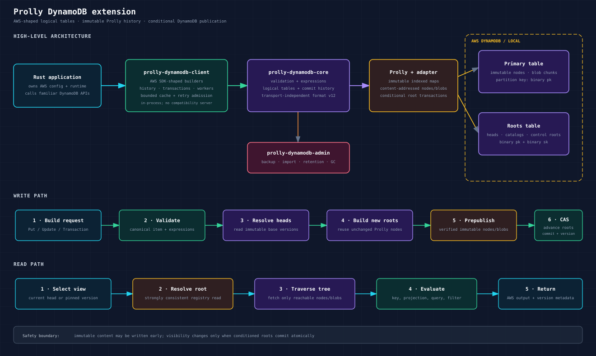

# Prolly DynamoDB extension

The DynamoDB extension provides logical DynamoDB tables backed by immutable,
versioned [Prolly](../../README.md) maps. It exposes a familiar subset of the
AWS SDK for Rust's DynamoDB fluent API while adding durable history, historical
reads, diffs, optimistic head checks, atomic multi-table transitions, audited
retention, backup/import, and explicit maintenance workflows.

It runs inside your Rust process. There is no proxy, HTTP compatibility server,
or replacement DynamoDB endpoint: your application owns the AWS SDK client and
passes it to the extension.



## Packages

| Package | Role | Use it when |
| --- | --- | --- |
| [`prolly-dynamodb-client`](client/) | AWS SDK-shaped application client | You want `put_item`, `query`, transactions, history, or workers against logical versioned tables. |
| [`prolly-dynamodb-core`](core/) | Transport-independent DynamoDB model and durable format | You are testing the logical engine in memory or integrating another Prolly store. Most applications should use the client instead. |
| [`prolly-dynamodb-admin`](admin/) | Explicit operational CLI | You need schema verification, backup/import, retention, leases, or garbage collection with reviewable plans and audit context. |
| [`prolly-store-dynamodb`](../../stores/prolly-store-dynamodb/) | Physical DynamoDB storage adapter | You need to store Prolly nodes, blobs, and named roots in DynamoDB. The client uses this adapter internally. |

## How it works

Each logical table is an immutable, indexed Prolly map. A successful mutation
creates a new map root and a durable commit rather than updating existing tree
nodes in place. Unchanged subtrees are shared between versions.

The physical adapter uses two DynamoDB tables:

- The **primary table** stores content-addressed Prolly nodes, traversal hints,
  and chunked large-value blobs under a binary `pk`.
- The **roots table** stores named root manifests, logical table heads,
  catalogs, checkpoints, leases, and other control roots under binary `pk` and
  `sk` keys. Its default name is `<primary-table>-roots`.

For a write, the client validates and canonicalizes the request, resolves the
current logical head, builds the new immutable tree, publishes verified nodes
and blobs, then conditionally advances the affected roots. A conflict cannot
expose a partial tree; it can only leave unreachable immutable content for a
later reviewed garbage-collection run. Multi-table transactions publish all
participating roots atomically.

For a read, the client resolves either the current head or a caller-pinned
historical version and traverses only nodes reachable from that root. The
ordinary `.send()` methods return official AWS output types. The additive
`.send_with_metadata()` methods also return the exact version or commit used.

The persistent database format is version 12. `Client::open` validates the
configured physical schema and format but never provisions tables or silently
upgrades an older namespace.

## Quick start with DynamoDB Local

The repository compose file starts DynamoDB Local on port 8000:

```bash
docker compose -f docker-compose.store-services.yml up -d dynamodb

export AWS_ACCESS_KEY_ID=local
export AWS_SECRET_ACCESS_KEY=local
export AWS_REGION=us-east-1
export PROLLY_STORE_DYNAMODB_ENDPOINT=http://127.0.0.1:8000
export PROLLY_STORE_DYNAMODB_TABLE=prolly-versioned-example

cargo run --manifest-path extensions/dynamodb/client/Cargo.toml \
  --example direct_crud
```

Use a unique, non-empty key prefix for every tenant or test. DynamoDB Local is
useful for contract and integration tests, but its latency, durability, and
scaling behavior do not represent AWS DynamoDB.

When using these crates from this repository, the relevant dependency setup is:

```toml
[dependencies]
prolly-dynamodb-client = { path = "extensions/dynamodb/client" }
prolly-store-dynamodb = { path = "stores/prolly-store-dynamodb" }
aws-config = { version = "=1.5.18", features = ["behavior-version-latest"] }
aws-sdk-dynamodb = "=1.73.0"
tokio = { version = "1", features = ["macros", "rt-multi-thread"] }
```

The extension currently requires Rust 1.91.1 or newer. Keep the AWS SDK pins
aligned with the extension manifests.

## Open a client and create a logical table

The caller owns AWS credential, region, retry, timeout, and endpoint
configuration. Physical provisioning is explicit through
`DynamoDbBackend::initialize_schema`; opening the logical client only validates
that schema.

```rust,no_run
use aws_sdk_dynamodb::types::{
    AttributeDefinition, KeySchemaElement, KeyType, ScalarAttributeType,
};
use prolly_dynamodb_client::Client;
use prolly_store_dynamodb::DynamoDbBackend;

async fn open() -> Result<Client, Box<dyn std::error::Error>> {
    let shared = aws_config::load_defaults(
        aws_config::BehaviorVersion::latest(),
    ).await;
    let mut sdk = aws_sdk_dynamodb::config::Builder::from(&shared);
    if let Ok(endpoint) = std::env::var("PROLLY_STORE_DYNAMODB_ENDPOINT") {
        sdk = sdk.endpoint_url(endpoint);
    }

    let backend = DynamoDbBackend::new(
        aws_sdk_dynamodb::Client::from_conf(sdk.build()),
        "prolly-versioned",
    )
    .with_root_table_name("prolly-versioned-roots")
    .with_key_prefix(b"orders-prod:".to_vec());

    backend.initialize_schema().await?;
    let client = Client::open(backend).await?;

    client.create_table()
        .table_name("Orders")
        .attribute_definitions(
            AttributeDefinition::builder()
                .attribute_name("accountId")
                .attribute_type(ScalarAttributeType::S)
                .build()?,
        )
        .key_schema(
            KeySchemaElement::builder()
                .attribute_name("accountId")
                .key_type(KeyType::Hash)
                .build()?,
        )
        .send()
        .await?;

    Ok(client)
}
```

In production, prefer provisioning the two physical tables separately and
granting the runtime identity only data-plane permissions. Use
`validate_initialized_schema` or the admin CLI's `verify` command when runtime
control-plane access is intentionally absent.

## CRUD with version metadata

The fluent builders use official AWS `AttributeValue` and output types. Request
validation happens before storage access, and unsupported fields are absent or
rejected rather than approximated.

```rust,no_run
use aws_sdk_dynamodb::types::{AttributeValue, ReturnValue};
use prolly_dynamodb_client::Client;

async fn update_order(client: &Client) -> Result<(), prolly_dynamodb_client::Error> {
    let created = client.put_item()
        .table_name("Orders")
        .item("accountId", AttributeValue::S("acct-1".into()))
        .item("status", AttributeValue::S("OPEN".into()))
        .request_token("create-order-acct-1")
        .send_with_metadata()
        .await?;
    println!("commit={:?}", created.commit_id);

    let updated = client.update_item()
        .table_name("Orders")
        .key("accountId", AttributeValue::S("acct-1".into()))
        .update_expression("SET #status = :closed")
        .expression_attribute_names("#status", "status")
        .expression_attribute_values(
            ":closed",
            AttributeValue::S("CLOSED".into()),
        )
        .return_values(ReturnValue::AllNew)
        .send_with_metadata()
        .await?;

    assert!(updated.output.attributes().is_some());
    Ok(())
}
```

Point mutations and logical table lifecycle calls accept durable request tokens
for safe retry after an ambiguous response or process restart. Reusing a token
with a different canonical request is rejected.

## Historical reads, optimistic writes, and diffs

Every accepted transition has an immutable version. Pin reads to a version when
all operations must observe the same snapshot, or attach an expected head to a
write when replacing an unobserved version would be unsafe.

```rust,no_run
use aws_sdk_dynamodb::types::AttributeValue;
use prolly_dynamodb_client::Client;

async fn inspect_history(client: &Client) -> Result<(), prolly_dynamodb_client::Error> {
    let orders = client.table("Orders");
    let before = orders.head().await?;

    orders.if_head(before.id.clone())
        .put_item()
        .item("accountId", AttributeValue::S("acct-2".into()))
        .item("status", AttributeValue::S("OPEN".into()))
        .send()
        .await?;

    let after = orders.head().await?;
    let old_item = orders.at(before.id.clone())
        .get_item()
        .key("accountId", AttributeValue::S("acct-2".into()))
        .send()
        .await?;
    assert!(old_item.item().is_none());

    let mut diff = orders.diff(before.id, after.id).page_size(256);
    while let Some(page) = diff.next_page().await? {
        for change in page.diffs {
            println!("{change:?}");
        }
    }
    Ok(())
}
```

Current-head `Query` and `Scan` paginators may observe a newer version on a
later page. Start them from `client.table(name).at(version)` when pagination
must remain on one immutable snapshot.

## Transactions

`TransactGetItems` resolves one validated root read set. `TransactWriteItems`
evaluates every condition against the original heads and advances every
participating table atomically. Explicit client request tokens provide a
durable ten-minute replay window; when omitted, the client generates a token
with the same safety behavior as the AWS SDK.

Batch writes are intentionally not atomic: each item is a separate conditional
head transition, matching DynamoDB semantics. Outcome-unknown failures are
returned as structured errors with reconciliation data and must not be blindly
replayed.

## Use cases

- **Auditable application records:** retain exact table versions and durable
  commit IDs for investigation, evidence, or change review.
- **Point-in-time reads and recovery:** pin reads, export a bounded verified
  archive, or restore through an explicit expected-head transition.
- **Atomic workflows across logical tables:** publish a consistent set of
  table heads without exposing partially updated state.
- **Sync and event processing:** consume durable per-table commit streams with
  stable IDs and at-least-once delivery.
- **Multi-tenant remote state:** isolate tenants or environments with key
  prefixes while sharing managed DynamoDB infrastructure.
- **DynamoDB-shaped domain code with versioning:** keep familiar Rust request
  builders while gaining immutable history and Prolly structural diffs.

For a raw versioned Prolly map without DynamoDB-shaped logical tables, use
[`prolly-store-dynamodb`](../../stores/prolly-store-dynamodb/) directly.

## Limitations and operational boundaries

- This is an **in-process Rust client**, not a DynamoDB-compatible network
  service. Other DynamoDB SDKs and tools cannot query its logical tables.
- Logical items are encoded into a private physical representation. Use
  dedicated tables or prefixes; native DynamoDB item clients cannot interpret
  or safely mutate the stored nodes and roots.
- Only the audited operation and field subset exposed by the client is
  supported. Check `client.capabilities()` and the detailed
  [`client compatibility contract`](client/COMPATIBILITY.md) before adoption.
- Logical items are limited to 400 KiB. Canonical values larger than 64 KiB use
  the verified chunked blob path; physical Prolly nodes have a 300 KiB safety
  ceiling.
- Transactions are bounded to 100 items and 4 MiB. Batch reads and writes also
  retain DynamoDB's 100-key and 25-operation limits.
- Immutable history consumes storage. Retention removes version roots but does
  not reclaim nodes or blobs; physical GC is a separate planned, fenced,
  audited workflow.
- `Client::open` starts no stream, TTL, or maintenance workers. Applications
  must create, run, cancel, and explicitly shut down those workers.
- Stream delivery is at-least-once. Downstream systems that need
  effectively-once effects must deduplicate the stable `CommitId` in their own
  transaction.
- Format mismatches fail closed. There is no silent database-format migration,
  and archives currently require an exact destination format match.
- Default writes prepublish immutable content before conditionally advancing
  roots. Conflicts can leave unreachable content, which is safe but may add
  storage cost until reviewed GC.
- DynamoDB request pricing, throttling, hot partitions, IAM policy, backups,
  and regional availability remain application/operator responsibilities.
  Benchmark with AWS DynamoDB before capacity or cost commitments.

## Operations and deeper references

- [`client/README.md`](client/README.md): complete client API, collection reads,
  transactions, workers, retention, backup/import, and GC examples.
- [`client/COMPATIBILITY.md`](client/COMPATIBILITY.md): exact supported API and
  durable compatibility contract.
- [`client/OPERATIONS.md`](client/OPERATIONS.md): production deployment,
  authority separation, incident, and rollback procedures.
- [`client/SECURITY.md`](client/SECURITY.md): threat model and exact-table IAM
  policy guidance.
- [`client/PERFORMANCE.md`](client/PERFORMANCE.md): measurement and scaling
  contract.
- [`admin/README.md`](admin/README.md): JSON-emitting backup, import, retention,
  lease, and garbage-collection commands.
