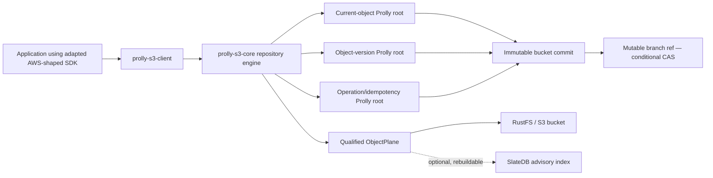

# Versioned S3 client adapter technical design and execution plan

> **For implementers:** execute phases in order. Every phase has an independently
> testable deliverable, explicit acceptance criteria, verification commands, and
> a rollback boundary. Do not begin a phase until the preceding phase's exit
> gate is satisfied.

**Goal:** Publish a Rust client adapter that preserves familiar AWS SDK for S3
operation shapes while storing each logical bucket as a Git-like sequence of
immutable Prolly snapshots. Logical payloads, Prolly nodes, commits, refs,
multipart state, and optional SlateDB metadata indexes may share one physical
S3 bucket under a reserved repository prefix.

**Primary deployment:** trusted server-side Rust applications with a
caller-owned `aws_sdk_s3::Client`, one configured physical bucket, direct S3
conditional ref publication, and an optional SlateDB cache/index.

**Reference dependency line:** `prolly-map 0.7.0`, `aws-sdk-s3 1.140.0`,
SlateDB `0.14.x`, Tokio `1.45`, Rust `1.94.1` for the AWS client crate, and
Rust `1.89` for the AWS-independent core. A later dependency change requires
the compatibility and clean-downstream gates in Phase 8.

**Related designs:**

- [`docs/object-store-vcs-design.md`](../docs/object-store-vcs-design.md)
- [`docs/prolly-vcs-design.md`](../docs/prolly-vcs-design.md)
- [`plans/019-versioned-dynamodb-client-package.md`](019-versioned-dynamodb-client-package.md)
- [`examples/filesystem_snapshot.rs`](../examples/filesystem_snapshot.rs)
- [`extensions/s3/QUALIFICATION.md`](../extensions/s3/QUALIFICATION.md)
- [`extensions/s3/OPERATIONS.md`](../extensions/s3/OPERATIONS.md)

## Status

- State: execution baseline implemented through Phase 7; not yet a
  production release
- Priority: P1
- Effort: XL
- Risk: high
- First implementation language: Rust
- Compatibility target: AWS SDK for Rust S3 call shape for an explicit subset
- Supported AWS storage profile: S3 general purpose bucket with strong object
  reads/lists and conditional `PutObject`
- Excluded storage profiles: S3 directory buckets, S3 on Outposts, and any
  bucket with conflicting default Object Lock/lifecycle policy, and any
  S3-compatible provider that fails the Phase 1 conformance suite
- Logical engine: `prolly-map` async-first engine
- Physical data store: one S3 or S3-compatible bucket
- Metadata acceleration: optional SlateDB under the same bucket or local storage
- Distributed publication: S3 conditional `PutObject` on mutable refs
- Wire-compatible S3 endpoint: out of scope

### Implementation audit and phase gates (2026-08-09)

This table is the source of truth for execution status. A check mark means the
listed implementation exists and its current automated evidence passes; it does
not waive the remaining acceptance criteria in the phase. Operators must not
enable destructive maintenance or claim production qualification until the
corresponding exit gate is complete.

| Phase | Current evidence | Remaining gate before phase completion | Status |
| --- | --- | --- | --- |
| 0 | Separate core/client crates, canonical packed-CBOR rejection, domain-separated IDs, explicit AWS 1.140.0 pin, machine-readable [`compatibility-v1.json`](../extensions/s3/compatibility-v1.json), checked-in language-neutral format/empty-repository/object-version/delta/ID/tree-format golden fixture, dependency-free Python CBOR/ID verifier, and injected clock/ID sources for deterministic cross-store restart fixtures | None | complete |
| 1 | Memory and AWS/RustFS object planes; immutable create-only writes; mutable ref CAS; physical current/version listing and exact-version deletion; zero-I/O `physical_layout` inspection API; 32-writer CAS test; signed expiring endpoint/bucket-bound attestations; physical-version snapshot proof that ordinary open performs no physical write; mismatch/signature/expiry rejection; RustFS unversioned and versioned qualification; fail-closed AWS directory/access-point/Object Lambda/Outposts/MRAP identifier classification; structured provider code/message/request-ID preservation with a generated-SDK-shaped fixture | None for implementation; each production provider/account is promoted separately in Phase 8 | complete |
| 2 | Chunked one-pass bodies, hash-verified reads/ranges, three Prolly roots, immutable-first commits/reflogs/ref CAS, initialization recovery, operation idempotency/reconciliation, concurrent disjoint-writer test; renewable CAS publication leases with immutable per-operation protection chains across ordinary, multi-delete, multipart-complete, and workspace publication; body-failure/expiry/no-cross-attribution tests; exhaustive ordinary, merge, and reset prewrite fault matrices; accepted-ref/lost-response and future-cancellation reconciliation across ordinary commits, multi-delete, merge, restore, multipart completion, and workspaces; opt-in million-chunk resource fixture; GC consumption of unexpired lease chains; final-source 10,000-operation deterministic dual-store/multi-restart corpus (1,102.53 s, 9.07 paired logical mutations/s in the debug fixture); refreshed instrumented live sequential 64 KiB RustFS baseline (1.988 puts/s, 106.469 gets/s); final-source live 160 MiB streamed multipart round trip with an 8 MiB canonical chunk budget and a separately measured 102.92 MiB total peak RSS | None | complete |
| 3 | AWS-shaped fluent put/get/head/list; official-input execution for those four operations; streaming `ByteStream`; signed snapshot-pinned cursors; managed HMAC rotation ledger with TTL-plus-skew retirement enforcement and restart verification; explicit rejection of every field in the pinned inputs; 21-page raw-key corpus with NUL, Unicode, exclusive cursors, and concurrent snapshot advancement; live 1,023/1,024/1,025-byte ASCII/multibyte key boundaries; grouped-prefix resume; multibyte delimiters; `max_keys` 0/1/1,000/1,001 policy; atomic expected-head and ETag write conditions; MD5/SHA-256 request validation; ETag/date condition precedence; precondition-before-range precedence; distinct malformed/unsatisfiable range categories; checksum responses; executable manifest-validator parity test; live RustFS payload/checksum/closed/open/suffix range/date/precondition/error/delimiter differential matrix with the raw RustFS range-precedence deviation explicitly pinned; opt-in real-AWS qualification harness | None for implementation; AWS differential promotion is a Phase 8 release gate | complete |
| 4 | Stable per-object version IDs, delete markers, historical reads, atomic multi-delete, version listing with key marker plus signed version cursor; explicit durable retention pins; injected-clock ordering and merge fixtures; live pagination advances the branch between pages and proves the signed cursor remains bound to the original snapshot | None | complete |
| 5 | Zero-copy same-repository copy; durable create/upload/list/complete/abort multipart; AWS-shaped key/upload-ID catalog; expiry cleanup; full and ranged upload-part-copy; completion idempotency and one-commit visibility; deterministic part-wins/completion-wins races; lost-response reconciliation after accepted part and terminal completion CAS; cancellation after accepted bucket publication reconciles and terminalizes the same upload without a duplicate commit; deterministic request validation before the `Active -> Completing` freeze; same-operation/different-input conflict detection; exact 10,000-part, synthetic 5 GiB part, and configured 5 TiB object limits; content-addressed immutable catalog snapshots; HMAC-authenticated repository/bucket/branch/prefix/position/expiry-bound markers; concurrent create/abort page stability; tamper/query rejection; expiry-aware exact-version GC eligibility; exact 1,000/1,001 catalog boundary; three-part cross-boundary range stream; independent-process `Completing` recovery against RustFS; measured 160 MiB streaming resource envelope | None | complete |
| 6 | Durable resumable workspaces, atomic mixed mutation publish, branches, tags, paged bounded first-parent log and object diff; bounded best-common-ancestor discovery; explicit merge plans/conflicts/ours/theirs policies; validated version/operation tree unions; two-parent merge publication; history-preserving restore; expected-head reset; branch/tag reflogs and tombstone recovery; deterministic criss-cross and truly unrelated-history fixtures; exhaustive merge/reset prewrite fault matrices; lost-response reconciliation for branch/tag create/delete/recover, merge, and reset; cancellation reconciliation for merge, restore, and workspace publication; live RustFS contention corpus with independent OS-process branch/tag create-only races, concurrent disjoint merges, explicit loser conflicts, final reconciliation, and fsck | None | complete |
| 7 | Memory/SlateDB advisory-index seam; owner-derived per-repository/per-writer SlateDB paths with durable owner records; automatic corrupt-head quarantine; canonical full rebuild with stale-entry removal; durable running/completed rebuild checkpoints and restart recovery; close/reopen persistence on same-bucket RustFS; complete owner-cache deletion/recreation with physical delete-marker evidence and byte-identical canonical physical-version snapshots; reachable-closure fsck with injected missing/corrupt coverage for every immutable family plus missing ref targets; portable clone into an empty target with independent target-provider qualification and destination-local ref CAS; identity-checked reachable-missing-closure fetch/push; destination-local CAS sync runs pinned to a source head with bounded sorted-path batches and restart recovery; immutable-first expected-head push; incremental commit fsck and missing-object repair; explicit proof that corrupt-present immutables are never overwritten; retained-root discovery across refs, tags, bounded reflogs, explicit pins, workspaces, uploads, and unexpired publication chains; immutable deterministic GC plans; durable fixed-time GC mark-run restart records; grace/candidate bounds; repository-wide failed-closed active sweep/publication fence; generation-checked explicit abort; CAS-checkpointed bounded sweep; run-bound configurable delete pacing; exact physical-version deletion; per-kind metrics; declared conservative indefinite physical-ref-version recovery policy; live-path, concurrent-head, orphan-exclusion, repair, interrupted-mark/sweep, rate, and physically versioned RustFS fixtures | None | complete |
| 8 | S3-scoped required CI for dependency policy, strict quality, 98-case behavior, exact MSRVs/clean downstreams, live RustFS, executable example, and signed exact-package rehearsal; pinned dependency baseline; strict workspace clippy; default/minimal feature checks; core build proven on Rust 1.89; exact all-feature workspace check proven on Rust 1.94.1; locked clean-downstream crates proven on Rust 1.89.0 for core and Rust 1.94.1 for minimal/AWS-only and SlateDB client surfaces; enforced reader/writer/capability requirements with future fixtures proving incompatible open fails before physical writes and a byte-identical legacy-profile fixture; independently compiled current/legacy codecs with successful new→legacy→new RustFS publication, exact `UnsupportedRepositoryFormat` results, and unchanged physical-version snapshots around rejected future reader/writer/profile opens; exact core/client `.crate` archive pairs compiled together without registry substitution, exercised through the same live rolling sequence, and sealed with the dependency policy/result into a closed twelve-artifact Ed25519 rehearsal manifest whose local ephemeral/dirty trust state is explicit; public interval metrics for object-plane SDK calls/transferred body bytes plus a public Smithy interceptor for executions, wire transmissions, retries, response classes, and response-less attempts; deterministic 503→200 retry proof; an instrumented ordinary RustFS baseline reporting 56.70 issued calls/write, 5 calls/read, and zero SDK retries; 17 S3-shaped object rows, 24 physically versioned repository-administration/maintenance rows including exact-version GC, four cross-repository clone/fetch/push rows, and one same-bucket SlateDB advisory-rebuild row reporting canonical call mix, wire attempts, separate advisory object-store calls, transfer amplification, latency, and exact physical-version storage growth through an isolated accounting client; a body-blind SlateDB-only HTTP correlation proving 125 `object_store` calls mapped one-to-one to 125 provider attempts with unique request IDs and no unexpected response classes; qualified clone returns target-side metrics so callers can aggregate source, target and wire-level control-plane costs; qualified hot-branch p50/p95/p99 latency and call amplification at 1/8/32 writers with idempotent ambiguity reconciliation and a declared 32-writer maximum for this single-node development profile; a pinned-toolchain clean provider-restart drill that requires authenticated S3 readiness rather than Docker health alone; a verified eight-workflow active-outage matrix covering ordinary, merge, multipart, workspace, atomic multi-delete, restore, administrative reset, and branch tombstone accepted-CAS loss; four-probe authenticated readiness stabilization; exact operation/ref/tombstone reconciliation; zero duplicate ref-only versions/commits; coordination-only operation replay; wire/storage accounting; payload/delete-marker/reflog checks; and fsck; a digest-pinned local IAM/credential-rotation drill proving prefix-scoped adapter operation, five denied destructive/cross-prefix probes, overlap-then-revoke rotation, terminal disabled-key mapping, final fsck, and IAM cleanup while explicitly recording RustFS beta.10 physical-version list/read action aliases; a pinned-test-binary soak harness with exact workflow/fsck records, restart/mount/source/toolchain checks, explicit memory/storage/build bounds, independent verification, and non-overwriting evidence; live RustFS coverage for CAS, exact physical-version deletion, reopen/history, AWS-shaped operations, multipart/workspaces, SlateDB advisory behavior, merge/restore, independently qualified clone, resumable fetch/push, and GC fencing | 24-hour soak, release-topology repetition or extension of the eight-workflow chaos matrix, AWS IAM exact-action separation, AWS general-purpose qualification, release-topology cost/contention plus repeat SlateDB transport correlation, and clean operator-key-signed release evidence | in progress |

The current implementation is therefore a working development preview for the
operations marked `true` in the compatibility manifest. It is deliberately not
described as production-ready: the 24-hour soak, expanded AWS provider
qualification, release-topology repetition, and operator-signed evidence remain
hard release gates rather than hidden follow-up work.

Phase 8 also includes a live physical-version backup/restore gate. A stable
112-version RustFS source inventory was archived as 111 hashed bodies plus one
delete-marker record under a canonical hashed manifest, replayed into a fresh
versioned bucket, and independently qualified. Repository identity,
main/feature/tag history, a retained logical historical read, three physical ref
recovery revisions, post-restore publication, and fsck all passed; the three
generated buckets were then removed by exact-version cleanup. Release evidence
must additionally archive and sign the external bucket encryption/policy/Object
Lock configuration and signing-key inventory; the local data-plane manifest
does not substitute for those control-plane artifacts.

Latest local qualification evidence on 2026-08-09:

- 98 unit, integration, fixture, qualification-harness, and contract test entries
  passed in the all-feature workspace run with the expensive corpus excluded,
  and the separately run
  10,000-operation deterministic dual-store/multi-restart corpus passed
  separately on Rust 1.89.0 in 1,102.53 seconds;
- strict all-target/all-feature Clippy with `-D warnings`: passed;
- AWS-independent core check with Rust 1.89.0: passed;
- exact all-feature workspace and minimal-client checks with Rust 1.94.1:
  passed; newer-line client check with Rust 1.95.0: passed;
- dependency-free Python canonical-CBOR/ID verifier: passed;
- live RustFS `1.0.0-beta.10`: all 11 normally enabled provider scenarios
  passed, including
  32-way ref CAS, exact physical-version deletion,
  independent-process multipart/ref contention recovery, reopened resumable
  sync, SlateDB quarantine/rebuild and complete cache-loss recovery, a dedicated
  physically versioned reflog reset/recovery drill, history administration, and
  GC fencing.
  The helper/flag-gated entries are not counted as default live evidence. The
  separately enabled restart, eight-workflow active outage, prefix-scoped IAM
  rotation, physical-version backup/restore, 1/8/32 contention, ordinary
  throughput, and 160 MiB resource probes plus the 46-row object,
  repository-maintenance, cross-repository, and advisory-rebuild cost matrix also
  passed against a healthy loopback service with
  `/Volumes/Workspace/prolly-data:/data`. The dedicated body-blind SlateDB
  transport run correlated 125 `object_store` API calls with exactly 125 HTTP
  attempts and 125 unique provider request IDs; 84 responses succeeded and 41
  were expected discovery misses, with no unexpected status or response-less
  attempt.
- independently compiled current and field-absent legacy v1 binaries exchanged
  writes and fscked one RustFS history; future reader/writer/profile markers
  rejected both clients with exact `UnsupportedRepositoryFormat` results and
  without changing physical-version snapshot digests. The exact packaged
  core/client pair compiled together without substituting a registry sibling,
  repeated that live sequence, and produced a closed twelve-artifact
  Ed25519 manifest with SHA-256
  `259fb064b4615e79ec433ab9d4feb47f55e384f1fa6c611753f74f18ac18a39b`;
  its dirty-source and ephemeral-signer labels keep it correctly scoped as a
  current-source local workflow rehearsal, not release evidence.

The opt-in multipart resource probe streams a 160 MiB logical object (20 times
the 8 MiB canonical content-chunk budget) from a 1 MiB generated source through
one-part completion and streams it back without collecting the body. Running
the final-source, already-built test binary directly under `/usr/bin/time -l`
measured 107,921,408 bytes (102.92 MiB) maximum RSS versus the prior
8,830,976-byte (8.42 MiB) no-op binary baseline, 29.57 seconds wall time, no
swaps or block input. The release envelope for this debug qualification binary
is therefore 128 MiB total RSS, including one 8 MiB canonical chunk and the
observed runtime/SDK/test overhead with headroom. Production release builds must
re-record rather than inherit this number.



The ref CAS is the only logical visibility point. Every object named by the
three state roots, commit, delta, and reflog is durable and lease-protected
before that CAS. Provider-issued ETags and physical version IDs never become
logical IDs.

## 1. Executive summary

The product is an in-process client adapter, not an S3-compatible HTTP server.
Applications replace the concrete `aws_sdk_s3::Client` at logical object call
sites with `prolly_s3::Client`, while continuing to supply their existing AWS
client for credentials, signing, transport, endpoint selection, and provider
retries.

```rust,no_run
use std::sync::Arc;
use aws_sdk_s3::primitives::ByteStream;
use prolly_s3_client::{Client, HmacAttestationSigner, HmacTokenSigner, ProviderIdentity};

async fn open(
    aws: aws_sdk_s3::Client,
    cursor_key: Vec<u8>,
) -> Result<Client, prolly_s3_client::Error> {
    Client::builder()
        .aws_client(aws)
        .bucket("acme-assets")
        .repository_prefix(".prolly/v1")
        .default_branch("main")
        .writer("asset-service")
        .provider_identity(ProviderIdentity::aws_region("us-west-2"))
        .attestation_signer(Arc::new(HmacAttestationSigner::single(
            "provider-key-2026-08",
            vec![9_u8; 32],
        )?))
        .token_signer(Arc::new(HmacTokenSigner::single(
            "cursor-key-2026-08",
            cursor_key,
        )?))
        .open()
        .await
}

async fn write(client: &Client) -> Result<(), prolly_s3_client::Error> {
    client
        .put_object()
        .bucket("acme-assets")
        .key("images/logo.png")
        .body(ByteStream::from_static(b"logo"))
        .content_type("image/png")
        .send()
        .await?;
    Ok(())
}
```

Provider identity is explicit because an already-constructed AWS client cannot
reliably expose every endpoint/addressing input used by the attestation
fingerprint. There is intentionally no no-op `provider_verified(true)` escape
hatch.

Every ordinary logical mutation produces one immutable bucket commit. A commit
contains a complete bucket-state handle and one or more parent commit IDs.
Payloads, Prolly nodes, version records, and the commit object become durable
before the selected branch ref moves. The ref update is the sole visibility
point and uses S3 conditional writes.

The design keeps three identities separate:

| Identity | Meaning | Source |
| --- | --- | --- |
| `ObjectVersionId` | One mutation of one logical S3 key | Canonical logical record plus operation ID |
| `CommitId` | One immutable snapshot of the entire logical bucket | Canonical commit bytes |
| `StorageToken` | Concurrency token for one mutable physical ref object | S3 ETag/version metadata |

An unrelated key update therefore changes the bucket `CommitId` but does not
change another object's `ObjectVersionId`. S3 ETags and physical
version IDs never become logical identities.

SlateDB may materialize object metadata, commit summaries, and hot Prolly nodes
under a separate prefix in the same bucket. The cache is rebuildable and may be
deleted without changing visible behavior. It is not the authority for
multi-process branch movement. A single-writer deployment may deliberately use
SlateDB more deeply, but that is a separately declared coordination mode.

The adapter streams unknown-length and large bodies into fixed-size immutable
content chunks. A canonical manifest records their layout, order, lengths, and
per-chunk hashes; the logical version stores supported whole/composite
checksums. This avoids a temporary physical object and lets ranged reads
validate every chunk they return.

## 2. Background and current foundation

### 2.1 Existing repository capabilities

The repository already provides most of the storage algorithms required by the
logical bucket:

- immutable ordered `Tree` handles;
- deterministic SHA-256 content-addressed nodes;
- `AsyncProlly` and `AsyncStore` for remote I/O;
- structural diff and three-way merge;
- `BlobRef`, `ValueRef`, and `AsyncBlobStore` for large values;
- named roots and compare-and-swap contracts;
- missing-node planning, copy helpers, proofs, and scoped GC;
- a filesystem snapshot example mapping path keys to blob references;
- a SlateDB store adapter for single-writer object-store-backed persistence.

The proposed object-store VCS design already separates immutable nodes, blobs,
and commits from mutable refs. This plan makes that separation concrete for S3
object semantics and an AWS-shaped client.

### 2.2 Why the existing `VersionedMap` is not the bucket repository

`VersionedMap` is useful for linear managed-map history, but the S3 product
needs branches, parent commits, reflogs, object-local version IDs, delete
markers, multipart staging, and immutable-first publication followed by one
remote ref CAS. It must not require an atomic transaction spanning all physical
S3 objects.

The S3 core may reuse Prolly tree operations and selected version helpers, but
it owns a separate bucket commit graph and publication protocol.

### 2.3 SlateDB constraint

The current `SlateDbStore` adapter serializes named-root preconditions inside
one adapter instance and requires one writer for each SlateDB path. SlateDB can
fence stale writers, but it is not a concurrent multi-writer branch database.

Consequently:

- direct S3 conditional writes own distributed branch publication;
- SlateDB may cache or index canonical metadata;
- independent writers use local or writer-specific SlateDB paths;
- a shared SlateDB path is permitted only in an explicit single-writer mode.

### 2.4 Gaps this plan closes

The baseline repository originally lacked the following capabilities. The
status table above is authoritative about which now have executable evidence
and which remain phase gates:

- an S3-backed immutable node/chunk/manifest/commit object plane;
- distributed ref values carrying physical update tokens;
- bucket commits with parentage and canonical IDs;
- a current-object tree plus an object-version catalog;
- logical S3 metadata codecs and delete-marker semantics;
- an AWS-shaped Rust client with supported-field validation;
- snapshot-pinned continuation tokens;
- multipart staging that publishes only on completion;
- atomic multi-object commit sessions;
- branch, tag, log, diff, merge, and restore interfaces;
- a rebuildable SlateDB advisory index;
- bucket-aware clone, fsck, retention, and GC workflows.

### 2.5 Audit findings resolved by this revision

The execution audit found design and qualification gaps that would otherwise
block or invalidate later phases. Each row is resolved before the relevant
phase exit or release gate:

| Gap | Resolution |
| --- | --- |
| Final content path is unknown while a body streams | Stream into fixed-size content-addressed chunks and publish a canonical content manifest. Never buffer the full object or rename a temporary object. |
| A reflog write could fail after the branch commit point | Write the immutable reflog entry before ref CAS and store its ID in the ref value. Failed CAS leaves an unreachable reflog entry for GC. |
| Wall-clock timestamps could order versions incorrectly | Order versions by commit generation, mutation ordinal, and version ID. Use wall-clock time only for display and retention hints. |
| Retrying an upload could consume a non-replayable `ByteStream` twice | Stage content once, then reuse its immutable `ContentRef` for logical retries. Provider retries remain inside the AWS SDK body contract. |
| Physical bucket versioning could prevent physical GC from reclaiming bytes | The object plane lists and deletes exact physical versions. GC reports delete markers and noncurrent versions separately. |
| S3-compatible capability probing was underspecified | Initialization runs an isolated conformance probe and stores a signed, expiring attestation. Open reads and verifies it without probe writes. |
| Reconciliation after cancellation had no public result | Add `OutcomeUnknown`, operation lookup, and explicit `reconcile_operation`. Cancellation after a possible ref CAS never reports a definitive cancellation without reconciliation. |
| Commit sessions were process-local | Persist a CAS-protected workspace manifest and support resume by `WorkspaceId`. Staged payloads remain immutable. |
| The object plane lacked exact range, listing, and delete contracts | Define a capability-bearing `ObjectPlane` with immutable put, ranged get, mutable CAS, paged list, and exact physical-version delete. |
| Ref and commit generations were conflated | `CommitGeneration` orders history; `RefGeneration` counts updates to one ref. They are separate canonical types. |
| Initialization could change repository identity after an early crash | A create-only initialization intent fixes the repository ID and format parameters before canonical objects are written. |
| Independently chunked multipart parts do not fit a fixed-chunk manifest | `Composed` manifests permit bounded short internal chunks while every chunk remains hash-verified. Completion does not reread the full object. |
| GC could sweep a slow unpublished operation | Every ordinary mutation holds a renewable publication lease whose protected set becomes a retained GC root. |
| Cursor signing could break across clients or restarts | Paginated listing requires a shared signer/key ring with explicit rotation and retention windows. No ephemeral key is generated on open. |
| Provider observations in the format would prevent portable clone | The canonical format records a required capability-profile version; separate endpoint-specific attestations record observed behavior. |
| Adding a profile field could change canonical v1 bytes and strand old readers | Profile 1 is an omitted/default trailing field, so original v1 format and initialization-intent bytes remain identical. A nondefault future profile is encoded explicitly and old/new incompatible clients fail before writes. |
| Persisted reader/writer requirements were not enforced | `open` validates reader, writer, and capability-profile requirements before constructing the repository. Future-requirement fixtures snapshot the physical namespace and prove rejected opens perform no mutation. |
| Existing `RootManifest` includes runtime tuning and timestamps | Canonical commits use `TreeRootV1` with only root CID and persisted-format digest. Runtime config is attached after decoding. |
| Logical ETag behavior was unspecified | V1 uses quoted full-content MD5 for `PutObject`, the conventional multipart composite MD5 for completion, and preserves the source ETag for zero-copy copies. Chunk CIDs provide integrity. |
| A retained root could publish after GC's final scan but before deletion | Each destructive batch owns a durable `Running` sweep fence. A publisher creates its protection lease before checking the fence; it either becomes visible to the mark scan or fails publication while deletion is active. A stranded `Running` state fails closed indefinitely; only a generation-checked operator abort, after establishing that no worker can still delete, releases the fence. Paused/completed/aborted runs do not block writers. |
| Process-local time and UUID generation prevented reproducible histories | `Clock` and `IdSource` are injected repository dependencies. Fixed/sequence implementations drive restart and cross-object-plane determinism fixtures. |
| Multipart uploads had no discoverable lifecycle | Active manifests are listed in stable `(key, UploadId)` order, terminal records remain for reconciliation, configured expiry uses CAS tombstones, and immutable catalog snapshots plus signed cursors pin scalable pages. |
| Long GC sweeps had no durable progress or useful accounting | `gc/runs` stores CAS-protected batch checkpoints and cumulative counts/bytes by immutable object family. Interrupted active sweeps fail closed and have a tested explicit abort transition. A validated 0-or-1..=1,000 deletes/second setting is bound into each run and paced while the publication fence remains active. |
| A merge retry after an accepted-but-canceled ref CAS recomputed its digest from the new head | When an explicit operation ID is already reachable, merge reconstructs the original two-parent inputs, selected base, and policy before reconciliation. A changed source/base/policy returns `IdempotencyConflict`; an exact retry returns the original commit. |
| Qualification counted flag-disabled probe tests as live work | Default RustFS scenarios and dedicated throughput/resource/contention/restart probes are reported separately. The soak deadline begins after baseline collection and the runner guarantees at least one iteration. |
| Provider object versions were visible but lacked a safe recovery API | Administrative physical-ref listing validates canonical ref records; recovery fscks the selected target and uses the normal expected-head reset/reflog path instead of raw provider overwrite. |
| Declared per-call deadlines and retry limits were admission-only options | Put/get/head/list now enforce deadlines. Pre-I/O expiry is retry-safe; an in-flight publishing timeout is `OutcomeUnknown` with a durable operation ID. Put retry limits override only logical ref-conflict retries. |
| Diff pagination materialized the complete change set before truncation | `diff_page` consumes the structural diff stream and retains at most `limit + 1` entries; its raw-key cursor is exclusive and tied to exact immutable endpoints. |
| History and upload-expiry capabilities existed only in the core | The client exposes exact-commit `log_page`, bounded `diff_page`, and explicit `expire_multipart_uploads` methods, with live RustFS contract coverage. |
| A nominal 24-hour loop could rebuild binaries or grow silently | The soak gate builds once, pins the executable digest, runs independent processes directly, requires per-workflow fsck/storage records, checks provider restarts/memory/data/build growth, preserves failures, and verifies evidence independently. |
| A maximum-speed soak retained every generated repository and measured fixture accumulation instead of bounded longevity | Soak schema v2 exact-deletes every physical version after each workflow's fsck/footprint record, proves zero remain, runs at a signed one-minute cadence, and enforces both per-iteration and absolute provider-data bounds. |
| Cargo package verification could select an older registry core instead of the sibling release archive | The release rehearsal packages the workspace without registry verification, extracts both exact archives, compiles the client against the extracted core in offline mode, records that check, then runs rolling compatibility from the same pair. |
| AWS SDK defaults retained an advisory-bearing legacy TLS stack | Disable SDK defaults and enable only the modern HTTPS client/HTTP 1.x/Tokio/SigV4a features. The release gate rejects Rustls 0.21/rustls-webpki 0.101 in every shipped qualification lockfile. |
| SlateDB defaults pulled an unused Foyer/Bincode/Paste cache graph | Depend directly on SlateDB with defaults disabled and only its AWS object-store backend enabled. The advisory index does not depend on the separate Prolly SlateDB engine adapter. |
| A signed package rehearsal did not bind the dependency policy that approved its lockfile | Run the security gate before packaging and sign `deny.toml` plus the audit result in the same closed twelve-artifact evidence set. |
| Phase status treated provider-account promotion as an unfinished implementation dependency | Close implementation phases against the reference conformance profile and move every AWS/account/custom-endpoint promotion into Phase 8. Later implementation phases can then follow their declared exit gates without claiming unrun provider evidence. |
| The design required repeatable release gates but had no S3-scoped required CI | Add a path-scoped workflow for dependency policy, format, strict Clippy, the 98-case non-corpus suite, exact MSRVs, clean downstreams, live RustFS, the executable example, and exact-package rolling evidence. Long soak and account-owned AWS tests stay separate explicit gates. |
| A dependency change made the previously recorded streaming RSS envelope stale | Rerun the prebuilt final-source binary under `/usr/bin/time -l`, record the 102.92 MiB observation, and set a 128 MiB debug qualification envelope with release-build remeasurement required. |
| RustFS was version-tagged but the tag could be repointed | Pin the multi-architecture OCI index digest in Compose and required CI; every rehearsal additionally records the resolved platform image ID. |

No unresolved design question blocks Phase 0. A phase may discover provider or
SDK behavior that contradicts this plan; the corresponding STOP condition then
requires a design revision before implementation continues.

## 3. Product scope and compatibility contract

### 3.1 Goals

- Preserve familiar Rust call chains such as
  `client.get_object().bucket(...).key(...).send().await`.
- Reuse official AWS SDK S3 model, primitive, input, and output types where
  their public constructors permit it.
- Make every successful logical write reachable through an immutable bucket
  commit.
- Support independent processes through durable S3 ref CAS, never a local
  mutex.
- Provide stable historical reads, object versions, branches, tags, log, diff,
  merge, and restore.
- Group multiple logical S3 mutations into one atomic bucket commit.
- Keep request bodies streaming and memory bounded.
- Retry logical publication without reading a caller body more than once.
- Keep all durable repository data under one configurable prefix in the same
  physical bucket.
- Fail closed for unsupported operations and fields.
- Publish measurable latency, request amplification, storage amplification,
  and contention envelopes.

### 3.2 Non-goals

- Being type-identical to `aws_sdk_s3::Client` or generated fluent builders.
- Providing S3 wire compatibility to unmodified clients.
- Making logical keys visible to raw S3 listing or inventory.
- Forwarding unknown operations to the physical bucket.
- Treating S3 bucket versioning as logical repository history.
- Using SlateDB as multi-writer ref authority.
- Supporting bucket provisioning, ACL administration, Object Lock, lifecycle,
  website hosting, S3 Select, replication, notifications, or Inventory in v1.
- Supporting S3 directory buckets, S3 on Outposts, access-point aliases, or
  multi-region access points in v1.
- Claiming compatibility with an S3-compatible provider before it passes the
  object-plane conformance suite.
- Providing a security boundary against code that holds physical bucket write
  credentials.
- Starting implicit compaction, retention, migration, or GC workers on client
  open.

### 3.3 Trust and deployment boundary

The client is for trusted server-side applications. Any principal able to write
the internal repository prefix can bypass codecs, delete immutable objects, or
move refs outside the client. Untrusted browser, mobile, partner, or tenant
traffic requires an application-owned network boundary and short-lived logical
authorization; that is a separate design.

### 3.4 Compatibility levels

Every operation and field is classified:

| Level | Contract |
| --- | --- |
| Exact | Observable logical behavior matches the declared S3 behavior. |
| Compatible stronger | Behavior is stronger, such as snapshot-pinned pagination. |
| Subset | Only listed fields/forms are accepted. Others return `UnsupportedParameter`. |
| Extension | Additive repository behavior with no S3 equivalent. |
| Unsupported | Rejected with a stable error. |

The client exports a machine-readable capability report. A generated builder
setter existing in AWS SDK documentation does not imply support.

### 3.5 Normative v1 limits

The v1 format and capability manifest enforce these limits before publication:

| Limit | V1 contract |
| --- | --- |
| Logical key | Valid UTF-8, 1 to 1,024 encoded bytes |
| Repository prefix | 1 to 384 UTF-8 bytes after canonical validation |
| `ListObjectsV2` page | 0 to 1,000 combined contents/common-prefix entries |
| `DeleteObjects` request | 1 to 1,000 logical identifiers |
| Multipart part number | 1 through 10,000 |
| Multipart part size | 5 MiB through 5 GiB, except the final part may be smaller |
| Multipart parts returned per page | At most 1,000 |
| Multipart uploads returned per page | At most 1,000 |
| Repository log/diff/ref page | At most 1,000 entries; default 100 |
| Object size | Minimum of provider capability, configured safety limit, and the AWS profile limit |
| User metadata | At most 2,048 UTF-8 bytes across normalized names and values |
| Stored logical headers plus metadata | At most 8,192 canonical encoded bytes |
| Branch/tag name | Valid canonical ref name, at most 255 UTF-8 bytes after validation |
| Commit parents | At most 2 in v1 |
| Mutations per bucket commit | At most 10,000; ordinary S3 calls use their lower operation limit |
| Logical retry count | 0 through 16; default 3 for unconditional one-operation writes |
| Continuation-token lifetime | 1 second through 24 hours; default 15 minutes |
| Token clock-skew allowance | At most 5 minutes |
| Publication/workspace lease | 5 minutes through 24 hours; default 1 hour |
| Protection segment | At most 1,024 physical references |
| Multipart upload expiry | 1 hour through 30 days; default 7 days |

The format marker stores limits that affect canonical bytes or key ordering.
Runtime limits may be stricter but never looser. AWS S3 currently permits up to
10,000 multipart parts, part sizes from 5 MiB through 5 GiB except for the last
part, and a 48.8 TiB object. Provider conformance records the actual supported
maximum instead of assuming the AWS value.

S3 sorts general-purpose-bucket keys by UTF-8 bytes. The Prolly objects tree
uses those bytes directly, so prefix and delimiter behavior does not require a
second ordering model.

Repository prefixes have no leading/trailing slash, empty segment, `.` segment,
or `..` segment. Every physical layout constructor proves its result is at most
1,024 bytes. Ref paths use lowercase hex of canonical name bytes. Hex is
collision-free, preserves byte order for paged ref listing, and expands the
255-byte maximum name to at most 510 bytes; the prefix budget leaves room for
the reflog suffix. The ref payload stores and verifies the original name.

Branch and tag names are exact UTF-8 bytes with no Unicode normalization. They
follow the Git ref safety subset: no leading/trailing or repeated slash, empty,
`.` or `..` component, control/DEL/space, `~`, `^`, `:`, `?`, `*`, `[`, `\\`,
`..`, `@{`, trailing `.`, or component ending `.lock`. The reserved literal
`HEAD` is rejected. Names remain distinct by byte sequence.

### 3.6 Consistency and provider capability profile

```rust
pub struct ProviderCapabilities {
    pub conditional_create: bool,
    pub conditional_update: bool,
    pub strong_get_after_put: bool,
    pub strong_list_after_put: bool,
    pub strong_list_after_delete: bool,
    pub ranged_get: bool,
    pub paged_list: bool,
    pub list_physical_versions: bool,
    pub exact_version_delete: bool,
    pub physical_versioning: PhysicalVersioning,
    pub conflicting_lifecycle_rule: bool,
    pub default_object_lock_retention: bool,
    pub max_object_bytes: u64,
    pub max_single_put_bytes: u64,
}

pub enum PhysicalVersioning {
    Unversioned,
    Enabled,
    Suspended,
}
```

Distributed mode requires conditional create/update, strong object GET after
PUT, strong ref HEAD/GET after update, strong listing after put/delete, paged
listing, and ranged GET. AWS S3
general purpose buckets satisfy the strong object read/list profile. A custom
endpoint must pass the same behavioral tests; a configuration flag cannot
override a failed correctness capability.

`Suspended` remains a physically versioned profile for listing and deletion:
older version IDs may still exist. `open` reads bucket versioning state and
the relevant lifecycle/Object Lock configuration and fails if they differ from
the selected attestation; switching state requires explicit requalification.

An operation captures one valid attestation at start. A long-lived client
rejects new operations after its attestation expires until the caller invokes
the read-only `refresh_capabilities` path. No timer or background probe is
started.

V1 has one coordination profile: distributed conditional S3 ref CAS. Ordinary
`open` is physically read-only, but the resulting client is writer-capable and
therefore requires the full persisted provider profile. A separately qualified
read-only client and an externally fenced single-writer mode are future
capabilities; v1 never weakens CAS requirements merely because one process is
expected.

## 4. Package and module design

### 4.1 Proposed packages

```text
extensions/s3/core/
  src/model.rs          canonical identifiers and durable records
  src/codec.rs          domain-separated canonical v1 encoding
  src/content.rs        chunking, manifests, checksums, and ranged reads
  src/object_plane.rs   narrow provider-independent storage contract
  src/protection.rs     renewable publication leases/protection chains
  src/repository.rs     state, commits, refs, history, sync, fsck, and GC
  src/runtime.rs        injected clocks and ID sources
  src/store.rs          Prolly/ObjectPlane bridge

extensions/s3/client/
  src/client.rs         Client, Snapshot, sessions, AWS-shaped builders/conversion
  src/aws_object.rs     caller-owned AWS SDK object-plane adapter
  src/provider.rs       qualification and signed capability attestations
  src/advisory.rs       optional SlateDB/memory advisory-index seam
  src/wire_metrics.rs   Smithy execution/retry/response telemetry
  tests/                compatibility, AWS, and RustFS qualification
```

`prolly-s3-core` does not expose AWS SDK types. `prolly-s3-client` is thin: it
validates supported fields, converts to core commands, calls one semantic
implementation, and builds official AWS outputs.

The initial implementation may place both packages in a nested workspace until
the repository adopts a top-level Cargo workspace. Package placement must not
force unrelated `prolly-map` users to compile AWS or SlateDB dependencies.

### 4.2 Deep bucket repository module

```text
AWS-shaped Client / Snapshot / CommitSession / Repository
                         |
                 BucketRepository
       canonical commands, commits, history, publication
         /                    |                    \
  AsyncProlly state     immutable content      ref publication
         \                    |                    /
                     ObjectPlane

                 AdvisoryIndex (optional)
```

The external interface does not expose `Tree`, `Cid`, `BlobRef`, physical
paths, SlateDB handles, or physical ref tokens. Those remain implementation
details behind the repository seam.

### 4.3 Dependency categories

- Prolly algorithms are in-process and composed directly.
- SlateDB is local-substitutable through a rebuildable advisory-index seam.
- S3 is a true external dependency behind `ObjectPlane`.
- `AwsS3ObjectPlane` is the production adapter.
- `MemoryObjectPlane` deterministically models CAS, failures, and corruption.
- S3-compatible endpoints use the AWS adapter with an explicit endpoint plus a
  capability probe; compatibility is not guessed from provider name.

### 4.4 Internal object-plane contract

The repository module owns a narrow storage contract. Prolly nodes, content
chunks, manifests, commits, deltas, reflogs, and refs all use this contract.

```rust
pub trait ObjectPlane: Send + Sync {
    fn capabilities(&self) -> &ProviderCapabilities;
    async fn get(&self, request: GetRequest)
        -> Result<Option<StoredObject>, StorageError>;
    async fn head(&self, path: &ObjectPath)
        -> Result<Option<StoredMetadata>, StorageError>;
    async fn put_immutable(&self, request: ImmutablePut)
        -> Result<ImmutablePutOutcome, StorageError>;
    async fn load_mutable(&self, path: &ObjectPath)
        -> Result<Option<MutableObject>, StorageError>;
    async fn compare_exchange(&self, request: CompareExchange)
        -> Result<CompareExchangeOutcome, StorageError>;
    async fn list(&self, request: ListRequest)
        -> Result<PhysicalListPage, StorageError>;
    async fn delete_exact(&self, path: &ObjectPath, version: PhysicalVersion)
        -> Result<DeleteOutcome, StorageError>;
}

pub enum PhysicalVersion {
    Unversioned { token: Option<StorageToken> },
    Versioned { version_id: String },
}
```

`GetRequest` contains one path, at most one inclusive byte range, and an
optional exact physical version. `ImmutablePut` requires replayable bytes, an
expected SHA-256 digest, length, and create-only mode. Raw caller streams never
cross this method; `content.rs` converts them into bounded replayable chunks.

`StoredMetadata`, `MutableObject`, and `PhysicalListPage` retain physical ETag,
version ID, length, checksum metadata, and last-modified time. Only ref CAS and
maintenance use the physical token/version. `delete_exact` is mandatory when
physical bucket versioning is enabled, because an unversioned delete
would create another delete marker instead of reclaiming data.

`load_mutable` obtains bytes and their storage token from one provider response;
it never composes a body GET with a racing HEAD. `compare_exchange` distinguishes
create (`If-None-Match: *`) from update (`If-Match: <token>`) and returns the
observed winning value/token on precondition failure when the provider permits.

`ListRequest` selects current objects or all physical versions and carries the
provider's opaque continuation token unchanged. GC and ref recovery require
all-version listing on a physically versioned bucket; ordinary logical listing
never uses this physical order.

The interface does not promise multi-object transactions. Repository
correctness uses immutable idempotence plus one mutable compare-exchange.

`ProllyObjectStore<ObjectPlane>` implements `AsyncStore` for node batches and
uses `publish_nodes` only for immutable node durability. Branch publication
does not use `AsyncManifestStore`, because the repository ref must retain and
compare the provider's exact storage token. The S3 adapter does not implement
`AsyncTransactionalStore`: a physical bucket cannot atomically commit nodes and
roots, and claiming that contract would bypass immutable-first publication.
Large logical payloads use `content.rs`, not the whole-buffer
`AsyncBlobStore` interface.

Write paths construct an explicit per-publication store wrapper with a
`ProtectionSink`; each node/chunk/manifest CID referenced during staging is fed
into the lease's bounded protection segments whether the physical put created
it or found identical existing content. Reads use the same base store without a
sink. The design does not rely on task-local/global operation context, so
concurrent publications cannot attribute objects to the wrong lease.

## 5. Public Rust interface

### 5.1 Client construction

```rust
pub struct Client;
pub struct ClientBuilder;

impl Client {
    pub fn builder() -> ClientBuilder;
}

impl ClientBuilder {
    pub fn aws_client(self, client: aws_sdk_s3::Client) -> Self;
    pub fn bucket(self, bucket: impl Into<String>) -> Self;
    pub fn repository_prefix(self, prefix: impl Into<String>) -> Self;
    pub fn provider_identity(self, identity: ProviderIdentity) -> Self;
    pub fn default_branch(self, branch: impl Into<String>) -> Self;
    pub fn writer(self, actor: impl Into<String>) -> Self;
    pub fn logical_retry_limit(self, attempts: u8) -> Self;
    pub fn gc_delete_rate_limit_per_second(self, deletes: u32) -> Self;
    pub fn token_signer(self, signer: Arc<dyn TokenSigner>) -> Self;
    pub fn cursor_ttl(self, ttl: Duration) -> Self;
    pub fn cursor_clock_skew(self, skew: Duration) -> Self;
    pub fn attestation_signer(self, signer: Arc<dyn AttestationSigner>) -> Self;
    pub fn provider_attestation(self, id: ProviderProfileId) -> Self;
    pub fn provider_attestation_validity(self, validity: Duration) -> Self;
    pub fn advisory_index(self, index: Arc<dyn AdvisoryIndex>) -> Self;
    pub async fn qualify_provider(self) -> Result<ProviderAttestationV1, Error>;
    pub async fn initialize(self) -> Result<Client, Error>;
    pub async fn open(self) -> Result<Client, Error>;
}
```

The builder requires an explicit physical bucket and nonroot repository prefix.
The logical bucket name is exactly the configured physical bucket in v1; aliases
are deliberately deferred. `ProviderIdentity` is explicit because a constructed
AWS client does not expose every endpoint, region, and addressing input needed
for a stable attestation fingerprint. Format-bearing limits are loaded from the
repository marker rather than supplied as mutable client runtime options.

`initialize` creates or loads the initialization intent, runs the isolated
provider conformance probe, writes the empty immutable closure, creates the
format marker, and creates a missing matching initial branch ref. It never
overwrites or "repairs" a divergent ref. Repeating it with the same format is
idempotent; a different repository format or initial ref fails closed.

`open` performs no physical writes. It loads the persisted capability attestation
and rejects format, hash, codec, bucket type, or conditional-write
incompatibility before serving calls. Cache warming starts only when the caller
explicitly requests it.

When `provider_attestation` is set, `open` requires that exact signed record.
When omitted, it reads all matching nonexpired attestations and selects the
greatest `(observed_at_millis, ProviderProfileId)` deterministically. Production
deployments should pin the ID during rollout; automatic selection exists for
single-provider development and never accepts an unsigned record.

Listing APIs require a shared `TokenSigner`/verification key ring. The client
never generates an ephemeral signing key on `open`, because another process
and a later restart must verify existing cursors. A deployment that omits the
signer can use point operations but the capability report marks paginated
listing unavailable and builders fail before reading repository data.

The built-in HMAC signer has an explicit rotation ledger. An active key is
retained indefinitely, a retired key records when it stopped signing, and a
removed-key tombstone preserves that retirement instant after secret deletion.
Builder validation requires verification material through cursor TTL plus
configured clock skew and rejects premature deletion, duplicate/ambiguous key
IDs, zero or over-24-hour TTLs, and skew above 15 minutes. Reconstructing the
same managed ring after restart verifies pre-rotation tokens; only the active
key signs new tokens.

### 5.2 Familiar operation surface

```rust
impl Client {
    pub fn get_object(&self) -> GetObjectBuilder;
    pub fn head_object(&self) -> HeadObjectBuilder;
    pub fn put_object(&self) -> PutObjectBuilder;
    pub fn delete_object(&self) -> DeleteObjectBuilder;
    pub fn delete_objects(&self) -> DeleteObjectsBuilder;
    pub fn copy_object(&self) -> CopyObjectBuilder;
    pub fn list_objects_v2(&self) -> ListObjectsV2Builder;
    pub fn list_object_versions(&self) -> ListObjectVersionsBuilder;
    pub fn create_multipart_upload(&self) -> CreateMultipartUploadBuilder;
    pub fn upload_part(&self) -> UploadPartBuilder;
    pub fn upload_part_copy(&self) -> UploadPartCopyBuilder;
    pub fn list_parts(&self) -> ListPartsBuilder;
    pub fn list_multipart_uploads(&self) -> ListMultipartUploadsBuilder;
    pub fn complete_multipart_upload(&self) -> CompleteMultipartUploadBuilder;
    pub fn abort_multipart_upload(&self) -> AbortMultipartUploadBuilder;
    pub async fn refresh_capabilities(&self) -> Result<ProviderProfileId, Error>;
}
```

Builders mirror supported AWS setter names and `set_*` forms. They are owned by
this crate because generated AWS fluent builders are bound to Smithy HTTP
execution. Each builder lowers to an input-first method:

```rust
impl Client {
    pub async fn execute_get_object(
        &self,
        input: aws_sdk_s3::operation::get_object::GetObjectInput,
        options: ReadOptions,
    ) -> Result<aws_sdk_s3::operation::get_object::GetObjectOutput, Error>;

    pub async fn execute_put_object(
        &self,
        input: aws_sdk_s3::operation::put_object::PutObjectInput,
        options: WriteOptions,
    ) -> Result<Versioned<aws_sdk_s3::operation::put_object::PutObjectOutput>, Error>;

    pub async fn execute_head_object(
        &self,
        input: aws_sdk_s3::operation::head_object::HeadObjectInput,
        options: ReadOptions,
    ) -> Result<aws_sdk_s3::operation::head_object::HeadObjectOutput, Error>;

    pub async fn execute_list_objects_v2(
        &self,
        input: aws_sdk_s3::operation::list_objects_v2::ListObjectsV2Input,
        options: ReadOptions,
    ) -> Result<Versioned<aws_sdk_s3::operation::list_objects_v2::ListObjectsV2Output>, Error>;

    pub async fn reconcile_operation(
        &self,
        operation: OperationId,
    ) -> Result<Option<CommitReceipt>, Error>;
}
```

Every accepted input field is validated. Unknown or unsupported fields never
fall through to S3.

```rust
pub struct ReadOptions {
    pub deadline: Option<Instant>,
}

pub struct WriteOptions {
    pub operation_id: Option<OperationId>,
    pub expected_head: Option<CommitId>,
    pub logical_retry_limit: Option<u8>,
    pub deadline: Option<Instant>,
}
```

If absent, `OperationId` is generated once before the body is read and returned
in the receipt/error context. Callers that need retry across process loss
persist and reuse it. An explicit expected head disables implicit ref-conflict
replay.

The `Client` is already bound to repository, bucket, and branch, so
`reconcile_operation` accepts the stable `OperationId` directly. An
`OutcomeUnknown` error carries the same ID in `Error::operation_id` with
`RetryAdvice::ReconcileOperation`; IDs are safe to persist but do not grant
authorization. Read/list deadlines return retry-safe `Timeout`. A write that
crosses its deadline after starting returns `OutcomeUnknown`, never a false
not-committed result. The per-call logical retry limit overrides the client
default only for that put.

### 5.3 Version metadata

```rust
pub struct Versioned<T> {
    pub output: T,
    pub snapshot: CommitId,
    pub commit: Option<CommitReceipt>,
}

pub struct CommitReceipt {
    pub id: CommitId,
    pub operation: OperationId,
    pub branch: BranchName,
    pub parents: Vec<CommitId>,
    pub changed_keys: u64,
}
```

Official S3 output `version_id` fields contain encoded `ObjectVersionId`
values. Bucket commit IDs are available only through `Versioned<T>`, snapshot
handles, commit log results, and explicit response metadata.

Text IDs are lowercase, version-prefixed, unpadded base32 encodings of their
fixed canonical bytes: `pov1_...` for object versions and `pbc1_...` for bucket
commits. Parsers require the prefix, exact decoded length, canonical alphabet,
and no padding. The provider's physical version string is never accepted
as a logical `version_id`.

### 5.4 Branch and snapshot views

```rust
impl Client {
    pub fn on_branch(&self, branch: impl Into<String>) -> Result<Client, Error>;
    pub async fn at(&self, commit: CommitId) -> Result<Snapshot, Error>;
}

impl Snapshot {
    pub fn commit_id(&self) -> CommitId;
    pub fn get_object(&self) -> GetObjectBuilder;
    pub fn head_object(&self) -> HeadObjectBuilder;
    pub fn list_objects_v2(&self) -> ListObjectsV2Builder;
    pub fn list_object_versions(&self) -> ListObjectVersionsBuilder;
}
```

A snapshot is constructed from an exact `CommitId` and is immutable. Callers
resolve a branch with `head_commit` or a tag through `list_tags`, then pass the
selected target to `at`; no moving-name resolution is hidden inside snapshot
construction. Mutation builders do not exist on `Snapshot`.

### 5.5 Atomic multi-object commits

```rust
impl Client {
    pub fn begin_commit(&self) -> CommitBuilder;
}

impl CommitBuilder {
    pub fn message(self, message: impl Into<String>) -> Self;
    pub fn expires_after(self, duration: Duration) -> Self;
    pub async fn start(self) -> Result<CommitSession, Error>;
}

impl CommitSession {
    pub fn id(&self) -> WorkspaceId;
    pub fn base_commit(&self) -> CommitId;
    pub fn put_object(&mut self) -> StagedPutObjectBuilder<'_>;
    pub fn delete_object(&mut self) -> StagedDeleteObjectBuilder<'_>;
    pub async fn publish(self) -> Result<CommitReceipt, Error>;
    pub async fn abort(self) -> Result<(), Error>;
}

impl Client {
    pub async fn resume_commit(
        &self,
        workspace: WorkspaceId,
    ) -> Result<CommitSession, Error>;
}
```

Staged builders terminate in `stage()`, not `send()`. Staging may upload
immutable payloads, but no logical change is visible until `publish` moves the
ref. Same-repository copy remains an ordinary zero-copy S3-shaped operation;
v1 commit sessions deliberately stage puts and deletes only. A CAS-protected
workspace manifest stores the exact base, mutation records, content refs,
client writer, expiry, and state. A ref conflict never silently rebases a
multi-object commit.

### 5.6 Repository administration

```rust
impl Client {
    pub fn repository_id(&self) -> RepositoryId;
    pub fn physical_layout(&self) -> PhysicalRepositoryLayout;
    pub fn s3_operation_metrics(&self) -> S3OperationMetrics;
    pub fn reset_s3_operation_metrics(&self) -> S3OperationMetrics;
    pub async fn head_commit(&self) -> Result<CommitId, Error>;
    pub async fn create_branch(&self, name: impl AsRef<str>, from: Option<CommitId>)
        -> Result<BranchHead, Error>;
    pub async fn list_branches(&self) -> Result<Vec<BranchHead>, Error>;
    pub async fn delete_branch(&self, name: impl AsRef<str>, expected: CommitId)
        -> Result<(), Error>;
    pub async fn create_tag(&self, name: impl AsRef<str>, target: CommitId)
        -> Result<Tag, Error>;
    pub async fn list_tags(&self) -> Result<Vec<Tag>, Error>;
    pub async fn delete_tag(&self, name: impl AsRef<str>, expected: CommitId)
        -> Result<(), Error>;
    pub async fn list_tag_reflog(&self, tag: impl AsRef<str>)
        -> Result<Vec<(ReflogEntryId, ReflogEntryV1)>, Error>;
    pub async fn log(&self, limit: usize) -> Result<Vec<(CommitId, BucketCommitV1)>, Error>;
    pub async fn log_page(&self, start: CommitId, after: Option<CommitId>, limit: usize)
        -> Result<Vec<(CommitId, BucketCommitV1)>, Error>;
    pub async fn diff(&self, from: CommitId, to: CommitId)
        -> Result<Vec<ObjectDiff>, Error>;
    pub async fn diff_page(&self, from: CommitId, to: CommitId,
        after: Option<&[u8]>, limit: usize) -> Result<(Vec<ObjectDiff>, bool), Error>;
    pub async fn merge_bases(&self, left: CommitId, right: CommitId)
        -> Result<Vec<CommitId>, Error>;
    pub async fn plan_merge(&self, source: CommitId, selected_base: Option<CommitId>,
        policy: MergePolicy) -> Result<MergePlan, Error>;
    pub async fn merge(&self, source: CommitId, selected_base: Option<CommitId>,
        policy: MergePolicy, operation: Option<OperationId>, message: Option<String>)
        -> Result<CommitReceipt, Error>;
    pub async fn restore(&self, source: CommitId, expected_head: CommitId,
        operation: Option<OperationId>, message: Option<String>)
        -> Result<CommitReceipt, Error>;
    pub async fn reset_branch(&self, to: CommitId, expected_head: CommitId,
        reason: &str) -> Result<RefMoveReceipt, Error>;
    pub async fn recover_branch(&self, reflog: ReflogEntryId,
        expected_head: CommitId, reason: &str) -> Result<RefMoveReceipt, Error>;
    pub async fn list_reflog(&self) -> Result<Vec<(ReflogEntryId, ReflogEntryV1)>, Error>;
    pub async fn list_physical_branch_ref_versions(&self)
        -> Result<Vec<PhysicalBranchRefVersion>, Error>;
    pub async fn recover_branch_from_physical_version(&self, version_id: &str,
        expected_head: CommitId, reason: &str) -> Result<RefMoveReceipt, Error>;
    pub async fn recover_tag(&self, tag: impl AsRef<str>, reflog: ReflogEntryId,
        expected_target: CommitId, reason: &str) -> Result<Tag, Error>;
    pub async fn create_retention_pin(&self, name: &str, target: CommitId,
        owner: &str, reason: &str, ttl: Option<Duration>)
        -> Result<RetentionPinV1, Error>;
    pub async fn list_retention_pins(&self) -> Result<Vec<RetentionPinV1>, Error>;
    pub async fn delete_retention_pin(&self, name: &str, expected: CommitId)
        -> Result<(), Error>;
    pub async fn expire_multipart_uploads(&self, limit: usize) -> Result<usize, Error>;
    pub async fn rebuild_advisory_index(&self) -> Result<AdvisoryRebuildReport, Error>;
    pub async fn clone_to(&self, target_aws_client: aws_sdk_s3::Client,
        target_bucket: impl Into<String>, target_repository_prefix: impl AsRef<str>,
        target_identity: ProviderIdentity, qualification: ProviderQualificationOptions)
        -> Result<QualifiedClone, Error>;
    pub async fn fetch_from(&self, source: &Client) -> Result<SyncReport, Error>;
    pub async fn fetch_from_resumable(&self, source: &Client,
        run: Option<OperationId>, max_objects: usize) -> Result<SyncRunV1, Error>;
    pub async fn sync_run(&self, run: OperationId) -> Result<SyncRunV1, Error>;
    pub async fn push_to(&self, destination: &Client, expected_destination: CommitId,
        reason: &str) -> Result<SyncReport, Error>;
    pub async fn plan_gc(&self, grace: Duration, max_candidates: usize)
        -> Result<GcDryRun, Error>;
    pub async fn plan_gc_resumable(&self, run: Option<OperationId>,
        grace: Duration, max_candidates: usize) -> Result<GcMarkRunV1, Error>;
    pub async fn gc_mark_run(&self, run: OperationId) -> Result<GcMarkRunV1, Error>;
    pub async fn load_gc_plan(&self, plan: GcPlanId) -> Result<GcPlanV1, Error>;
    pub async fn sweep_gc(&self, plan: GcPlanId) -> Result<GcSweepReport, Error>;
    pub async fn sweep_gc_batch(&self, plan: GcPlanId, max_candidates: usize)
        -> Result<GcSweepReport, Error>;
    pub async fn gc_run(&self, plan: GcPlanId) -> Result<GcRunV1, Error>;
    pub async fn abort_gc_run(&self, plan: GcPlanId, expected_generation: u64,
        reason: &str) -> Result<GcRunV1, Error>;
    pub async fn fsck(&self) -> Result<FsckReport, Error>;
    pub async fn fsck_commit(&self, commit: CommitId) -> Result<FsckReport, Error>;
    pub async fn repair_missing_from(&self, source: &Client)
        -> Result<RepairReport, Error>;
}
```

`restore` creates new logical versions whose current view matches the selected
snapshot while preserving intervening version history. `reset_branch` and
`recover_branch` move a ref without creating a commit; both require explicit
expected state, reason, stronger administrative authorization, and a prewritten
reflog. They are never exposed through ordinary S3-shaped builders.

`log_page` binds an exclusive cursor to an exact first-parent chain selected by
its immutable start commit. `diff_page` binds an exclusive raw-key cursor to
the two exact commit IDs and uses the streaming structural differ, so it never
materializes the complete change set merely to return one bounded page. A page
never silently restarts from a moving branch. Retention pins are
named mutable tombstone records with target, owner, reason, optional expiry,
and generation. GC planning is non-destructive. `plan_gc_resumable` stores a
bounded running/completed operation record with a fixed planning timestamp and
request identity. After worker loss it recomputes the canonical retained set;
only a completed record names an immutable plan, so partial marking can never
authorize deletion. `sweep_gc_batch` is the only
destructive entry point, advances a durable CAS checkpoint, reports cumulative
per-kind counts/bytes, and returns `complete = false` until every exact
physical candidate has been reconciled. A failed call can leave the run
`Running`, which deliberately fences all ref publication without a timeout.
`abort_gc_run` is an audited recovery action: it requires the observed run
generation and a non-empty reason, and must be used only after the operator has
proved that no sweep worker can still issue a delete.

## 6. Durable repository model

### 6.1 Physical layout

```text
<repository-prefix>/
  format/v1.cbor
  format/initialization.cbor
  providers/<provider-profile-id>.cbor
  nodes/sha256/ab/cd/<cid>
  chunks/sha256/ab/cd/<chunk-cid>
  content-manifests/sha256/ab/cd/<manifest-cid>
  commits/sha256/ab/cd/<commit-id>
  deltas/sha256/ab/cd/<delta-id>
  refs/heads/<ref-name-hex>
  refs/tags/<ref-name-hex>
  reflogs/heads/<ref-name-hex>/<entry-id>
  reflogs/tags/<ref-name-hex>/<entry-id>
  multipart/uploads/<upload-id>
  multipart/catalog-snapshots/ab/cd/<snapshot-id>.cbor
  workspaces/<workspace-id>
  publications/<operation-id>/lease
  publications/segments/<segment-id>.cbor
  retention/pins/<pin-name-hex>
  probes/<operation-id>/{mutable,listed}
  sync/runs/<operation-id-hex>
  gc/mark-runs/<operation-id-hex>.cbor
  gc/plans/<plan-id>.cbor
  gc/runs/<plan-id>.cbor
```

Logical user keys never become physical top-level keys. Raw S3 access therefore
sees repository internals, not the logical namespace. IAM should restrict the
repository prefix and applications must not mix raw logical writes with the
adapter. `Client::physical_layout()` exposes this contract without provider I/O,
including each family's write discipline and clone/GC participation. Same-bucket
SlateDB advisory data is outside the canonical repository prefix at
`.prolly-cache/<repository-id>/<writer-id-hex>/` and is always rebuildable.

### 6.2 Format marker

```rust
pub struct RepositoryFormatV1 {
    pub repository_id: RepositoryId,
    pub format_version: u16,
    pub state_tree_format: TreeFormat,
    pub content_index_format: TreeFormat,
    pub canonical_limits: CanonicalLimits,
    pub min_reader_version: u32,
    pub min_writer_version: u32,
    pub created_at_millis: u64,
    // Appended schema field: missing/omitted means profile 1.
    pub required_capability_profile: u16,
}
```

The format marker is created once. V1's format version fixes canonical packed
CBOR, SHA-256, domain separators, and content-ID rules; changing any of those
requires a new format version rather than a mutable digest field. Writers fail
closed on an unknown format/capability profile, reader/writer protocol range,
persisted tree format, or canonical limit.
V1 exposes explicit current reader/writer protocol constants. `open` rejects a
zero or higher-than-current `min_reader_version`/`min_writer_version` with
`UnsupportedRepositoryFormat` before constructing a repository or issuing any
write. A compatible format-setting mismatch remains
`RepositoryFormatConflict`, while an unknown format version is unsupported.
The profile-1 requirement is defaulted and omitted from canonical serialization,
which preserves the original v1 marker and initialization-intent bytes. A
future nondefault profile is serialized in the appended field and therefore
fails closed in clients that cannot interpret it. The marker records a
capability-profile requirement, not a particular endpoint's observed values,
so clone
and recovery can qualify another provider without changing repository identity.

`initialize` writes a separate immutable capability attestation keyed by a
canonical provider-profile ID. The attestation includes the endpoint/bucket
class fingerprint, probe version, observed limits, tested behaviors, timestamp,
and SDK version. `open` performs no probe writes: it must load a matching,
unexpired attestation or return `ProviderNotQualified`. Qualifying a new
endpoint is an explicit administrative operation.

```rust
pub struct ProviderAttestationV1 {
    pub id: ProviderProfileId,
    pub endpoint_fingerprint: [u8; 32],
    pub bucket_fingerprint: [u8; 32],
    pub bucket_class: BucketClass,
    pub capabilities: ProviderCapabilities,
    pub probe_suite_version: u32,
    pub sdk_version: String,
    pub observed_at_millis: u64,
    pub expires_at_millis: u64,
    pub signer_key_id: String,
    pub signature: Vec<u8>,
}
```

The profile ID hashes the canonical fields except `id` and `signature`. The
signature covers that ID; the endpoint and bucket fingerprints provide the
location binding. Secrets and raw credentials are never stored in the
attestation.

The v1 content chunk size is 8 MiB. It is format-bearing because it affects
content-manifest bytes, deduplication, and ranged-read cost. A later chunking
policy uses a new content-layout version instead of changing the v1 default.

### 6.3 Bucket state

```rust
pub struct BucketStateV1 {
    pub objects: TreeRootV1,
    pub versions: TreeRootV1,
    pub operations: TreeRootV1,
}

pub struct TreeRootV1 {
    pub root: Option<Cid>,
    pub format_digest: TreeFormatDigest,
}
```

- `objects`: logical key to its current live version; a delete removes the key;
- `versions`: logical key plus object version ID to immutable version record;
- `operations`: operation ID to canonical result for idempotent reconciliation.

All three roots are captured by one commit. Readers never combine roots from
different commits.

`TreeRootV1` deliberately excludes `RuntimeConfig` and `RootManifest` creation/
update timestamps. On open, the repository verifies `format_digest` against the
format marker and combines the persisted `TreeFormat` with caller-local runtime
cache/read-parallelism settings to construct an ephemeral `Config`/
`RootManifest`. Runtime tuning can therefore change without changing commit IDs.

```rust
pub struct OperationRecordV1 {
    pub input_digest: [u8; 32],
    pub result: CanonicalOperationResult,
    pub commit_generation: CommitGeneration,
    pub created_at_millis: u64,
}
```

An operation record does not contain its publishing `CommitId`: the operation
tree root is part of that commit, so a back-reference would create a hash cycle.
The publishing commit is located by walking immutable deltas after the
cumulative operation tree proves the operation is reachable. An advisory index
may accelerate `OperationId -> CommitId`, but the result is always verified
against the commit delta and operation root.

### 6.4 Object records

```rust
pub struct CurrentObjectV1 {
    pub version: ObjectVersionId,
}

pub struct ObjectVersionBodyV1 {
    pub order: ObjectVersionOrder,
    pub created_at_millis: u64,
    pub kind: ObjectVersionKindV1,
}

pub enum ObjectVersionKindV1 {
    Live {
        content: ContentRef,
        size: u64,
        logical_etag: String,
        headers: ObjectHeaders,
        checksums: Checksums,
        user_metadata: BTreeMap<String, String>,
        tags: BTreeMap<String, String>,
    },
    DeleteMarker,
}

pub struct ObjectVersionV1 {
    pub id: ObjectVersionId,
    pub body: ObjectVersionBodyV1,
}

pub enum ContentRef {
    Empty,
    Chunks(ContentManifestRef),
}
```

The current-object and version trees use canonical, length-delimited key
encoding. Raw UTF-8 S3 key bytes retain their lexicographic ordering. Version
keys sort by logical key and descending `ObjectVersionOrder`.

The sortable tuple codec escapes `0x00` as `0x00 0xff` and terminates a byte
component with `0x00 0x00`; it never places a length before the logical key.
This preserves raw-byte order and prefix seeks even for embedded NUL bytes.
The version suffix bitwise-complements fixed-width big-endian generation,
ordinal, and version-ID bytes to obtain descending tuple order. Golden fixtures
cover empty prefixes, embedded NUL, multibyte UTF-8, `0xff` boundaries, and the
maximum key. Decoders reject generation overflow and noncanonical escapes.

```rust
pub struct ObjectVersionOrder {
    pub commit_generation: CommitGeneration,
    pub mutation_ordinal: u32,
}
```

Commit generation is one greater than the maximum parent generation. Mutation
ordinal is the canonical position after sorting one mutation per logical key by
raw key bytes. Duplicate keys in one batch/workspace are rejected before
staging; callers replace the staged mutation explicitly if desired. Version ID
in the version-tree key breaks ties across concurrent branches. Keeping the ID
outside the record avoids a hash cycle when deriving `ObjectVersionId`.
Wall-clock time never controls version ordering.

An `ObjectVersionId` is derived from the repository ID, logical key, operation
ID, and canonical `ObjectVersionBodyV1` bytes. The body excludes the ID, so the
hash has no cycle. Reusing an operation ID with different input is an
idempotency error.

Logical ETags are compatibility metadata. V1 uses quoted full-content MD5 for
`PutObject`. Logical multipart completion uses the quoted MD5 of concatenated
binary part MD5 values followed by `-<part-count>`. A copy that reuses the
source `ContentRef` preserves its source logical ETag; a copy that streams new
content computes the ordinary put ETag. This zero-copy rule is a declared S3
subset divergence. ETags do not provide integrity or identity. SHA-256 chunk
CIDs and manifest CIDs provide storage integrity; supported whole/composite
checksums provide the declared client checksum semantics. S3 ETags are
never exposed as logical object ETags.

The tagged kind makes content, size, ETag, headers, checksums, metadata, and tags
impossible on a delete marker. A live zero-byte object uses `ContentRef::Empty`.
The live `tags` field is reserved and empty until object tagging receives a
declared compatibility contract; v1 writers reject tagging inputs instead of
persisting behavior that is not yet supported.

Delete publication removes the logical key from the current-object tree and
adds `ObjectVersionKindV1::DeleteMarker` to the version tree. Current listing
therefore scans live entries directly instead of filtering an unbounded number
of tombstones. Selected historical reads and version listing use the version
tree.

### 6.5 Content chunks and manifests

`content.rs` reads each caller body once. It computes whole-object MD5 and
SHA-256 while filling bounded 8 MiB chunks. Each full or final partial chunk is
written create-only at its SHA-256 path. Empty content uses `ContentRef::Empty`.

```rust
pub struct ContentManifestV1 {
    pub total_len: u64,
    pub chunk_count: u64,
    pub layout: ContentLayoutV1,
    pub chunk_index: TreeRootV1,
}

pub enum ContentLayoutV1 {
    CanonicalFixed,
    Composed,
}

pub struct ContentChunkRef {
    pub cid: Cid,
    pub len: u32,
}
```

The chunk index is an ordered Prolly map from fixed-width big-endian start offset
to `ContentChunkRef`. The manifest CID hashes the small canonical manifest, not
a flat vector of every chunk. Streaming builders publish index nodes
incrementally with bounded memory. Decoders validate `chunk_count`, start at
offset zero, contiguity without overflow, final length equal to `total_len`,
chunk size at most the format limit, and no zero-length entry.

`CanonicalFixed` additionally requires every nonfinal chunk to equal the format
chunk size. `Composed` permits short internal chunks so multipart completion and
range copy can concatenate already durable part indexes without rereading or
rewriting all payload bytes. A range lookup seeks to the greatest start offset
not above the request, then scans only intersecting entries.

Whole-object checksums live in the live object-version kind, not in the
storage manifest. Ordinary put computes whole MD5 and SHA-256 in its single
pass. Multipart completion records the declared S3 composite/full-object
checksum form supported by the field manifest; chunk CIDs still verify every
payload byte without a completion-time full-object reread. A range read fetches
only intersecting chunks and verifies each full fetched chunk before slicing
output. The adapter rejects multi-range `GetObject` requests.

### 6.6 Commit and delta objects

```rust
pub struct BucketCommitV1 {
    pub state: BucketStateV1,
    pub parents: Vec<CommitId>,
    pub generation: CommitGeneration,
    pub delta: DeltaId,
    pub author: Option<Actor>,
    pub message: Option<String>,
    pub created_at_millis: u64,
    pub metadata: BTreeMap<String, Vec<u8>>,
}

pub struct BucketDeltaV1 {
    pub operation_ids: Vec<OperationId>,
    pub changes: Vec<ObjectTransition>,
}
```

Commit ID is SHA-256 over a domain separator and canonical commit bytes. Delta
ID uses its own domain separator. Deltas accelerate log, object-version listing,
audit, and change feeds; the state roots remain authoritative.

Commit generation equals zero for the initial empty commit and one plus the
maximum parent generation for every later commit. Decoders reject any other
value. `created_at_millis` is injected, recorded for display and retention, and
does not decide ordering or correctness.

### 6.7 Ref and reflog objects

```rust
pub struct RefValueV1 {
    pub kind: RefKind,
    pub target: CommitId,
    pub previous_target: Option<CommitId>,
    pub generation: RefGeneration,
    pub operation: OperationId,
    pub reflog: ReflogEntryId,
    pub writer: ActorId,
    pub updated_at_millis: u64,
}

pub struct LoadedRef {
    pub value: RefValueV1,
    pub token: StorageToken,
}
```

`StorageToken` contains S3 ETag/version metadata and is never serialized
inside canonical commits. Ref deletion is a conditional tombstone update;
physical removal happens after a retention window.

The immutable reflog entry is written before the ref CAS. It records old and
new targets, operation ID, actor, message, and timestamp. The ref payload names
that entry. A successful ref therefore never depends on a later best-effort
audit write. A failed CAS leaves an unreachable reflog entry that GC may remove
after the grace period.

### 6.8 Durable workspace and upload manifests

Commit sessions and multipart uploads must survive process loss. Their mutable
manifest is a small CAS-protected object; payload chunks, mutation records, and
completed proposals remain immutable.

```rust
pub struct WorkspaceManifestV1 {
    pub id: WorkspaceId,
    pub branch: BranchName,
    pub base: CommitId,
    pub owner: ActorId,
    pub generation: WorkspaceGeneration,
    pub expires_at_millis: u64,
    pub mutations: Vec<StagedMutationRef>,
    pub state: WorkspaceState,
}

pub enum WorkspaceState {
    Open,
    Proposed { commit: CommitId },
    Published { commit: CommitId, operation: OperationId },
    Aborted,
}
```

Each manifest update compares its physical token and increments its own
generation. `resume_commit` verifies owner authorization, expiry, base, and
canonical staged records before returning a session. Publish first moves
`Open` to `Proposed`, publishes the branch with the workspace operation ID,
then reconciles and records `Published`. A lost final workspace update cannot
undo a successful branch CAS; resume derives the result from the operation
tree. Abort is a CAS tombstone and never deletes shared immutable content.

Staging fixes command input, content references, and their digests, but not
mutation ordinals or `ObjectVersionId` values. Proposal creation sorts the
complete one-mutation-per-key set, assigns ordinals, and derives version IDs.
Adding another staged key therefore cannot leave an earlier record with a stale
ordinal.

Multipart upload manifests use the same state discipline with `Active`,
`Completing`, `Completed`, and `Aborted` states. While active, the bounded
manifest maps fixed-width part numbers to immutable content references and part
records. `UploadPart` writes content first, then CASes the manifest containing
the new selection. Disjoint concurrent parts reload and reapply after a CAS
conflict; replacement deterministically changes one entry.

Completion loads one manifest generation, validates the caller's ordered
part/ETag list, and CASes `Active -> Completing` with the request digest while
preserving that exact selected part map. A racing part update loses the same
manifest CAS and cannot alter completion.
On the first `ListMultipartUploads` page, the repository scans authoritative
active, unexpired manifests, sorts summaries by `(logical key bytes, UploadId)`,
bounds the result by `history_traversal_limit`, and persists a canonical,
content-addressed `MultipartCatalogSnapshotV1`. The projection contains only
listing fields plus repository, branch, prefix, creation time, and expiry. It
does not become upload authority. Later create, complete, or abort operations
therefore cannot change pages from that snapshot.

The adapter returns the actual last logical key as `next_key_marker` and an
opaque HMAC-authenticated cursor as `next_upload_id_marker`. The cursor binds
repository, physical bucket, branch, prefix, snapshot ID, next array offset,
last key, format version, and expiry. A subsequent request must return both
markers. Initial caller-supplied raw `(key_marker, UploadId)` markers remain
supported by resolving their exclusive position while creating a fresh
snapshot. Invalid, expired, cross-query, or tampered cursors fail closed.

Catalog snapshots remain GC roots through cursor expiry. After expiry they are
ordinary immutable GC data: the grace cutoff and exact physical-version delete
rules still apply. Snapshot paths are not cloned or synchronized because they
are time-bounded local query artifacts. Upload manifests remain durable for
completion/abort reconciliation and retain staged part content independently.

Completion carries an operation ID and canonical input digest. After an
ambiguous part CAS, the client checks whether the exact part record is selected;
after an ambiguous terminal CAS it checks the terminal state and request digest.
A response lost after branch publication is reconciled through the branch
operation tree and terminalized without creating another commit.

Ordinary mutations create a renewable `PublicationLeaseV1` before staging
content. Its CAS-updated protection head points to an immutable linked list of
bounded `ProtectionSegmentV1` records containing staged chunk/manifest IDs and,
once known, the proposal commit. A publisher seals a segment after at most 1,024
references or the configured flush interval; unsealed recent writes remain
inside the GC grace period. This avoids an unbounded mutable lease document.

GC includes unexpired leases and their protection segments as roots. The
publisher must renew before half the lease interval and cannot continue after
expiry without verifying every staged object again. The segment flush interval
is shorter than half the lease interval, and the GC grace period exceeds both
the lease and flush intervals. This closes the race
between a long-running unpublished write and a concurrent sweep.

Lease release is a conditional state transition to `Completed` or `Abandoned`,
not an immediate path delete. Maintenance stops treating the lease as a root
only after the terminal-state grace period, then reclaims its exact physical
versions and now-unreachable protection segments.

## 7. Publication, concurrency, and retry algorithms

### 7.1 Immutable-first publication

For one mutation or one explicit commit session:

```text
1. Create a publication lease for the operation ID.
2. Resolve the selected branch and capture its physical ref token.
3. Evaluate S3 preconditions against that exact base commit.
4. Stream the caller body once into immutable chunks and a content manifest;
   periodically seal protection segments and CAS-update the lease head.
5. Write changed Prolly nodes for objects, versions, and operations.
6. Write immutable delta and commit objects; CAS-add the proposal to the lease.
7. Write the immutable reflog entry named by the proposed ref value.
8. Verify the referenced closure is durable/readable.
9. Conditional-write the branch ref using the captured token.
10. Reconcile as needed, release the lease, and update advisory diagnostics.
```

Step 9 is the commit point. Failure before it is invisible. Ambiguity during it
is reconciled by loading the ref and checking the durable operation result.
Advisory-index failure after the commit point does not change the operation
result.

### 7.2 Ordinary operation conflicts

An unconditional, single-operation mutation may reload the head, reevaluate
the command, and retry up to the configured logical retry limit. Requests with
`If-Match`, `If-None-Match`, a selected object version, or an explicit expected
head reevaluate their conditions and return `PreconditionFailed` or
`RefConflict` when no longer valid.

No semantic merge runs implicitly.

Logical retry reuses the already durable `ContentRef`; it never polls the
caller's `ByteStream` again. The AWS SDK owns transport retries for each bounded
chunk request. The repository owns only ref-conflict retries. Separate budgets
prevent multiplicative retry loops.

### 7.3 Explicit commit conflicts

`CommitSession::publish` never replays automatically. A moved branch returns
the expected head, current head, and unpublished commit ID. The immutable
proposal remains available for inspection, explicit rebase, merge, or GC.

### 7.4 Read consistency

Every command resolves one branch ref before reading state. A read uses that
commit for its full duration. `ListObjectsV2` continuation tokens include the
commit ID, normalized query digest, cursor, expiry, and MAC; later pages cannot
move to another head.

V1 listing does not write one pin per page. A branch ref protects its current
commit; every later ref movement writes a reflog that protects the old target.
The minimum reflog/tombstone retention is therefore the maximum token lifetime
plus clock-skew allowance. Explicit pins protect longer-lived snapshot jobs.
GC refuses a policy that violates this invariant.

### 7.5 Ambiguous outcomes and idempotency

Every mutation has an `OperationId`, generated once outside provider retry
loops. The operation tree records input digest, transition result, object
version IDs, and commit generation, but not the cyclic final commit ID. After
timeout or cancellation near ref publication, the client reloads the branch,
checks its cumulative operation tree, and locates the publishing delta before
deciding whether to return success, retry, or report ambiguity. Retained
reflog targets are searched when the operation is no longer reachable from the
current head.

The input digest covers repository ID, logical bucket, branch, operation kind,
normalized key(s), caller-supplied conditions, canonical headers/metadata,
ordered mutation set, and content references/checksums. It excludes deadline,
retry budget, tracing data, and provider request IDs. Reusing an ID through the
write API may still consume the supplied body once to prove the content digest;
`reconcile_operation` takes no body and only reports the already durable result.

The client never blindly replays a non-idempotent mutation after an ambiguous
commit point.

If reconciliation cannot complete within its own deadline, the client returns
an `Error` with `code == ErrorCode::OutcomeUnknown`,
`retry == RetryAdvice::ReconcileOperation`, and the stable operation ID in
`Error::operation_id`. Callers parse that ID and invoke
`reconcile_operation(OperationId)` later.
Cancellation before ref CAS returns `OperationCanceled`; cancellation during a
possibly accepted CAS first attempts reconciliation and never claims that the
mutation did not commit.

### 7.6 Idempotent initialization

Initialization uses this order:

1. Load and validate an existing format marker, if present. Otherwise,
   create-or-load `InitializationIntentV1` with a generated repository ID,
   canonical format parameters, and initialization operation ID.
2. Validate the bucket profile and run an isolated capability probe.
3. Write the empty Prolly closure, empty delta, initial commit, and initial
   reflog entry as immutable objects.
4. Create the format marker with `If-None-Match: *`.
5. Create the provider capability attestation with `If-None-Match: *`.
6. Create the default branch ref with `If-None-Match: *`.
7. Reload the intent, marker, attestation, and ref, then validate their exact
   relationship.
8. Remove probe objects by exact physical version when physical versioning is
   enabled, or by path on an unversioned physical bucket.

The initialization intent is retained as a create-only recovery record. It
makes repository-ID generation stable across a process crash before the format
marker exists and gives concurrent initializers one winner. If the marker
already exists, initialization validates it and resumes creation of the
matching attestation/ref. A different repository ID, codec, persisted tree format, chunk
size, canonical limit, or initial commit returns
`RepositoryFormatConflict`. Missing or stale provider attestation returns
`ProviderNotQualified`; an administrator must run qualification. Open never
repairs state or performs probe writes.

Creating the default ref is the initialization visibility point. Probe cleanup
after successful validation is best-effort and reports orphan versions for
maintenance; cleanup failure does not invalidate an initialized repository.
A present divergent/tombstoned default ref is never overwritten by
`initialize`.

### 7.7 Clocks, generations, and deterministic tests

The core receives a `Clock` and an ID source. Production uses a system clock
and cryptographically random operation/workspace IDs. Fixtures use deterministic
implementations. Clock values affect display timestamps and retention cutoffs,
but not key order, merge precedence, or commit generation.

### 7.8 Diff, merge, and restore rules

Diff compares the current-object roots of two resolved commits and returns
key-ordered old/new logical version metadata. `diff_page` resumes strictly
after the prior page's last raw object key and takes both immutable commit IDs
on every call. Payload bytes are not read unless a caller explicitly requests a
content comparison.

Ancestry lookup uses generation-prioritized traversal with a configurable
maximum of 100,000 visited commits by default. V1 automatic merge requires one
best common ancestor. No common ancestor returns `NoMergeBase`; multiple best
bases return sorted candidates in `AmbiguousMergeBase`. The `selected_base`
argument to `plan_merge` and `merge` may name one of those candidates
explicitly. The adapter does not invent a recursive
virtual base in v1. Exceeding the traversal bound returns
`HistoryLimitExceeded` before publication.

A three-way merge treats the three roots by role:

- current objects use base/ours/theirs key comparison; one-sided changes win,
  identical results coalesce, and divergent same-key changes produce a typed
  conflict unless an explicit policy selects a side;
- version trees take the validated union of immutable version records;
- operation trees take the validated union by operation ID; equal IDs with
  unequal input/result digests are corruption, not a merge conflict.

The merge commit has both heads as parents, generation one greater than their
maximum, and a delta for the transitions relative to the target parent.
Unchanged Prolly subtrees are reused. No timestamp or parent order silently
resolves a same-key content conflict.

Restore compares the current head with the selected source snapshot and emits
new object versions for changed keys, reusing source `ContentRef` values where
possible. Its current-object view becomes content-equivalent to the source, but
its version and operation trees retain intervening history plus the restore
operations. Restore therefore never swaps in all three historical roots or
erases versions created after the source commit.

## 8. S3 operation semantics

### 8.1 Initial operation matrix

| Operation | Level | Logical behavior |
| --- | --- | --- |
| `GetObject` | Subset | Pinned lookup and streaming body; one range and declared logical conditions supported. |
| `HeadObject` | Subset | Pinned metadata lookup without payload read. |
| `PutObject` | Subset | One object version and one bucket commit. |
| `DeleteObject` | Subset | No version creates delete marker; selected version removal is deferred. |
| `DeleteObjects` | Subset | Duplicate logical identifiers are rejected; a valid request publishes all deletes atomically in one commit. |
| `CopyObject` | Subset | Reuses immutable content when legal; creates destination version and commit. |
| `ListObjectsV2` | Subset | Declared fields are lexicographic and snapshot-pinned across pages. |
| `ListObjectVersions` | Subset | Reads the version tree, including delete markers. |
| Multipart create/upload/list/complete/abort | Subset | Only completion creates object version and bucket commit. |
| Object tagging | Deferred | Metadata-only version/commit semantics require phase-6 decision. |
| Presigned GET | Deferred | Possible only for directly addressable contiguous content. |
| Presigned PUT | Unsupported v1 | Requires explicit begin/finalize protocol. |
| Bucket administration | Unsupported | Call raw AWS client outside the logical adapter. |
| ACL, Object Lock, lifecycle, website, Select | Unsupported | No safe logical equivalence in v1. |

The machine-readable field manifest is normative. In particular, SSE-C,
request-payer, expected-owner, legal-hold, retention, restore, website, and ACL
fields are rejected unless a later format capability assigns them semantics.

### 8.2 Request normalization and conditions

- The client is bound to one physical bucket, repository prefix, repository ID,
  and logical bucket alias. A supplied bucket field must equal that alias.
- Keys are normalized only by validating UTF-8 and encoded length. The adapter
  does not Unicode-normalize, trim, case-fold, or interpret `.` and `..`.
- Header names use their S3-defined case rules. User metadata keys are
  lowercased HTTP-token names for canonical storage; duplicate normalized names,
  control characters, and invalid UTF-8 values are rejected. Supported stored
  headers are content type, encoding, language, disposition, cache control, and
  expiry. Storage class, redirect, ACL, lock, and encryption headers are not
  reinterpreted as logical metadata.
- `CopySource` is parsed as an S3 path plus optional `versionId`; ambiguous or
  double-decoded forms are rejected.
- `GetObject` accepts one closed, open-ended, or suffix byte range. Multiple
  ranges and unsatisfiable ranges return stable range errors.
- Preconditions are evaluated against the object version in the command's
  pinned base commit. Their result and precedence match the capability
  manifest; a ref conflict causes reevaluation only for retryable ordinary
  writes. Conditions are never evaluated against a later head silently.
- Client-supplied content MD5 and declared checksums are verified before ref
  publication. A mismatch cannot create a logical version.
- A declared content length is checked against bytes consumed. Known oversized
  bodies fail before polling; unknown-length bodies stop at the first byte over
  the effective object limit, abandon the lease, and never publish.
- `HeadObject` reads no payload chunks. `GetObject` validates the version and
  manifest before returning, then its official `ByteStream` loads a bounded
  number of chunks on demand. Midstream provider/corruption failures surface as
  body errors; dropping the body cancels prefetch without blocking client drop.

### 8.3 Listing and continuation contract

`ListObjectsV2` orders key bytes lexicographically. `CommonPrefixes` and object
entries together count toward `max_keys`; the default and maximum are 1,000.
The v1 delimiter is a nonempty UTF-8 byte string up to 16 bytes. `start_after`
applies only on the first page. `encoding_type=url` is supported; other values
are rejected.

Continuation tokens are opaque, authenticated, versioned envelopes containing
repository ID, commit ID, operation kind, normalized query digest, last tree
position, issue/expiry time, and signing-key ID. `ListCursorV1::AfterKey` stores
an exclusive full key after an object entry; `ListCursorV1::AtPrefixEnd` stores
the inclusive lexicographic end of a complete common-prefix range (or end of
tree). A page boundary therefore cannot emit the same object or group twice.
Tokens are encrypted if query
confidentiality is required; a MAC alone protects integrity, not secrecy. Key
rotation retains verification keys until the maximum token lifetime and pin
window expire. Invalid, expired, cross-query, or cross-repository tokens fail
without falling back to a moving-head listing.

`ListMultipartUploads` uses the same signer but places its opaque continuation
in `next_upload_id_marker` while preserving the actual last logical key in
`next_key_marker`. Its content-addressed snapshot stores the exact sorted upload
summaries returned across all pages. The cursor and snapshot are jointly bound
to repository, bucket, branch, prefix, position, last key, and one expiry; both
are checked on every continuation. This is an adapter-compatible marker subset,
not a claim that S3 accepts or emits the same opaque value.

`ListObjectVersions` orders logical keys by UTF-8 bytes and each key's versions
by descending `(CommitGeneration, mutation_ordinal, ObjectVersionId)`. Display
timestamps do not affect order. For a first request, caller-provided
`key_marker` and optional logical `version_id_marker` are resolved against the
captured commit. A truncated response returns the actual last logical key as
`next_key_marker` and an adapter-issued opaque cursor as
`next_version_id_marker`. Later requests must return both. The cursor binds the
snapshot, query, exact version-tree position, expiry, and signer key. This is a
declared SDK-compatible subset, not wire-level token equivalence with physical
S3.

Versions and delete markers together count toward the 1,000 maximum. `is_latest`
is true only for the first version-tree entry for a key in the pinned snapshot,
even when that entry is a delete marker or a page starts mid-key. Markers are
exclusive cursors: the named entry itself is not repeated.

### 8.4 Delete behavior

`DeleteObject` without a version creates a new delete-marker object version and
one bucket commit. Current `GetObject` returns `NoSuchKey`; historical snapshots
and `ListObjectVersions` retain the prior data.

Deleting an absent key or a key whose latest logical version is already a
delete marker creates another distinct marker, matching versioned S3 behavior.
The current-object tree remains absent, while the version and operation roots
and bucket commit advance.

Permanent deletion of a selected historical version conflicts with immutable
Git-like history. V1 rejects it. A later administrative erasure workflow may
rewrite reachable history under explicit policy, audit, and retention controls.

### 8.5 Multipart behavior

- Create writes a create-only upload manifest containing target key and metadata.
- Each part payload is immutable and content-addressed.
- The bounded CAS-protected upload manifest selects one immutable record for
  each part number.
- Part numbers are 1 through 10,000. Every nonfinal completed part is at least
  5 MiB; no part exceeds 5 GiB. Part/upload list pages contain at most 1,000
  results. `ListParts` returns the selected manifest generation's bounded map;
  upload listing persists one immutable, time-bounded catalog snapshot.
  Authenticated cursors bind that snapshot and the normalized query, so
  concurrent changes do not move later pages.
- Uploading or replacing a part does not create a bucket commit.
- Complete verifies the exact caller-supplied part list, builds an immutable
  ordered content manifest, records its input digest, stages one object
  transition, and publishes one commit.
- Abort tombstones the upload; GC removes parts after a grace period.
- GET and range GET stream across manifest parts without assembling the full
  object in memory.
- The logical multipart ETag follows the policy in Section 6.4. A part ETag
  identifies the selected immutable part record, not a provider ETag.

### 8.6 Copy behavior

Copy resolves its source against one pinned revision. When storage-encryption
and content representation permit it, the destination version reuses the
immutable `ContentRef`; metadata replacement does not copy payload bytes.
Source range copy and multipart `UploadPartCopy` reuse complete chunks where
aligned and stream only boundary bytes. Copy conditions are evaluated against
the resolved source version before destination publication.

## 9. SlateDB metadata design

### 9.1 Advisory-index seam

```rust
pub trait AdvisoryIndex: Send + Sync {
    async fn record_commit(
        &self,
        repository: RepositoryId,
        receipt: &CommitReceipt,
    ) -> Result<()>;
    async fn branch_head(
        &self,
        repository: RepositoryId,
        branch: &str,
    ) -> Result<Option<CommitId>>;
    async fn rebuild_heads(
        &self,
        repository: RepositoryId,
        heads: &[(String, CommitId)],
    ) -> Result<AdvisoryRebuildReport>;
}
```

SlateDB may cache:

- decoded object/version metadata;
- commit and ref summaries;
- hot internal Prolly nodes;
- prefix-listing accelerators;
- mirrors of canonical GC checkpoints and metrics.

Every entry is keyed by canonical commit/root identity. Stale cache entries may
reduce hit rate but cannot change results. On corruption or format mismatch the
cache is discarded and rebuilt.

### 9.2 Same-bucket layout

Writer-local caches opened through `SlateDbAdvisoryIndex::open_owned` use:

```text
.prolly-cache/<repository-id>/<hex-writer-id>/...
```

The API validates the writer ID, derives the path rather than accepting an
arbitrary writable location, and persists a matching owner record inside the
database. Independent write clients must use distinct stable writer IDs. A
single shared SlateDB writer may serve many readers only when deployment
ownership and fencing are explicit. The default client does not start a shared
writer automatically.

### 9.3 Failure behavior

An invalid head value is copied to a digest-keyed quarantine namespace and
removed from the active namespace before returning `CorruptCommit`.
`Client::rebuild_advisory_index` enumerates canonical S3 branch refs, removes
all stale active head entries, quarantines unreadable entries, writes the exact
canonical set, and flushes. Cache reads, writes, compaction, and rebuild
failures emit diagnostics and fall back to canonical Prolly/S3 reads. A cache
failure cannot turn a committed operation into an apparent rollback or a
failed operation into success.
Maintenance progress needed for safe resume is stored under canonical
`gc/mark-runs`, `gc/runs`, and `sync/runs`, not only in SlateDB. Losing the
advisory checkpoint may cost cache work but cannot skip a mark or authorize
deletion.

## 10. Error model

```rust
pub struct Error {
    pub code: ErrorCode,
    pub retry: RetryAdvice,
    pub message: String,
    pub operation_id: Option<String>,
    pub provider_code: Option<Box<str>>,
    pub provider_message: Option<Box<str>>,
    pub provider_request_id: Option<Box<str>>,
}

#[non_exhaustive]
pub enum ErrorCode {
    InvalidRequest,
    UnsupportedParameter,
    InvalidBucket,
    InvalidKey,
    InvalidBranch,
    InvalidRevision,
    InvalidLimit,
    EntityTooLarge,
    IncompleteBody,
    RepositoryNotInitialized,
    RepositoryFormatConflict,
    UnsupportedRepositoryFormat,
    ProviderNotQualified,
    MissingCapability,
    NoSuchKey,
    NoSuchVersion,
    NoSuchBranch,
    NoSuchUpload,
    UploadConflict,
    NoSuchWorkspace,
    WorkspaceExpired,
    WorkspaceConflict,
    NoMergeBase,
    AmbiguousMergeBase,
    MergeConflict,
    HistoryLimitExceeded,
    PreconditionFailed,
    NotModified,
    RefConflict,
    IdempotencyConflict,
    InvalidContinuationToken,
    InvalidRange,
    ChecksumMismatch,
    CorruptNode,
    CorruptContent,
    CorruptCommit,
    MissingClosure,
    PermissionDenied,
    Throttled,
    Timeout,
    OperationCanceled,
    OutcomeUnknown,
    Transport,
    InternalInvariant,
}

pub enum RetryAdvice {
    Never,
    Safe,
    After(Duration),
    ReloadHead,
    ReconcileOperation,
}
```

AWS-shaped builders map stable logical failures to familiar S3 error codes and
status categories where appropriate, while retaining the structured core error
as the source. Provider request IDs and retryability survive transport mapping.

`Error` carries only safe structured transport context: operation ID and
provider code/message/request ID. It never stores the caller body, credentials,
storage token, raw metadata, or physical object key. `OutcomeUnknown` is an
adapter-specific result and is never collapsed into a generic timeout.

## 11. Security and operational ownership

Recommended roles are separate:

- provisioner: physical bucket, encryption, physical versioning, and policies;
- provider qualifier: isolated probes and signed capability attestations;
- runtime client: immutable object writes and approved conditional ref updates;
- maintenance worker: list, pin, retention, reflog, upload cleanup, and GC;
- recovery operator: fsck, ref repair, and physical-version restoration.

S3 bucket versioning is recommended as defense in depth for mutable ref
recovery, but it is not the logical version model. Server-side encryption is
configured on the physical bucket/adapter. Per-request SSE-C and mixed KMS-key
semantics are unsupported until content deduplication and copy behavior are
designed for them.

Bucket lifecycle expiration must not target the authoritative repository
prefix. Retention and reclamation are repository operations because only the
commit graph proves reachability. On a physically versioned bucket, sweep and
probe cleanup delete the exact listed physical version ID; a path-only delete
is forbidden because it creates a physical delete marker without reclaiming the
selected bytes. Ref recovery permissions remain separate from routine runtime
permissions.

Runtime writers receive read-only access to `format/` and `providers/` after
initialization. Provider attestations are content-digested and signed by a
configured qualification key; `open` verifies signature, endpoint fingerprint,
bucket class, probe version, required behaviors, and expiry. A self-asserted
capability document or configuration boolean cannot enable distributed mode.

Diagnostics never log payload bytes, credentials, user metadata values, raw
keys by default, signed URLs, or ref tokens.

## 12. Observability and resource lifecycle

Required diagnostics include:

- logical operation, branch, resolved commit, duration, and error category;
- object version and commit transition IDs;
- logical bytes read/written and physical bytes transferred;
- node, chunk, manifest, commit, ref, upload, and cache request counts;
- cache hits, misses, rebuilds, and fallback reads;
- ref conflicts, logical retries, reconciliation outcomes, and orphan bytes;
- multipart parts, manifests, streamed ranges, and checksum failures;
- log/diff/merge work and Prolly structural reuse;
- GC candidates, protected objects, reclaimed bytes, and grace-period skips.

Dropping a client performs no blocking I/O and never shuts down the caller's AWS
client. Background maintenance workers are explicit, leased, cancellable, and
separately joined.

## 13. Phased execution plan

### Phase progression

| Phase | Deliverable | Depends on | Relative effort | Primary risk |
| --- | --- | --- | --- | --- |
| 0 | Contracts, package skeleton, formats, fixtures | current repo | M | identity/format mistakes |
| 1 | Object plane, provider qualification, and ref CAS | Phase 0 | L | provider conditional semantics |
| 2 | Content engine, commits, publication, and idempotency | Phases 0-1 | XL | unreachable or partial state |
| 3 | Rust put/get/list client MVP | Phase 2 | L | compatibility overclaim |
| 4 | Object versions and delete markers | Phase 3 | L | S3/Git semantic mismatch |
| 5 | Copy and resumable multipart | Phases 3-4 | XL | ambiguous completion |
| 6 | Workspaces, branches, diff, merge, restore | Phases 2-5 | XL | conflict correctness |
| 7 | SlateDB index, sync, fsck, retention, and GC | Phases 2-6 | XL | unsafe reclamation |
| 8 | Production qualification and release | all prior | L | dependency/provider drift |

### Phase 0: Contracts, package skeleton, and canonical fixtures

#### Context and background

Logical object identity, bucket identity, physical ref tokens, canonical bytes,
and compatibility promises become durable constraints after the first writer is
released. Correcting them later requires migration and mixed-version handling.
This phase establishes those contracts before remote writes exist.

#### Dependencies

- current `prolly-map` async engine, `TreeFormat`, `Config`, and `RootManifest`
  behavior;
- approved decisions in this plan;
- no AWS account or object-store emulator required.

#### Scope

- Create `prolly-s3-core` and `prolly-s3-client` package skeletons.
- Define repository, object-version, commit, ref, reflog, content, upload,
  workspace, operation, provider-profile, and storage-token types. Assign a
  domain separator to every content-derived ID.
- Define canonical v1 codecs for format, bucket state, object versions,
  content manifests, operations, deltas, commits, refs, reflogs, workspaces,
  uploads, capability attestations, and continuation tokens.
- Define `CommitGeneration`, `RefGeneration`, mutation ordinals, canonical key
  ordering, the 8 MiB content layout, and all limits in Section 3.5.
- Define the operation/field compatibility manifest.
- Define stable error codes, retry advice, and capability reporting.
- Compile-spike construction of official AWS output types and an official
  `ByteStream` backed by the adapter's bounded async reader on the pinned SDK
  line. Record any required aligned Smithy feature/dependency.
- Add golden fixtures and property-test generators.
- Pin the Phase 0 baseline: `prolly-map` 0.7.0 and the AWS-independent core at
  Rust 1.89; `aws-sdk-s3` 1.140.0 and the client at Rust 1.94.1; SlateDB 0.14.0,
  `prolly-store-slatedb` 0.5.0, and Tokio 1.45.

#### Deliverables

- compiling package skeletons;
- versioned format types and canonical codec library;
- checked-in language-neutral fixture corpus;
- an initial empty repository fixture with all three roots, delta, generation-0
  commit, reflog, default ref value, and canonical IDs;
- machine-readable compatibility and capability manifests;
- architecture tests proving public core types do not depend on AWS SDK types.

#### Acceptance criteria

- Encoding the same logical value produces byte-identical output across 1,000
  randomized repetitions and process restarts.
- Decode-encode round trips preserve exact canonical bytes for every fixture.
- Domain-separated IDs differ when identical payload bytes are interpreted as
  chunks, content manifests, deltas, commits, or object versions.
- `ObjectVersionId`, `CommitId`, and `StorageToken` are distinct types with no
  implicit conversions.
- Unsupported repository/codec versions fail before any write.
- Every initially advertised operation field appears exactly once in the
  compatibility manifest.
- A custom body streams through the official `GetObjectOutput.body` type with
  backpressure and a midstream checksum error; no private AWS API or full
  buffering is required.
- Object-version derivation has no self-hash cycle, and live empty content is
  distinguishable from a delete marker in canonical bytes.
- Versions sort identically when the fixture clock moves backward, repeats, or
  differs between processes; only generation, ordinal, and version ID decide
  order.
- The format stores provider requirements but no endpoint-specific physical
  ETag, physical version ID, timestamp-derived identity, or observed limit.
- Changing node-cache limits, read parallelism, or `RootManifest` timestamps
  does not change any `TreeRootV1`, state root, object version, or commit ID.
- `cargo check` and unit/property tests pass at the declared MSRV.

#### Verification

```sh
cargo check --manifest-path extensions/s3/core/Cargo.toml --all-targets
cargo test --manifest-path extensions/s3/core/Cargo.toml
cargo check --manifest-path extensions/s3/client/Cargo.toml --all-targets
python3 extensions/s3/fixtures/verify_canonical_v1.py
```

#### Exit gate

Two independent fixture decoders compute the same IDs and canonical bytes, and
reviewers approve the identity and compatibility contracts.

#### Rollback boundary

Packages and fixtures are additive. They can be removed without changing
`prolly-map` or any persisted user data.

### Phase 1: Object plane, provider qualification, and distributed ref CAS

#### Context and background

Prolly nodes and payloads are safe to write idempotently because their paths are
content-derived. Branch refs are mutable and require real distributed
conditional updates. Conflating those behaviors is the principal data-loss
risk.

#### Dependencies

- Phase 0 path and capability contracts;
- caller-owned AWS SDK S3 client;
- provider support for conditional create and update in multi-writer mode.

#### Scope

- Define internal `ObjectPlane` and storage-token types.
- Implement `AwsS3ObjectPlane` and deterministic `MemoryObjectPlane`.
- Implement ranged get, head, create-only immutable put, paged prefix list,
  mutable load/CAS, physical current/version listing, and exact
  physical-version delete.
- Validate SHA-256 identity on read and before write.
- Implement load/create/compare-exchange for refs.
- Implement isolated provider probes for conditional create/update, read/list
  visibility, ranges, paging, maximum request behavior, physical versioning,
  and exact-version delete. Persist an immutable attestation only after all
  required behaviors pass.
- Reject directory buckets, S3 on Outposts, unsupported access-point forms,
  conflicting lifecycle/default Object Lock policy, and endpoints whose
  observed behavior does not satisfy the format profile.
- Map provider precondition, throttling, permission, timeout, and ambiguity
  errors without erasing metadata.

#### Deliverables

- production AWS object-plane adapter;
- memory adapter with fault/race injection;
- immutable object and distributed-ref conformance suites;
- zero-I/O path-layout inspection API (`Client::physical_layout`).
- explicit `qualify_provider` administration command; ordinary `open` remains
  read-only.

#### Acceptance criteria

- Rewriting identical immutable content is idempotent; differing bytes at the
  same content path return corruption.
- Corrupted node/chunk/manifest/commit reads fail before bytes reach Prolly or
  callers.
- With 32 concurrent writers using one expected ref token, exactly one CAS
  succeeds and 31 receive the winning current value.
- Ref create races have exactly one winner.
- A backend lacking conditional update is rejected in distributed mode.
- A capability flag cannot override a failed probe, and an expired or
  endpoint-mismatched attestation fails with `ProviderNotQualified`.
- `open` issues no PUT, DELETE, probe, cache initialization, or repair request.
- Read-after-put and list-after-put probes observe the required strong profile
  without a sleep/retry window masking eventual consistency.
- On an unversioned test bucket, exact delete removes the named object. On a
  physically versioned test bucket, it removes the selected physical version
  and does not create a new delete marker.
- Physical listing follows opaque provider continuation tokens to exhaustion
  without omissions or duplicates.
- S3 ETags/version IDs appear only inside `StorageToken` and
  diagnostics.
- The memory and reference S3-compatible provider pass the same conformance
  suite. Every advertised production provider/account, including AWS, must pass
  the opt-in suite as a Phase 8 promotion gate before it is supported.

#### Verification

```sh
cargo test --manifest-path extensions/s3/Cargo.toml -p prolly-s3-core \
  --test repository_contract concurrent_disjoint_writers_do_not_lose_updates
PROLLY_S3_RUSTFS=1 \
  cargo test --manifest-path extensions/s3/Cargo.toml -p prolly-s3-client --all-features \
  --test rustfs_repository rustfs_conditional_object_plane_conformance
PROLLY_S3_RUSTFS=1 \
  cargo test --manifest-path extensions/s3/Cargo.toml -p prolly-s3-client --all-features \
  --test rustfs_repository rustfs_exact_delete_preserves_other_physical_versions
PROLLY_S3_AWS=1 PROLLY_AWS_REGION=us-west-2 \
  PROLLY_AWS_BUCKET_UNVERSIONED=<isolated-bucket> \
  PROLLY_AWS_BUCKET_VERSIONED=<isolated-versioned-bucket> \
  PROLLY_AWS_REJECT_IDENTIFIERS=<comma-separated-real-identifiers> \
  cargo test --manifest-path extensions/s3/Cargo.toml -p prolly-s3-client \
  --all-features --test aws_qualification -- --nocapture
```

#### Exit gate

The concurrent-writer test demonstrates linearizable ref movement on the
reference supported profile, and unsupported providers fail closed. This closes
the implementation phase; it does not promote an untested provider account,
which is a Phase 8 decision.

#### Rollback boundary

No public logical client exists. Delete the isolated test prefix to remove all
phase data; core format fixtures remain reusable.

### Phase 2: Content engine, commits, publication, and idempotency

#### Context and background

This phase creates the authoritative repository module. Correctness depends on
immutable closure durability before ref publication, deterministic state
transitions, and reconciliation of ambiguous outcomes.

#### Dependencies

- Phase 1 object plane and ref CAS;
- `AsyncProlly`, structural diff, and canonical builders;
- Phase 0 codecs.

#### Scope

- Implement object, version, and operation Prolly schemas.
- Implement one-pass bounded 8 MiB content chunking, whole-object MD5/SHA-256,
  incremental Prolly chunk-index construction, content-manifest validation,
  replayable immutable chunk writes, and offset-seeking range planning. Do not
  route large bodies through the
  whole-`Vec<u8>` `AsyncBlobStore` contract.
- Implement canonical put/delete/copy state transitions.
- Implement delta and commit creation with parent validation.
- Implement idempotent initialize/open, provider-attestation validation, and
  initial empty repository recovery after every partial initialization step.
- Implement immutable-first publication with reflog-before-ref ordering.
- Implement renewable publication leases and protected-set updates for staged
  content and proposed closures.
- Implement operation-ID reconciliation and logical retry rules.
- Implement separate provider/ref retry budgets and cancellation handling at
  every durable boundary.
- Implement pinned snapshot resolution and commit traversal.
- Add complete fault injection around every publication step.

#### Deliverables

- deep `BucketRepository` module;
- deterministic mutation and commit engine;
- publication trace diagnostics;
- bounded content-chunk/manifest module and single-pass body test source;
- repository initialization/open and basic fsck.

#### Acceptance criteria

- A successful ref always points to a commit whose complete
  node/chunk/manifest/delta
  closure is readable and hash-valid.
- Unknown-length, zero-length, and multi-chunk bodies produce canonical content
  references without buffering the full body or requiring a physical rename.
- A synthetic million-chunk index builds and range-seeks within declared memory
  bounds; no flat manifest or API output contains every chunk.
- A body source that errors if polled twice succeeds through forced ref
  conflicts: logical retries reuse its staged `ContentRef`.
- Failure injected before ref CAS leaves the previous head fully visible.
- Failure injected after an accepted but ambiguous ref CAS is reconciled to one
  success result without duplicate logical versions.
- Replaying the same operation ID and input returns the original result.
- Reusing an operation ID with different input returns `IdempotencyConflict`.
- Canonical operation records contain no final commit ID. Reconciliation finds
  the publishing commit through a delta and returns the same result with the
  advisory index deleted.
- Every successful ref payload names an already-readable reflog entry. Failure
  after ref CAS cannot turn a committed result into failure because of an
  advisory write.
- A paused publisher either renews its lease and remains a GC root or expires
  and fails closed before publication; it never publishes a swept closure.
- Concurrent publications attribute every staged node/chunk/manifest to the
  correct explicit protection sink; fault tests find no cross-lease reference.
- Cancellation before possible CAS acceptance reports canceled; cancellation
  during an ambiguous CAS returns a reconciled result or an `Error` with
  `ErrorCode::OutcomeUnknown` and the stable `Error::operation_id`, never a false
  not-committed result.
- Repeating `initialize` after each injected failure converges on the exact
  fixture repository. `open` on the same states either reads a valid repository
  or fails without writes.
- Two writers updating disjoint keys serialize without losing either update.
- Two writers updating the same key produce a valid serial history or an
  explicit precondition/conflict result.
- A 10,000-operation deterministic trace produces identical state and commit
  IDs in memory and through the object-plane adapter.

#### Verification

```sh
cargo test --manifest-path extensions/s3/Cargo.toml -p prolly-s3-core \
  --test repository_contract
cargo test --manifest-path extensions/s3/Cargo.toml -p prolly-s3-core \
  --test multipart_faults
cargo test --manifest-path extensions/s3/Cargo.toml -p prolly-s3-core \
  --test deterministic_runtime
cargo test --manifest-path extensions/s3/Cargo.toml -p prolly-s3-core \
  --test pagination_and_multipart multipart_range_stream_crosses_three_part_boundaries_without_assembly
PROLLY_S3_RUSTFS=1 PROLLY_S3_BENCHMARK=1 \
  cargo test --manifest-path extensions/s3/Cargo.toml -p prolly-s3-client \
  --test rustfs_repository rustfs_ordinary_throughput_probe -- --nocapture
```

#### Exit gate

The fault matrix covers every durable write and response boundary, and no test
observes partial committed state.

#### Rollback boundary

The repository format is not yet released. Test prefixes may be deleted; codec
changes still require fixture updates and review but no migration.

### Phase 3: Rust put, get, head, and listing client MVP

#### Context and background

The core is usable only after a familiar client translates AWS-shaped inputs
without duplicating semantics. The primary risk is silently accepting fields or
implying concrete AWS client compatibility that the adapter cannot provide.

#### Dependencies

- Phase 2 repository module;
- aligned `aws-sdk-s3` public model and primitive types.

#### Scope

- Implement bucket-bound concrete `Client` and builders for `GetObject`,
  `HeadObject`, `PutObject`, and `ListObjectsV2`.
- Implement official-input `execute_*` methods.
- Build official AWS output types where public builders allow it.
- Implement supported conditions, metadata, headers, ranges, delimiter,
  prefix, maximum keys, and start-after behavior.
- Implement bounded streaming AWS `ByteStream` conversion in both directions;
  no operation collects a full object.
- Implement snapshot-pinned authenticated continuation tokens, expiry, signer
  key rotation, and the pin/retention bridge.
- Reject every unsupported field explicitly.

#### Deliverables

- publishable internal MVP client crate;
- compile fixtures demonstrating migration-shaped call chains;
- API-path parity suite for fluent, input-first, and core calls;
- differential logical tests against an isolated S3 bucket where
  semantics are comparable.

#### Acceptance criteria

- Advertised fluent examples compile without naming crate-specific builders.
- Fluent, input-first, and core paths produce identical logical results and
  commit IDs for the same deterministic command trace.
- A listing spanning at least 20 pages remains pinned to one commit while
  another writer advances the branch between every page.
- Keys at 1,023/1,024/1,025 UTF-8 bytes, multibyte keys, byte-prefix
  boundaries, multibyte delimiters, `max_keys` 0/1/1,000/1,001, and combined
  object/common-prefix counting match the declared contract.
- Pages ending exactly on a `CommonPrefix` skip the complete grouped range on
  resume and neither duplicate nor omit the following object/prefix.
- Changing prefix, delimiter, start-after, bucket, repository, or expiry in a
  continuation token returns `InvalidContinuationToken`.
- Rotating token signing keys preserves tokens until their maximum lifetime;
  removal before that lifetime plus clock-skew window is rejected by
  configuration validation.
- Closed, open-ended, and suffix ranges cross chunk boundaries correctly;
  multiple or unsatisfiable ranges fail with the declared S3 mapping.
- Differential fixtures cover `If-Match`, `If-None-Match`, modified-since,
  unmodified-since, checksum, and range precedence for every advertised field.
- Every unsupported operation field fails with `UnsupportedParameter`; no
  field is ignored.
- Logical operation errors preserve stable code, retry advice, and provider
  request metadata when present.

#### Verification

```sh
cargo test --manifest-path extensions/s3/Cargo.toml -p prolly-s3-client \
  --test compatibility_manifest
cargo test --manifest-path extensions/s3/Cargo.toml -p prolly-s3-core \
  --test pagination_and_multipart all_bounded_cursors_are_exclusive_stable_and_complete
PROLLY_S3_RUSTFS=1 cargo test --manifest-path extensions/s3/Cargo.toml \
  -p prolly-s3-client --test rustfs_repository \
  rustfs_aws_shaped_client_round_trip
# The complete S3 differential matrix is an AWS-account release gate;
# run the Phase 1 aws_qualification command plus the signed differential job.
```

#### Exit gate

The checked-in capability manifest exactly matches executable field-validation
tests, and put/get/head/list behavior is correct under concurrent branch
movement.

#### Rollback boundary

The MVP remains pre-release. Removing the client crate leaves the Phase 2 core
repository and test data inspectable.

### Phase 4: Object versions, delete markers, and version listing

#### Context and background

Git-like bucket commits and S3 object versions are related but not identical.
Using commit IDs as object version IDs causes unrelated writes to appear as new
versions. This phase implements per-key version identity and efficient history
queries explicitly.

#### Dependencies

- Phase 2 version tree and operation IDs;
- Phase 3 client conversion and pagination framework.

#### Scope

- Enable the Phase 0/2 object-version ID codec in AWS-shaped selection and
  listing APIs; no identity or persisted-byte decision is deferred to this
  phase.
- Implement `GetObject`/`HeadObject` by object version ID.
- Implement delete markers and current-view absence semantics.
- Enable `DeleteObject` and atomic `DeleteObjects` AWS-shaped builders over
  those delete-marker transitions.
- Implement `ListObjectVersions` over the version tree.
- Implement first-page logical markers and later-page authenticated opaque
  version cursors pinned to one bucket commit.
- Reject permanent selected-version deletion in v1.
- Add retention/pin hooks required before pruning version records.

#### Deliverables

- complete object-version lifecycle;
- AWS-shaped version outputs and delete-marker results;
- version-list pagination and fixtures;
- documented divergence for permanent version erasure.

#### Acceptance criteria

- Updating key `b` changes the bucket commit but not key `a`'s current
  `ObjectVersionId`.
- Re-putting identical bytes to the same key creates a distinct object version
  unless the operation ID is an idempotent replay.
- Delete without a selected version creates one delete marker and one commit.
- Repeating delete on an absent/currently deleted key creates another marker
  and commit while the live current-object tree stays unchanged.
- Current get after a delete marker returns `NoSuchKey`; explicit earlier
  version get returns its payload.
- `ListObjectVersions` orders keys and versions deterministically and includes
  delete markers exactly once.
- Backward, equal, and skewed clocks do not change version order. Merge fixtures
  order parent-branch versions by generation, ordinal, and version ID without
  consulting timestamps.
- Version pagination remains pinned while concurrent writes add new versions.
- Truncated pages return an actual `next_key_marker` plus an adapter cursor in
  `next_version_id_marker`; missing one, swapping repositories, or changing a
  query fails instead of silently restarting.
- A selected-version `DeleteObject` is rejected before staging or publication.
- `DeleteObjects` rejects duplicate identifiers and exposes either all valid
  selected logical deletes in one commit or none.
- Object version IDs never contain or depend on S3 version IDs.

#### Verification

```sh
cargo test --manifest-path extensions/s3/Cargo.toml -p prolly-s3-core \
  --test repository_contract put_get_delete_and_version_history_are_bucket_atomic
cargo test --manifest-path extensions/s3/Cargo.toml -p prolly-s3-core \
  --test repository_contract multi_delete_moves_the_bucket_head_once
PROLLY_S3_RUSTFS=1 cargo test --manifest-path extensions/s3/Cargo.toml \
  -p prolly-s3-client --test rustfs_repository \
  rustfs_aws_shaped_client_round_trip
```

#### Exit gate

Golden histories cover create, overwrite, identical re-put, delete marker,
branch divergence, merge, and idempotent replay without identity ambiguity.

#### Rollback boundary

Because object-version fields are already reserved in v1 codecs, the feature
can remain capability-disabled without changing the base commit format.

### Phase 5: Copy and resumable multipart uploads

#### Context and background

The Phase 2 content engine already makes ordinary bodies bounded and
single-pass. This phase adds durable multipart coordination and copy semantics
without introducing a second payload representation or publishing during part
upload.

#### Dependencies

- Phase 3 put/get/head/list client;
- Phase 4 object-version identity;
- Phase 2 immutable chunk and content-manifest storage.

#### Scope

- Reuse the Phase 2 chunker, manifest, checksums, and range planner for parts
  and completed objects.
- Implement logical `CopyObject` with content-reference reuse.
- Implement multipart create, part upload/copy, list, complete, and abort.
- Implement CAS-protected upload states/part-index roots, the key-ordered upload
  catalog, resume, completion input digests, authenticated list cursors, and
  upload expiry.
- Implement checksum/ETag compatibility policy and corruption tests.
- Bound concurrency, memory, temporary disk, and provider retries.

#### Deliverables

- multipart manifest/state codec and command engine over the common content
  module;
- complete multipart AWS-shaped builders;
- large-object and range conformance suite;
- explicit resource-limit configuration and diagnostics.

#### Acceptance criteria

- Uploading and downloading an object at least 20 times the configured memory
  budget keeps measured resident buffering within the budget plus documented
  constant overhead.
- An unknown-length part/body source is polled once. Forced provider retries,
  ref conflicts, and completion reconciliation reread only durable chunks.
- Create/upload/list/abort operations never move a branch ref.
- Complete publishes exactly one object version and one bucket commit.
- A failed or ambiguous completion reconciles without duplicate versions.
- A completion retry with a different ordered part/ETag list returns
  `IdempotencyConflict`.
- Concurrent uploads of different part numbers do not lose parts; replacement
  of one part number selects exactly one caller-visible ETag.
- A forced `UploadPart`/`CompleteMultipartUpload` race proves that either the
  part enters the frozen root before completion or its manifest CAS fails; it
  can never mutate a completing root.
- Part number, size, 10,000-part, 1,000-result page, object-size, and configured
  resource boundaries fail before branch publication with stable codes.
- Range reads crossing 1, 2, and N part boundaries return exact requested bytes
  without full-object assembly.
- Copy without payload transformation performs no payload-byte rewrite;
  range-copy rewrites only unaligned boundary chunks.
- Missing, reordered, duplicated, or checksum-invalid completed parts fail
  before commit publication.
- A process can resume `Open` and `Completing` uploads from the durable manifest;
  `Completed` returns the original result and `Aborted` cannot be resurrected.
- Upload-catalog continuations are authenticated, expire deterministically, and
  reject tampering or changes to repository, bucket, branch, prefix, or last
  key without falling back to a new scan.
- Creating, completing, or aborting uploads between pages cannot add, remove, or
  reorder entries from the first page's immutable catalog snapshot.
- Catalog snapshots are retained through cursor expiry and become GC candidates
  only after expiry plus the ordinary publication grace cutoff.

#### Verification

```sh
cargo test --manifest-path extensions/s3/Cargo.toml -p prolly-s3-core \
  --test pagination_and_multipart
cargo test --manifest-path extensions/s3/Cargo.toml -p prolly-s3-core \
  --test multipart_faults
PROLLY_S3_RUSTFS=1 cargo test --manifest-path extensions/s3/Cargo.toml \
  -p prolly-s3-client --test rustfs_repository \
  rustfs_completing_upload_resumes_in_independent_process
PROLLY_S3_RUSTFS=1 PROLLY_S3_RESOURCE_TEST=1 \
  cargo test --manifest-path extensions/s3/Cargo.toml -p prolly-s3-client \
  --test rustfs_repository rustfs_multipart_streaming_resource_probe -- --nocapture
```

Run opt-in provider tests at documented size tiers, including empty, one-byte,
single-part threshold, multi-part threshold, and a release large-object tier.

#### Exit gate

Resource measurements and fault tests prove bounded memory and exactly-one
logical publication for multipart completion.

#### Rollback boundary

Multipart operations remain capability-gated. Existing chunked objects and
commits stay readable if multipart write support is disabled.

### Phase 6: Commit sessions, branches, tags, diff, merge, and restore

#### Context and background

The client becomes Git-like at bucket scope when callers can group changes,
name histories, compare snapshots, reconcile branches, and restore old state.
These behaviors must remain explicit so ordinary S3 operations stay simple.

#### Dependencies

- Phase 2 commit graph;
- Phases 3-5 complete object command semantics;
- Prolly structural diff and three-way merge.

#### Scope

- Implement durable CAS-protected `CommitSession` creation, staging, resume,
  abort, expiry, proposal, publication, and reconciliation.
- Implement branch/tag create, load, tombstone delete, and listing.
- Implement bounded commit log and ancestry/LCA traversal.
- Implement object-aware diff pages.
- Implement explicit merge planning, conflict enumeration, and fixed merge
  policies suitable for language bindings.
- Implement restore as a new commit and administrative reset as a separate
  expected-head operation.
- Implement reflog-based recovery helpers.

#### Deliverables

- multi-object atomic commit interface;
- repository administration interface;
- commit graph, diff, and merge engine;
- recovery examples and conformance histories.

#### Acceptance criteria

- Readers observe either all staged keys or none; no intermediate workspace
  state is reachable from a ref.
- A process crash after every workspace update can resume by `WorkspaceId` with
  the same base, staged mutation IDs, payload references, owner, and expiry.
- Concurrent session handles cannot lose staged mutations: one workspace CAS
  wins and the loser reloads or returns `WorkspaceConflict`.
- A branch movement during explicit publish returns expected/current/proposed
  commits and never silently rebases.
- Failure after branch CAS but before marking the workspace `Published`
  reconciles through the operation tree and returns the original commit.
- Branch creation from a commit is create-only and race safe.
- Merge-base fixtures cover linear, fork, merge-commit, unrelated, and
  criss-cross histories. Criss-cross returns every best-base candidate in stable
  order and publishes only when the caller selects one explicitly.
- Disjoint branch changes merge without rewriting unchanged subtrees.
- Same-key divergent changes return explicit conflicts unless a declared policy
  resolves them.
- Every merge result contains coherent objects, versions, and operations roots;
  no root is inherited from a different parent by accident.
- Restore produces a new child of the current head whose current-object
  contents equal the selected snapshot while its version and operation trees
  preserve intervening history and record restore mutations.
- Ref tombstones and reflogs permit recovery within the retention window.
- Expired or aborted workspaces cannot publish; expiry cleanup does not delete
  content reachable from another workspace, upload, operation, or commit.

#### Verification

```sh
cargo test --manifest-path extensions/s3/Cargo.toml -p prolly-s3-core \
  --test repository_contract
PROLLY_S3_RUSTFS=1 cargo test --manifest-path extensions/s3/Cargo.toml \
  -p prolly-s3-client --test rustfs_repository \
  rustfs_branch_tag_and_merge_contend_across_independent_processes
```

#### Exit gate

Multi-process branch and merge histories pass deterministic fixtures and fault
injection with no lost updates or partial publication.

#### Rollback boundary

Repository administration is additive over existing commits. Individual
features may remain capability-disabled without making object history unreadable.

### Phase 7: SlateDB advisory index, sync, fsck, retention, and GC

#### Context and background

Immutable-first publication intentionally leaves unreachable objects after
conflicts and failures. Historical reads require retention, while safe deletion
requires a complete retained-root set. SlateDB can reduce metadata and listing
cost only if its loss cannot affect correctness.

V1 marks the complete parent ancestry and state closure of every retained ref,
tag, pin, and reflog target. A time/size policy never prunes history still
reachable from one of those roots. Destructive reachable-history rewriting is a
future audited migration, not GC. Sweep therefore targets failed proposals,
expired deleted-branch histories, terminal uploads/workspaces/leases, obsolete
physical ref versions, and other proven-unreachable objects.

#### Dependencies

- complete commit/ref/upload graph from Phases 2-6;
- Prolly sync and GC primitives;
- SlateDB adapter and object-store configuration.

#### Scope

- Implement `SlateDbAdvisoryIndex` and `MemoryAdvisoryIndex`.
- Add cache warm, invalidate, rebuild, format upgrade, and fallback behavior.
- Implement clone/fetch/push closure planning for commits, nodes, chunks, and
  content manifests. Copy only reachable objects missing at the destination;
  never use namespace-wide copying as a sync plan.
- Treat format requirements and repository identity as portable; qualify the
  target provider independently. Do not copy capability attestations, probes,
  SlateDB cache, GC runs, leases, or physical storage tokens as repository
  content.
- Implement full and incremental fsck. Repair only missing immutable closure
  members from a qualified matching repository. Treat a corrupt present
  immutable as an incident requiring quarantine/physical-version recovery rather
  than overwriting it in place.
- Implement retained-root discovery from refs, tags, reflogs, pins, uploads,
  workspaces, publication leases, token/reflog retention policy, physical
  ref-version recovery policy, and active maintenance runs.
- Implement a fenced GC run: persist cutoff and physical-version candidates;
  mark canonical roots and closures; reread mutable roots/leases; abort or mark
  additions if they changed; then sweep only marked-unreachable candidates.
- Store authoritative mark-operation records under `gc/mark-runs`, immutable
  plans under `gc/plans`, and sweep checkpoints under `gc/runs`; SlateDB may
  mirror them but never decides deletion. A mark restart fixes the original
  planning time but recomputes canonical reachability instead of serializing an
  unbounded retained-path set.
- Implement dry-run and sweep with grace periods, exact physical-version
  deletion, per-kind allowlists, rate limits, and resumable checkpoints.
- Implement explicit leased maintenance workers and recovery reports.
- Keep an active sweep fence failed closed across worker loss. Release it only
  through a generation-checked, reason-bearing operator abort after excluding
  any surviving delete worker; never infer safety from wall-clock expiry.

#### Deliverables

- optional SlateDB metadata acceleration;
- verified sync and closure-copy helpers;
- fsck command/library interface;
- GC planner, dry-run report, and guarded sweep;
- operational runbooks for ref recovery and cache rebuild.

#### Acceptance criteria

- Deleting the complete SlateDB cache changes performance only; all logical
  results and IDs remain identical.
- Cache corruption is detected, quarantined, and rebuilt without serving wrong
  metadata.
- Two independent writers never open the same writable cache path by default.
- Clone into an empty store reproduces exact commit, state, object-version, and
  payload identities.
- Fetch and push copy only the selected head's reachable missing closure; a
  valid-looking orphan under a canonical physical prefix is not transferred.
- Clone to a second provider preserves repository IDs/commits but cannot open
  for writes until that target has its own valid capability attestation and refs
  are created with target-provider tokens.
- Fsck detects every injected missing/corrupt node, chunk, manifest, commit, and
  ref-target failure.
- Incremental fsck verifies one selected commit closure. Missing-object repair
  restores that closure from a qualified identity-matching source and then
  reruns fsck; it never masks or overwrites a corrupt present immutable.
- GC dry-run is deterministic and reports counts/bytes by object kind.
- Sweep never deletes an object reachable from any retained root or younger
  than the grace period under fault-injected concurrent publication.
- A publisher paused beyond one grace interval remains protected by a renewed
  publication lease; an expired publisher fails closure verification and cannot
  move a ref.
- On a physically versioned bucket, sweep enumerates versions and deletes only
  the recorded exact version IDs. It never issues a path-only delete and never
  removes physical ref history inside the configured recovery window.
- Format markers, capability attestations, current refs, current coordination
  manifests, and active run state are outside the immutable sweep allowlist.
- An interrupted mark resumes from a durable fixed-time operation record and
  safely recomputes canonical reachability; it cannot name a plan until marking
  completes. Sweep and sync resume after their last CAS-checkpointed candidate
  index or sorted object path without repeating checkpointed work. Cache rebuild
  resumes from its durable owner-bound checkpoint. Deleting SlateDB checkpoints
  may repeat cache work but cannot skip marking or authorize a delete.
- An interrupted delete leaves its run `Running` and blocks every subsequent
  ref publication. No lease timeout releases it. A stale-generation abort is
  rejected; an explicit current-generation abort records its reason, cannot
  resume deletion, and releases publication only after operator intervention.

#### Verification

```sh
cargo test --manifest-path extensions/s3/Cargo.toml -p prolly-s3-core \
  --test repository_contract checkpointed_
cargo test --manifest-path extensions/s3/Cargo.toml -p prolly-s3-core \
  --test gc_retention
PROLLY_S3_RUSTFS=1 cargo test --manifest-path extensions/s3/Cargo.toml \
  -p prolly-s3-client --all-features --test rustfs_repository \
  rustfs_same_bucket_slatedb_is_advisory_only
PROLLY_S3_RUSTFS=1 cargo test --manifest-path extensions/s3/Cargo.toml \
  -p prolly-s3-client --all-features --test rustfs_repository \
  rustfs_complete_slatedb_cache_loss_rebuilds_from_canonical_s3
PROLLY_S3_RUSTFS=1 cargo test --manifest-path extensions/s3/Cargo.toml \
  -p prolly-s3-client --all-features --test rustfs_repository \
  rustfs_branch_merge_restore_and_gc_fence
```

#### Exit gate

An end-to-end scenario initializes, writes, branches, merges, clones, corrupts,
repairs, dry-runs GC, sweeps, deletes the cache, rebuilds it, and verifies the
same logical repository.

#### Rollback boundary

The advisory index and maintenance workers are optional. Disabling them leaves
canonical repository reads/writes intact; a failed sweep cannot be rolled back
without physical bucket versioning or backups, so sweep remains opt-in until the
exit gate passes.

### Phase 8: Production qualification and release

#### Context and background

Correctness tests do not establish acceptable S3 request cost, cold-read
latency, contention behavior, dependency compatibility, or operational safety.
Release requires measured envelopes and clean downstream packaging.

#### Dependencies

- all declared v1 features and operational tooling;
- isolated S3-compatible CI environment and opt-in AWS account profile.

#### Scope

- Run multi-process soak, chaos, and upgrade tests.
- Qualify AWS general-purpose buckets with physical versioning both disabled and
  enabled; run the same provider suite for every advertised custom endpoint.
- Benchmark cold/warm reads, writes, listing, history, multipart, diff, merge,
  cache rebuild, sync, and GC.
- Measure provider requests, transferred bytes, storage amplification, CPU,
  memory, temporary disk, and orphan accumulation.
- Verify IAM profiles, encryption, physical bucket versioning recovery, and
  credential ownership.
- Test mixed reader/writer versions and fail-closed upgrade negotiation.
- Test the pinned baseline and newest compatible dependency set separately;
  dependency drift does not silently raise either crate's declared MSRV.
- Build the S3 SDK without its legacy TLS feature, audit every release lockfile,
  and permit only exact reason-bearing advisory exceptions. A canonical codec
  replacement is a versioned repository-format migration, not an incidental
  dependency upgrade.
- Disable SlateDB's default feature set and enable only the object-store backend
  required by the same-bucket adapter; optional cache machinery must not enlarge the release graph
  unless it is deliberately enabled and separately qualified. Do not depend on
  the separate Prolly storage-engine adapter when only SlateDB's direct advisory
  API is used.
- Publish compatibility matrix, migration guide, recovery guide, and workload
  envelope.
- Produce language-neutral command/result fixtures for later bindings.

#### Deliverables

- release candidate crates;
- signed/attested fixture and conformance artifacts;
- performance and cost report;
- security, upgrade, rollback, backup, and recovery runbooks;
- explicit v1 capability manifest.

#### Acceptance criteria

- A 24-hour multi-process soak completes with no lost update, duplicate logical
  version, unresolved ambiguous outcome, or unbounded resource growth.
- Contention tests publish documented throughput and p50/p95/p99 latency at 1,
  8, 32, and 128 writers or the supported maximum.
- Benchmarks report logical-to-physical request and byte amplification for every
  advertised operation.
- Clean downstream crates compile at the declared MSRV for the minimal
  AWS-backed client surface and the optional SlateDB-index surface.
- The AWS-independent core compiles on Rust 1.89. The client baseline compiles
  on Rust 1.94.1 with `aws-sdk-s3` 1.140.0, and upgrade CI records the newest
  compatible line rather than floating release artifacts.
- The resolved graph contains no Rustls 0.21/rustls-webpki 0.101 legacy TLS
  stack. `cargo deny` reports no vulnerability or unsoundness advisories and no
  unapproved advisory exception. The sole v1 exception, if still required, is
  the exact reason-bearing unmaintained `serde_cbor` advisory and has golden
  canonical fixtures plus an independent decoder; its removal requires an
  explicit backward-compatible format migration.
- Rolling reader/writer upgrade tests either remain compatible or fail before
  writes; no mixed codec silently proceeds.
- A legacy profile-1 format marker remains byte-identical/readable, while
  future reader, writer, and capability requirements all return
  `UnsupportedRepositoryFormat` with an unchanged physical-version snapshot.
- Recovery from a mistakenly moved/deleted ref succeeds using reflog and physical
  S3 versions in the documented profile.
- GC qualification on a physically versioned bucket proves reclaimed versions
  disappear without creating path delete markers or damaging retained physical
  ref history.
- The public compatibility manifest, documentation, compile tests, and runtime
  validator agree exactly.
- No background worker starts during ordinary client open.

#### Verification

```sh
cargo test --manifest-path extensions/s3/core/Cargo.toml --all-features
cargo test --manifest-path extensions/s3/client/Cargo.toml --all-features
cargo check --manifest-path extensions/s3/client/Cargo.toml --no-default-features
cargo deny --manifest-path extensions/s3/Cargo.toml --config extensions/s3/deny.toml check advisories
bash extensions/s3/scripts/check_clean_downstream.sh
PROLLY_S3_RUSTFS=1 \
  cargo test --manifest-path extensions/s3/client/Cargo.toml --all-features \
  --test rustfs_repository
PROLLY_S3_AWS=1 cargo test --manifest-path extensions/s3/Cargo.toml \
  -p prolly-s3-client --all-features --test aws_qualification -- --nocapture
PROLLY_S3_RUSTFS=1 bash extensions/s3/scripts/run_rustfs_restart_drill.sh
PROLLY_S3_RUSTFS=1 bash extensions/s3/scripts/run_rustfs_active_outage_drill.sh
PROLLY_S3_RUSTFS=1 bash extensions/s3/scripts/run_rustfs_contention_matrix.sh
PROLLY_S3_RUSTFS=1 bash extensions/s3/scripts/run_rustfs_cost_matrix.sh
PROLLY_S3_RUSTFS=1 bash extensions/s3/scripts/run_rustfs_slatedb_http_correlation.sh
PROLLY_S3_RUSTFS=1 bash extensions/s3/scripts/run_rustfs_rolling_upgrade.sh
PROLLY_S3_RUSTFS=1 \
PROLLY_S3_RELEASE_SIGNING_KEY=/secure/path/release-ed25519-private.pem \
  bash extensions/s3/scripts/run_signed_release_rehearsal.sh
PROLLY_S3_RUSTFS=1 \
PROLLY_S3_SOAK_SECONDS=86400 \
PROLLY_S3_SOAK_RUN_ID=release-YYYYMMDD \
PROLLY_S3_SOAK_EVIDENCE_DIR=/Volumes/Workspace/prolly-build/versioned-s3/soak-evidence/release-YYYYMMDD \
  bash extensions/s3/scripts/run_rustfs_soak.sh
```

Release qualification additionally runs the documented soak, chaos, benchmark,
upgrade, recovery, and clean-downstream scripts.

#### Exit gate

All whole-program done criteria pass, the compatibility/cost envelope is
published, and operators have rehearsed backup, ref recovery, cache rebuild,
and GC dry-run workflows.

#### Rollback boundary

Before stable release, withdraw the release candidate and preserve existing
format readers. After stable release, writer rollback is allowed only within
the format marker's compatible writer range. Breaking rollback requires an
explicit repository migration; never downgrade writers blindly.

## 14. Performance and cost model

Every benchmark reports:

```text
logical latency and bytes
S3 GET/HEAD/PUT/LIST/DELETE counts and bytes
Prolly nodes read/written and structural reuse
payload/chunk/manifest bytes written and deduplicated
ref conflicts, retries, proposed orphan bytes, and reconciliation time
SlateDB cache hits/misses, object-store reads, compaction, and rebuild cost
CPU, peak memory, temporary disk, and in-flight concurrency
commit count, object-version count, retained history, and GC reclaimable bytes
```

Required matrices include:

- 0 B, 1 B, 1 KiB, 64 KiB, 1 MiB, 16 MiB, and release large-object tiers;
- 1,000, 100,000, 1,000,000, and qualified larger object counts;
- shallow and deep prefixes with delimiters;
- cold and warm point/range reads;
- one writer, uniform writers, and hot-key/hot-branch writers;
- 1, 10, 100, and 10,000 mutations per explicit commit where supported;
- history depths from 10 to 100,000 commits;
- cache disabled, cold, warm, corrupted, and rebuilding;
- single-action and multipart content with cross-chunk ranges.

## 15. Testing strategy

1. Unit tests for canonical types, codecs, keys, conditions, and errors.
2. Property tests for injectivity, clock-independent ordering, deterministic
   transitions, physical path budgets, and mutation versus clean-rebuild
   equality.
3. Golden fixtures for formats, IDs, commits, versions, deltas, refs, uploads,
   tokens, and command traces.
4. Object-plane conformance tests shared by memory, emulator, and AWS adapters,
   including physically versioned and unversioned buckets.
5. Client/core/API-path parity tests.
6. Differential tests against S3 for the declared comparable subset.
7. Multi-process ref, retry, version, branch, and workspace races.
8. Fault injection at every initialization, body read, write, lease update,
   read, CAS, response, cancellation, cache, sync, and GC boundary.
9. Resource tests for streaming memory, disk, and concurrency bounds.
10. Upgrade, rollback, recovery, and clean-downstream packaging tests.

## 16. Risks and mitigations

| Risk | Consequence | Mitigation |
| --- | --- | --- |
| Commit ID used as object VersionId | Unrelated writes appear as object versions | Separate identity types and trees; golden histories |
| Physical ETag used as logical identity | Provider changes corrupt semantics | Restrict physical metadata to `StorageToken` |
| SlateDB treated as multi-writer authority | Writers fence or lose updates | S3 ref CAS is authoritative; fail-closed coordination mode |
| Ref moves before closure is durable | Head points to missing content | Immutable-first publication and closure verification |
| Required reflog is written after CAS | Commit succeeds without audit trail | Immutable reflog before ref CAS; ref names entry |
| Unknown AWS field accepted | Silent semantic divergence | Machine-readable field matrix and fail-closed validation |
| Ambiguous CAS is blindly retried | Duplicate logical mutations | Durable operation IDs and reconciliation tree |
| Logical retry rereads `ByteStream` | Nonreplayable body fails or changes | Stage chunks once; retries reuse `ContentRef` |
| Wall clock orders versions | Skew changes history order | Commit generation, mutation ordinal, and ID tie-breaker |
| Runtime `Config` enters a commit | Identical data hashes differently by process | Canonical `TreeRootV1`; attach runtime tuning after decode |
| Full bodies are buffered | Memory exhaustion | Bounded streaming, chunk manifests, and resource tests |
| Multipart completion requires full reread | Completion cost scales with all payload bytes | Composed manifests and per-chunk integrity |
| Part pointer changes during completion | Completed object selects an unfrozen part set | CAS-freeze the manifest's part-index root |
| Pagination follows moving branch | Duplicated/missing list results | Commit-bound authenticated continuation tokens |
| Token keys differ by process | Valid pages fail after restart | Required shared signer/key ring and rotation window |
| GC races publication or tokens | Historical reads fail | leases, pins, uploads, workspaces, root recheck, grace period |
| Path-only GC on a versioned bucket | Bytes remain or wrong physical version is hidden | enumerate and delete exact physical version IDs |
| Stale/self-asserted provider profile | CAS/consistency assumptions are false | signed expiring qualification attestation and IAM separation |
| Crash before format marker changes repository ID | Initialization cannot converge | create-only initialization intent |
| Raw S3 users expect logical keys | Data appears missing or internals leak | bucket-bound adapter docs and IAM isolation |
| SDK model drift | Builders stop compiling or change meaning | aligned versions, re-exports, compile fixtures, upgrade CI |
| SDK default features retain a legacy TLS stack | Known transport vulnerabilities ship despite a current top-level SDK | disable defaults, select the modern HTTPS client explicitly, inspect locks, and make `cargo deny` a release gate |
| Canonical codec becomes unmaintained | A casual replacement breaks durable IDs or old repositories | one exact reason-bearing advisory exception, golden bytes, independent decoding, and a separately versioned migration |
| Hidden workers run per process | Duplicate unsafe maintenance | explicit leased workers only |

## 17. Alterphysicals considered

### 17.1 Use S3 bucket versioning only

Rejected. Physical versions are per physical key and cannot atomically select one
whole-bucket snapshot, branch, merge, or restore without rewriting logical
objects. Physical versioning remains valuable for ref disaster recovery.

### 17.2 Store logical objects at their original physical keys

Rejected for authoritative Git-like snapshots. Moving a bucket head could not
atomically change the visible set of many raw S3 keys. The design instead uses
metadata indirection to immutable content.

### 17.3 Make SlateDB the shared source of truth

Rejected for distributed client writers. SlateDB's single-writer model is
useful for cache/index and explicit coordinator deployments but does not replace
per-operation multi-writer branch CAS.

### 17.4 Reuse generated AWS fluent builders directly

Rejected. Their concrete execution path invokes Smithy HTTP against physical
S3. Public inputs, outputs, primitives, and model types are reusable; client
builders must be owned by this crate.

### 17.5 Use bucket commit IDs as S3 VersionIds

Rejected. A read of an unchanged key would report a new version after an
unrelated write. The adapter exposes object versions in S3 outputs and bucket
commits through explicit repository metadata.

### 17.6 Add an S3-compatible HTTP server first

Deferred. It adds request signing verification, XML protocol fidelity,
independent authorization, deployment, admission, and another transport without
being necessary for trusted Rust callers.

## 18. Whole-program done criteria

The versioned S3 client is complete for its declared v1 scope when:

- familiar supported Rust call chains compile using official AWS model/output
  types and crate-owned client/error types;
- the capability manifest lists every accepted operation and field;
- unsupported operations and fields fail explicitly;
- object versions and bucket commits remain distinct and deterministic;
- every visible ref points to a complete hash-valid immutable closure;
- initialization converges after any partial step, and `open` performs no
  physical write;
- the active provider has a valid signed attestation for every required
  conditional, consistency, range, listing, and deletion behavior;
- current, historical, version-selected, and paginated reads remain correct
  under concurrent writers;
- retries and ambiguous outcomes never duplicate a logical mutation;
- unknown-length bodies are read once into bounded chunks and never reread for
  logical retry;
- multipart completion and explicit commit sessions publish atomically;
- open workspaces/uploads survive process restart and terminal states reconcile
  to their original result;
- branch, tag, log, diff, merge, restore, reflog, and recovery histories pass
  deterministic and multi-process tests;
- deleting or rebuilding SlateDB changes performance only;
- clone, fsck, retention, dry-run GC, sweep, and recovery are bounded,
  checkpointed, and rehearsed;
- GC protects active publication leases and uses exact physical version deletes
  whenever physical bucket versioning is enabled;
- streaming resource use, physical amplification, contention, and provider cost
  are measured and published;
- no hidden worker starts on open;
- clean downstream packages compile at the declared MSRV and dependency line;
- upgrade and rollback behavior is format-negotiated and tested.

## 19. Stop conditions

Stop implementation and return to design review if any phase requires:

- exposing a mutable ref before its complete immutable closure is durable;
- using SlateDB, a process mutex, or a sticky client as distributed correctness;
- using provider ETags/version IDs as object or commit identity;
- ordering commits or object versions by wall-clock time;
- serializing `RuntimeConfig` or mutable `RootManifest` timestamps into a
  canonical state/commit identity;
- collapsing `ObjectVersionId` and `CommitId`;
- accepting an unknown AWS operation or field with guessed behavior;
- claiming official AWS output/body compatibility when the pinned public SDK
  cannot construct those values without buffering or private APIs;
- forwarding unsupported logical operations to the physical repository prefix;
- replaying an ambiguous non-idempotent operation without durable
  reconciliation;
- polling a caller body again during logical retry or multipart reconciliation;
- making a reflog, operation record, or other required correctness write only
  after the branch CAS;
- silently rebasing or merging an explicit multi-object commit;
- buffering unbounded object, listing, diff, or GC state;
- pruning content without a complete retained-root proof and grace period;
- sweeping a physically versioned bucket by path instead of exact physical
  version ID;
- running a provider probe, cache write, repair, or initialization side effect
  during ordinary `open`;
- trusting a capability flag or unsigned attestation after behavioral
  qualification failed;
- starting implicit maintenance workers during client open;
- claiming raw or wire-level S3 compatibility without protocol conformance and
  an independently secured server design;
- changing canonical writer behavior without fixtures, reader/writer version
  negotiation, migration, and rollback.

## 20. References

- Repository object-store design:
  [`docs/object-store-vcs-design.md`](../docs/object-store-vcs-design.md)
- Repository domain language:
  [`CONTEXT.md`](../CONTEXT.md)
- Repository VCS design:
  [`docs/prolly-vcs-design.md`](../docs/prolly-vcs-design.md)
- Versioned client precedent:
  [`plans/019-versioned-dynamodb-client-package.md`](019-versioned-dynamodb-client-package.md)
- Filesystem snapshot example:
  [`examples/filesystem_snapshot.rs`](../examples/filesystem_snapshot.rs)
- [AWS S3 data consistency model](https://docs.aws.amazon.com/AmazonS3/latest/userguide/Welcome.html#ConsistencyModel)
- [AWS S3 conditional writes](https://docs.aws.amazon.com/AmazonS3/latest/userguide/conditional-writes.html)
- [AWS S3 `PutObject` reference](https://docs.aws.amazon.com/AmazonS3/latest/API/API_PutObject.html)
- [AWS S3 object-key naming and ordering](https://docs.aws.amazon.com/AmazonS3/latest/userguide/object-keys.html)
- [AWS S3 `ListObjectsV2` reference](https://docs.aws.amazon.com/AmazonS3/latest/API/API_ListObjectsV2.html)
- [AWS S3 `ListObjectVersions` reference](https://docs.aws.amazon.com/AmazonS3/latest/API/API_ListObjectVersions.html)
- [AWS S3 multipart limits](https://docs.aws.amazon.com/AmazonS3/latest/userguide/qfacts.html)
- [AWS S3 `GetObject` ranges and response fields](https://docs.aws.amazon.com/AmazonS3/latest/API/API_GetObject.html)
- [AWS S3 version deletion behavior](https://docs.aws.amazon.com/AmazonS3/latest/userguide/DeletingObjectVersions.html)
- [AWS S3 repeated delete-marker behavior](https://docs.aws.amazon.com/AmazonS3/latest/userguide/ManagingDelMarkers.html)
- [SlateDB architecture and deployment model](https://slatedb.io/)
